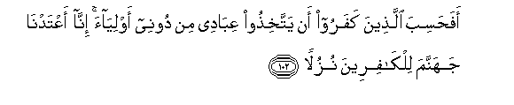
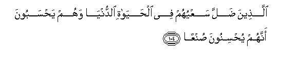
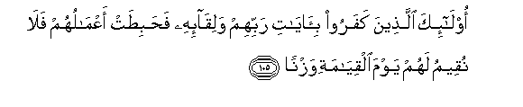
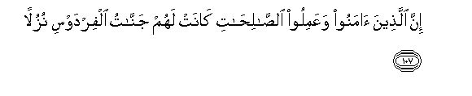
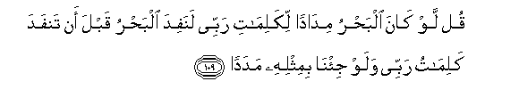
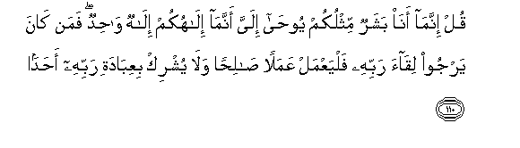

  
[Intangible Textual Heritage](../../index)  [Islam](../index) 
[Index](index)   
[Hypertext Qur'an](../htq/index)  [Unicode](../uq/018.htm#018_102) 
[Palmer](../sbe09/018)  [Pickthall](../pick/018.htm#018_102)  [Yusuf Ali
English](../yaq/yaq018)  [Rodwell](../qr/018)   
  
[Sūra XVIII.: Kahf, or the Cave. Index](018)  
  [Previous](01811)  [Next](01901) 

------------------------------------------------------------------------

  
*The Holy Quran*, tr. by Yusuf Ali, \[1934\], at Intangible Textual
Heritage

------------------------------------------------------------------------

# Sūra XVIII.: Kahf, or the Cave.

### Section 12

------------------------------------------------------------------------

102. Afa<u>h</u>asiba alla<u>th</u>eena kafaroo an yattakhi<u>th</u>oo
AAib<u>a</u>dee min doonee awliy<u>a</u>a inn<u>a</u> aAAtadn<u>a</u>
jahannama lilk<u>a</u>fireena nuzul<u>a</u>**n**

102\. Do the Unbelievers think  
That they can take  
My servants as protectors  
Besides Me? Verily We  
Have prepared Hell  
For the Unbelievers  
For (their) entertainment.

------------------------------------------------------------------------

103. Qul hal nunabbi-okum bi**a**l-akhsareena aAAm<u>a</u>l<u>a</u>**n**

103\. Say: "Shall we tell you  
Of those who lose most  
In respect of their deeds?—

------------------------------------------------------------------------

104. Alla<u>th</u>eena <u>d</u>alla saAAyuhum fee al<u>h</u>ay<u>a</u>ti
a**l**dduny<u>a</u> wahum ya<u>h</u>saboona annahum yu<u>h</u>sinoona
<u>s</u>unAA<u>a</u>**n**

104\. "Those whose efforts have  
Been wasted in this life,  
While they thought that  
They were acquiring good  
By their works?"

------------------------------------------------------------------------

105. Ol<u>a</u>-ika alla<u>th</u>eena kafaroo bi-<u>a</u>y<u>a</u>ti
rabbihim waliq<u>a</u>-ihi fa<u>h</u>abi<u>t</u>at aAAm<u>a</u>luhum
fal<u>a</u> nuqeemu lahum yawma alqiy<u>a</u>mati wazn<u>a</u>**n**

105\. They are those who deny  
The Signs of their Lord  
And the fact of their  
Having to meet Him  
(In the Hereafter): vain  
Will be their works,  
Nor shall We, on the Day  
Of Judgment, give them  
Any weight.

------------------------------------------------------------------------

106. <u>Tha</u>lika jaz<u>a</u>ohum jahannamu bim<u>a</u> kafaroo
wa**i**ttakha<u>th</u>oo <u>a</u>y<u>a</u>tee warusulee
huzuw<u>a</u>**n**

106\. That is their reward,  
Hell; because they rejected  
Faith, and took My Signs  
And My Messengers  
By way of jest.

------------------------------------------------------------------------

107. Inna alla<u>th</u>eena <u>a</u>manoo waAAamiloo
a**l**<u>ssa</u>li<u>ha</u>ti k<u>a</u>nat lahum jann<u>a</u>tu
alfirdawsi nuzul<u>a</u>**n**

107\. As to those who believe  
And work righteous deeds,  
They have, for their entertainment,  
The Gardens of Paradise,

------------------------------------------------------------------------

108. Kh<u>a</u>lideena feeh<u>a</u> l<u>a</u> yabghoona AAanh<u>a</u>
<u>h</u>iwal<u>a</u>**n**

108\. Wherein they shall dwell  
(For aye): no change  
Will they wish for from them.

------------------------------------------------------------------------

109. Qul law k<u>a</u>na alba<u>h</u>ru mid<u>a</u>dan likalim<u>a</u>ti
rabbee lanafida alba<u>h</u>ru qabla an tanfada kalim<u>a</u>tu rabbee
walaw ji/n<u>a</u> bimithlihi madad<u>a</u>**n**

109\. Say: "If the ocean were  
Ink (wherewith to write out)  
The words of my Lord,  
Sooner would the ocean be  
Exhausted than would the words  
Of my Lord, even if we  
Added another ocean  
Like it, for its aid."

------------------------------------------------------------------------

110. Qul innam<u>a</u> an<u>a</u> basharun mithlukum yoo<u>ha</u> ilayya
annam<u>a</u> il<u>a</u>hukum il<u>a</u>hun w<u>ah</u>idun faman
k<u>a</u>na yarjoo liq<u>a</u>a rabbihi falyaAAmal AAamalan
<u>sa</u>li<u>h</u>an wal<u>a</u> yushrik biAAib<u>a</u>dati rabbihi
a<u>h</u>ad<u>a</u>**n**

110\. Say: "I am but a man  
Like yourselves, (but)  
The inspiration has come  
To me, that your God is  
One God: whoever expects  
To meet his Lord, let him  
Work righteousness, and,  
In the worship of his Lord,  
Admit no one as partner.

------------------------------------------------------------------------

[Next: Section 1 (1-15)](01901)

