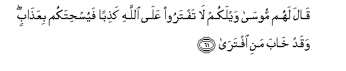
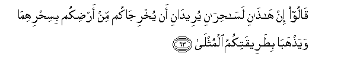
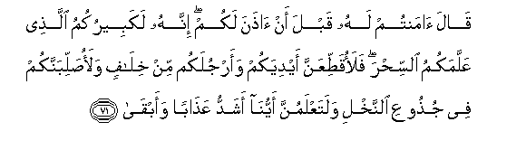
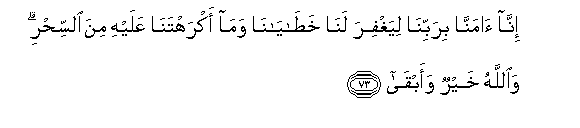

  
[Intangible Textual Heritage](../../index)  [Islam](../index) 
[Index](index)   
[Hypertext Qur'an](../htq/index)  [Unicode](../uq/020.htm#020_055) 
[Palmer](../sbe09/020)  [Pickthall](../pick/020.htm#020_055)  [Yusuf Ali
English](../yaq/yaq020)  [Rodwell](../qr/020)   
  
[Sūra XX.: Ṭā-Hā. (Mystic Letters, Ṭ. H.) Index](020)  
  [Previous](02002)  [Next](02004) 

------------------------------------------------------------------------

  
*The Holy Quran*, tr. by Yusuf Ali, \[1934\], at Intangible Textual
Heritage

------------------------------------------------------------------------

# Sūra XX.: Ṭā-Hā. (Mystic Letters, Ṭ. H.)

### Section 3

------------------------------------------------------------------------

55. Minh<u>a</u> khalaqn<u>a</u>kum wafeeh<u>a</u> nuAAeedukum
waminh<u>a</u> nukhrijukum t<u>a</u>ratan okhr<u>a</u>

55\. From the (earth) did We  
Create you, and into it  
Shall We return you,  
And from it shall We  
Bring you out once again"

------------------------------------------------------------------------

56. Walaqad arayn<u>a</u>hu <u>a</u>y<u>a</u>tin<u>a</u> kullah<u>a</u>
faka<u>thth</u>aba waab<u>a</u>

56\. And We showed Pharaoh  
All Our Signs, but he  
Did reject and refuse.

------------------------------------------------------------------------

57. Q<u>a</u>la aji/tan<u>a</u> litukhrijan<u>a</u> min
ar<u>d</u>in<u>a</u> bisi<u>h</u>rika y<u>a</u> moos<u>a</u>

57\. He said: "Hast thou come  
To drive us out  
Of our land with thy magic,  
O Moses?

------------------------------------------------------------------------

58. Falana/tiyannaka bisi<u>h</u>rin mithlihi fa**i**jAAal
baynan<u>a</u> wabaynaka mawAAidan l<u>a</u> nukhlifuhu na<u>h</u>nu
wal<u>a</u> anta mak<u>a</u>nan suw<u>a</u>**n**

58\. "But we can surely produce  
Magic to match thine!  
So make a tryst  
Between us and thee,  
Which we shall not fail  
To keep—neither we nor thou—  
In a place where both  
Shall have even chances."

------------------------------------------------------------------------

59. Q<u>a</u>la mawAAidukum yawmu a**l**zzeenati waan yu<u>h</u>shara
a**l**nn<u>a</u>su <u>d</u>u<u>ha</u>**n**

59\. Moses said: "Your tryst  
Is the Day of the Festival,  
And let the people be assembled  
When the sun is well up."

------------------------------------------------------------------------

60. Fatawall<u>a</u> firAAawnu fajamaAAa kaydahu thumma at<u>a</u>

60\. So Pharaoh withdrew:  
He concerted his plan,  
And then came (back).

------------------------------------------------------------------------

61. Q<u>a</u>la lahum moos<u>a</u> waylakum l<u>a</u> taftaroo
AAal<u>a</u> All<u>a</u>hi ka<u>th</u>iban fayus<u>h</u>itakum
biAAa<u>tha</u>bin waqad kh<u>a</u>ba mani iftar<u>a</u>

61\. Moses said to him:  
Woe to you! Forge not  
Ye a lie against God,  
Lest He destroy you (at once)  
Utterly by chastisement:  
The forger must suffer  
Frustration!"

------------------------------------------------------------------------

62. Fatan<u>a</u>zaAAoo amrahum baynahum waasarroo a**l**nnajw<u>a</u>

62\. So they disputed, one with  
Another, over their affair,  
But they kept their talk secret.

------------------------------------------------------------------------

63. Q<u>a</u>loo in h<u>atha</u>ni las<u>ah</u>ir<u>a</u>ni
yureed<u>a</u>ni an yukhrij<u>a</u>kum min ar<u>d</u>ikum
bisi<u>h</u>rihim<u>a</u> waya<u>th</u>hab<u>a</u>
bi<u>t</u>areeqatikumu almuthl<u>a</u>

63\. They said: "These two  
Are certainly (expert) magicians:  
Their object is to drive you  
Out from your land  
With their magic, and  
To do away with your  
Most cherished institutions.

------------------------------------------------------------------------

64. FaajmiAAoo kaydakum thumma i/too <u>s</u>affan waqad afla<u>h</u>a
alyawma mani istaAAl<u>a</u>

64\. "Therefore concert your plan,  
And then assemble  
In (serried) ranks:  
He wins (all along) to-day  
Who gains the upper hand"

------------------------------------------------------------------------

65. Q<u>a</u>loo y<u>a</u> moos<u>a</u> imm<u>a</u> an tulqiya
wa-imm<u>a</u> an nakoona awwala man alq<u>a</u>

65\. They said: "O Moses!  
Whether wilt thou  
That thou throw (first)  
Or that we be the first  
To throw?"

------------------------------------------------------------------------

66. Q<u>a</u>la bal alqoo fa-i<u>tha</u> <u>h</u>ib<u>a</u>luhum
waAAi<u>s</u>iyyuhum yukhayyalu ilayhi min si<u>h</u>rihim annah<u>a</u>
tasAA<u>a</u>

66\. He said, "Nay, throw ye  
First!" Then behold  
Their ropes and their rods—  
So it seemed to him  
On account of their magic—  
Began to be in lively motion!

------------------------------------------------------------------------

67. Faawjasa fee nafsihi kheefatan moos<u>a</u>

67\. So Moses conceived  
In his mind  
A (sort of) fear.

------------------------------------------------------------------------

68. Quln<u>a</u> l<u>a</u> takhaf innaka anta al-aAAl<u>a</u>

68\. We said: "Fear not!  
For thou hast indeed  
The upper hand:

------------------------------------------------------------------------

69. Waalqi m<u>a</u> fee yameenika talqaf m<u>a</u> <u>s</u>anaAAoo
innam<u>a</u> <u>s</u>anaAAoo kaydu s<u>ah</u>irin wal<u>a</u>
yufli<u>h</u>u a**l**ss<u>ah</u>iru <u>h</u>aythu at<u>a</u>

69\. "Throw that which is  
In thy right hand:  
Quickly will it swallow up  
That which they have faked  
What they have faked  
Is but a magician's trick:  
And the magician thrives not,  
(No matter) where he goes."

------------------------------------------------------------------------

70. Faolqiya a**l**ssa<u>h</u>aratu sujjadan q<u>a</u>loo
<u>a</u>mann<u>a</u> birabbi h<u>a</u>roona wamoos<u>a</u>

70\. So the magicians were  
Thrown down to prostration:  
They said, "We believe  
In the Lord of Aaron and Moses".

------------------------------------------------------------------------

71. Q<u>a</u>la <u>a</u>mantum lahu qabla an <u>ath</u>ana lakum innahu
lakabeerukumu alla<u>th</u>ee AAallamakumu a**l**ssi<u>h</u>ra
falaoqa<u>tt</u>iAAanna aydiyakum waarjulakum min khil<u>a</u>fin
walao<u>s</u>allibannakum fee ju<u>th</u>ooAAi a**l**nnakhli
walataAAlamunna ayyun<u>a</u> ashaddu AAa<u>tha</u>ban waabq<u>a</u>

71\. (Pharaoh) said: "Believe ye  
In Him before I give  
You permission? Surely  
This must be your leader,  
Who has taught you magic!  
Be sure I will cut off  
Your hands and feet  
On opposite sides, and I  
Will have you crucified  
On trunks of palm-trees:  
So shall ye know for certain,  
Which of us can give  
The more severe and the more  
Lasting Punishment!"

------------------------------------------------------------------------

72. Q<u>a</u>loo lan nu/thiraka AAal<u>a</u> m<u>a</u>
j<u>a</u>an<u>a</u> mina albayyin<u>a</u>ti wa**a**lla<u>th</u>ee
fa<u>t</u>aran<u>a</u> fa**i**q<u>d</u>i m<u>a</u> anta q<u>ad</u>in
innam<u>a</u> taq<u>d</u>ee h<u>ath</u>ihi al<u>h</u>ay<u>a</u>ta
a**l**dduny<u>a</u>

72\. They said: "Never shall we  
Regard thee as more than  
The Clear Signs that have  
Come to us; or than  
Him Who created us!  
So decree whatever thou  
Desirest to decree: for thou  
Canst only decree (touching)  
The life of this world.

------------------------------------------------------------------------

73. Inn<u>a</u> <u>a</u>mann<u>a</u> birabbin<u>a</u> liyaghfira
lan<u>a</u> kha<u>ta</u>y<u>a</u>n<u>a</u> wam<u>a</u> akrahtan<u>a</u>
AAalayhi mina a**l**ssi<u>h</u>ri wa**A**ll<u>a</u>hu khayrun
waabq<u>a</u>

73\. "For us, we have believed  
In our Lord: may He  
Forgive us our faults,  
And the magic to which  
Thou didst compel us:  
For God is Best  
And Most Abiding."

------------------------------------------------------------------------

74. Innahu man ya/ti rabbahu mujriman fa-inna lahu jahannama l<u>a</u>
yamootu feeh<u>a</u> wal<u>a</u> ya<u>h</u>y<u>a</u>

74\. Verily he who comes  
To his Lord as a sinner  
(At Judgment),—for him  
Is Hell: therein shall he  
Neither die nor live.

------------------------------------------------------------------------

75. Waman ya/tihi mu/minan qad AAamila a**l**<u>ssa</u>li<u>ha</u>ti
faol<u>a</u>-ika lahumu a**l**ddaraj<u>a</u>tu alAAul<u>a</u>

75\. But such as come  
To Him as Believers  
Who have worked righteous deeds,—  
For them are ranks exalted,—

------------------------------------------------------------------------

76. Jann<u>a</u>tu AA<u>a</u>dnin tajree min ta<u>h</u>tih<u>a</u>
al-anh<u>a</u>ru kh<u>a</u>lideena feeh<u>a</u> wa<u>tha</u>lika
jaz<u>a</u>o man tazakk<u>a</u>

76\. Gardens of Eternity,  
Beneath which flow rivers:  
They will dwell therein  
For aye: such is the reward  
Of those who purify  
Themselves (from evil).

------------------------------------------------------------------------

[Next: Section 4 (77-89)](02004)

