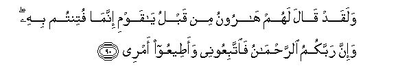

  
[Intangible Textual Heritage](../../index)  [Islam](../index) 
[Index](index)   
[Hypertext Qur'an](../htq/index)  [Unicode](../uq/020.htm#020_090) 
[Palmer](../sbe09/020)  [Pickthall](../pick/020.htm#020_090)  [Yusuf Ali
English](../yaq/yaq020)  [Rodwell](../qr/020)   
  
[Sūra XX.: Ṭā-Hā. (Mystic Letters, Ṭ. H.) Index](020)  
  [Previous](02004)  [Next](02006) 

------------------------------------------------------------------------

  
*The Holy Quran*, tr. by Yusuf Ali, \[1934\], at Intangible Textual
Heritage

------------------------------------------------------------------------

# Sūra XX.: Ṭā-Hā. (Mystic Letters, Ṭ. H.)

### Section 5

------------------------------------------------------------------------

90. Walaqad q<u>a</u>la lahum h<u>a</u>roonu min qablu y<u>a</u> qawmi
innam<u>a</u> futintum bihi wa-inna rabbakumu
a**l**rra<u>h</u>m<u>a</u>nu fa**i**ttabiAAoonee waa<u>t</u>eeAAoo amree

90\. Aaron had already, before this  
Said to them: ."O my people!  
Ye are being tested in this:  
For verily your Lord is (God)  
Most Gracious: so follow me  
And obey my command."

------------------------------------------------------------------------

91. Q<u>a</u>loo lan nabra<u>h</u>a AAalayhi AA<u>a</u>kifeena
<u>h</u>att<u>a</u> yarjiAAa ilayn<u>a</u> moos<u>a</u>

91\. They had said: "We will not  
Abandon this cult, but we  
Will devote ourselves to it  
Until Moses returns to us.

------------------------------------------------------------------------

92. Q<u>a</u>la y<u>a</u> h<u>a</u>roonu m<u>a</u> manaAAaka i<u>th</u>
raaytahum <u>d</u>alloo

92\. (Moses) said: "O Aaron!  
What kept thee back, when  
Thou sawest them going wrong,

------------------------------------------------------------------------

93. All<u>a</u> tattabiAAani afaAAa<u>s</u>ayta amree

93\. "From following me? Didst thou  
Then disobey my order?"

------------------------------------------------------------------------

94. Q<u>a</u>la yabnaomma l<u>a</u> ta/khu<u>th</u> bili<u>h</u>yatee
wal<u>a</u> bira/see innee khasheetu an taqoola farraqta bayna banee
isr<u>a</u>-eela walam tarqub qawlee

94\. (Aaron) replied: "O son  
Of my mother! Seize (me) not  
By my beard nor by  
(The hair of) my head!  
Truly I feared lest thou  
Shouldst say, "Thou hast caused  
A division among the Children  
Of Israel, and thou didst not  
Respect my word!"

------------------------------------------------------------------------

95. Q<u>a</u>la fam<u>a</u> kha<u>t</u>buka y<u>a</u>
s<u>a</u>miriy**yu**

95\. (Moses) said: "What then  
Is thy case, O Sāmarī?"

------------------------------------------------------------------------

96. Q<u>a</u>la ba<u>s</u>urtu bim<u>a</u> lam yab<u>s</u>uroo bihi
faqaba<u>d</u>tu qab<u>d</u>atan min athari a**l**rrasooli
fanaba<u>th</u>tuh<u>a</u> waka<u>tha</u>lika sawwalat lee nafsee

96\. He replied: "I saw what  
They saw not: so I took  
A handful (of dust) from  
The footprint of the Apostle,  
And threw it (into the calf):  
Thus did my soul suggest  
To me."

------------------------------------------------------------------------

97. Q<u>a</u>la fa**i**<u>th</u>hab fa-inna laka fee
al<u>h</u>ay<u>a</u>ti an taqoola l<u>a</u> mis<u>a</u>sa wa-inna laka
mawAAidan lan tukhlafahu wa**o**n*<u>th</u>*ur il<u>a</u> il<u>a</u>hika
alla<u>th</u>ee *<u>th</u>*alta AAalayhi AA<u>a</u>kifan
lanu<u>h</u>arriqannahu thumma lanansifannahu fee alyammi
nasf<u>a</u>**n**

97\. (Moses) said: "Get thee gone!  
But thy (punishment) in this life  
Will be that thou wilt say,  
'Touch me not'; and moreover  
(For a future penalty) thou hast  
A promise that will not fail:  
Now look at thy god,  
Of whom thou hast become  
A devoted worshipper:  
We will certainly (melt) it  
In a blazing fire and scatter  
It broadcast in the sea!"

------------------------------------------------------------------------

98. Innam<u>a</u> il<u>a</u>hukumu All<u>a</u>hu alla<u>th</u>ee
l<u>a</u> il<u>a</u>ha ill<u>a</u> huwa wasiAAa kulla shay-in
AAilm<u>a</u>**n**

98\. But the God of you all  
Is the One God: there is  
No god but He: all things  
He comprehends in His knowledge.

------------------------------------------------------------------------

99. Ka<u>tha</u>lika naqu<u>ss</u>u AAalayka min anb<u>a</u>-i m<u>a</u>
qad sabaqa waqad <u>a</u>tayn<u>a</u>ka min ladunn<u>a</u> thikra**n**

99\. Thus do We relate to thee  
Some stories of what happened  
Before: for We have sent  
Thee a Message from  
Our own Presence,

------------------------------------------------------------------------

100. Man aAAra<u>d</u>a AAanhu fa-innahu ya<u>h</u>milu yawma
alqiy<u>a</u>mati wizr<u>a</u>**n**

100\. If any do turn away  
Therefrom, verily they will  
Bear a burden  
On the Day of Judgment;

------------------------------------------------------------------------

101. Kh<u>a</u>lideena feehi was<u>a</u>a lahum yawma alqiy<u>a</u>mati
<u>h</u>iml<u>a</u>**n**

101\. They will abide in this (state):  
And grievous will the burden  
Be to them on that Day,—

------------------------------------------------------------------------

102. Yawma yunfakhu fee a**l**<u>ss</u>oori wana<u>h</u>shuru
almujrimeena yawma-i<u>th</u>in zurq<u>a</u>**n**

102\. The Day when the Trumpet  
Will be sounded: that Day,  
We shall gather the sinful,  
Blear-eyed (with terror).

------------------------------------------------------------------------

103. Yatakh<u>a</u>fatoona baynahum in labithtum ill<u>a</u>
AAashr<u>a</u>**n**

103\. In whispers will they consult  
Each other: "Ye tarried not  
Longer than ten (Days);"

------------------------------------------------------------------------

104. Na<u>h</u>nu aAAlamu bim<u>a</u> yaqooloona i<u>th</u> yaqoolu
amthaluhum <u>t</u>areeqatan in labithtum ill<u>a</u> yawm<u>a</u>**n**

104\. We know best what they  
Will say, when their leader  
Most eminent in Conduct  
Will say: "Ye tarried not  
Longer than a day!"

------------------------------------------------------------------------

[Next: Section 6 (105-115)](02006)

