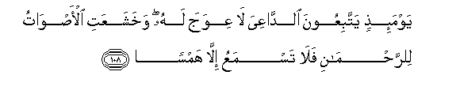
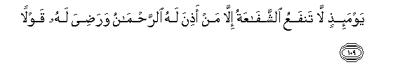
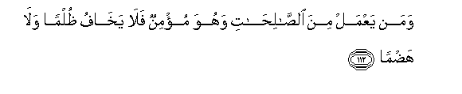
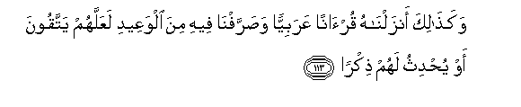
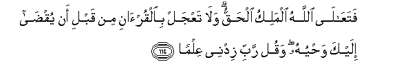
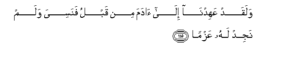

  
[Intangible Textual Heritage](../../index)  [Islam](../index) 
[Index](index)   
[Hypertext Qur'an](../htq/index)  [Unicode](../uq/020.htm#020_105) 
[Palmer](../sbe09/020)  [Pickthall](../pick/020.htm#020_105)  [Yusuf Ali
English](../yaq/yaq020)  [Rodwell](../qr/020)   
  
[Sūra XX.: Ṭā-Hā. (Mystic Letters, Ṭ. H.) Index](020)  
  [Previous](02005)  [Next](02007) 

------------------------------------------------------------------------

  
*The Holy Quran*, tr. by Yusuf Ali, \[1934\], at Intangible Textual
Heritage

------------------------------------------------------------------------

# Sūra XX.: Ṭā-Hā. (Mystic Letters, Ṭ. H.)

### Section 6

------------------------------------------------------------------------

105. Wayas-aloonaka AAani aljib<u>a</u>li faqul yansifuh<u>a</u> rabbee
nasf<u>a</u>**n**

105\. They ask thee concerning  
The Mountains: say, "My Lord  
Will uproot them and scatter  
Them as dust;

------------------------------------------------------------------------

106. Faya<u>th</u>aruh<u>a</u> q<u>a</u>AAan
<u>s</u>af<u>s</u>af<u>a</u>**n**

106\. "He will leave them as plains  
Smooth and level;

------------------------------------------------------------------------

107. L<u>a</u> tar<u>a</u> feeh<u>a</u> AAiwajan wal<u>a</u>
amt<u>a</u>**n**

107\. "Nothing crooked or curved  
Wilt thou see in their place."

------------------------------------------------------------------------

108. Yawma-i<u>th</u>in yattabiAAoona a**l**dd<u>a</u>AAiya l<u>a</u>
AAiwaja lahu wakhashaAAati al-a<u>s</u>w<u>a</u>tu
li**l**rra<u>h</u>m<u>a</u>ni fal<u>a</u> tasmaAAu ill<u>a</u>
hams<u>a</u>**n**

108\. On that Day will they follow  
The Caller (straight): no crookedness  
(Can they show) him: all sounds  
Shall humble themselves in  
The Presence of (God) Most Gracious:  
Nothing shalt thou hear  
But the tramp of their feet  
(As they march).

------------------------------------------------------------------------

109. Yawma-i<u>th</u>in l<u>a</u> tanfaAAu a**l**shshaf<u>a</u>AAatu
ill<u>a</u> man a<u>th</u>ina lahu a**l**rra<u>h</u>m<u>a</u>nu
wara<u>d</u>iya lahu qawl<u>a</u>**n**

109\. On that Day shall no  
Intercession avail  
Except for those for whom  
Permission has been granted  
By (God) Most Gracious  
And whose word is  
Acceptable to Him.

------------------------------------------------------------------------

110. YaAAlamu m<u>a</u> bayna aydeehim wam<u>a</u> khalfahum wal<u>a</u>
yu<u>h</u>ee<u>t</u>oona bihi AAilm<u>a</u>**n**

110\. He knows what (appears  
To His creatures as) before  
Or after or behind them:  
But they shall not compass it  
With their knowledge.

------------------------------------------------------------------------

111. WaAAanati alwujoohu lil<u>h</u>ayyi alqayyoomi waqad kh<u>a</u>ba
man <u>h</u>amala *<u>th</u>*ulm<u>a</u>**n**

111\. (All) faces shall be humbled  
Before (Him)—the Living,  
The Self-Subsisting, Eternal:  
Hopeless indeed will be  
The man that carries  
Iniquity (on his back).

------------------------------------------------------------------------

112. Waman yaAAmal mina a**l**<u>ssa</u>li<u>ha</u>ti wahuwa mu/minun
fal<u>a</u> yakh<u>a</u>fu *<u>th</u>*ulman wal<u>a</u>
ha<u>d</u>m<u>a</u>**n**

112\. But he who works deeds  
Of righteousness, and has faith,  
Will have no fear of harm  
Nor of any curtailment  
(Of what is his due).

------------------------------------------------------------------------

113. Waka<u>tha</u>lika anzaln<u>a</u>hu qur-<u>a</u>nan AAarabiyyan
wa<u>s</u>arrafn<u>a</u> feehi mina alwaAAeedi laAAallahum yattaqoona aw
yu<u>h</u>dithu lahum <u>th</u>ikr<u>a</u>**n**

113\. Thus have We sent this  
Down—an Arabic Qur-ān—  
And explained therein in detail  
Some of the warnings,  
In order that they may  
Fear God, or that it may  
Cause their remembrance (of Him).

------------------------------------------------------------------------

114. FataAA<u>a</u>l<u>a</u> All<u>a</u>hu almaliku al<u>h</u>aqqu
wal<u>a</u> taAAjal bi**a**lqur-<u>a</u>ni min qabli an yuq<u>da</u>
ilayka wa<u>h</u>yuhu waqul rabbi zidnee AAilm<u>a</u>**n**

114\. High above all is God,  
The King, the Truth!  
Be not in haste  
With the Qur-ān before  
Its revelation to thee  
Is completed, but say,  
"O my Lord! advance me  
In knowledge."

------------------------------------------------------------------------

115. Walaqad AAahidn<u>a</u> il<u>a</u> <u>a</u>dama min qablu fanasiya
walam najid lahu AAazm<u>a</u>**n**

115\. We had already, beforehand,  
Taken the covenant of Adam,  
But he forgot: and We found  
On his part no firm resolve.

------------------------------------------------------------------------

[Next: Section 7 (116-128)](02007)

