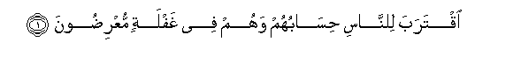
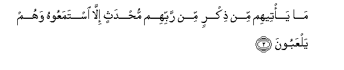
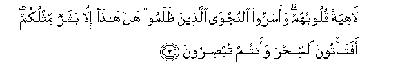
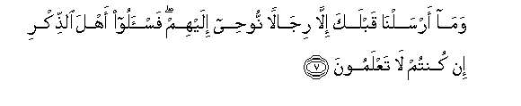

  
[Intangible Textual Heritage](../../index)  [Islam](../index) 
[Index](index)   
[Hypertext Qur'an](../htq/index)  [Unicode](../uq/021.htm#021_001) 
[Palmer](../sbe09/021)  [Pickthall](../pick/021.htm#021_001)  [Yusuf Ali
English](../yaq/yaq021)  [Rodwell](../qr/021)   
  
[Sūra XXI.: Anbiyāa, or The Prophets Index](021)  
  [Previous](02008)  [Next](02102) 

------------------------------------------------------------------------

  
*The Holy Quran*, tr. by Yusuf Ali, \[1934\], at Intangible Textual
Heritage

------------------------------------------------------------------------

# Sūra XXI.: Anbiyāa, or The Prophets

### Section 1

1. Iqtaraba li**l**nn<u>a</u>si <u>h</u>is<u>a</u>buhum wahum fee
ghaflatin muAAri<u>d</u>oon**a**

1\. Closer and closer to mankind  
Comes their Reckoning: yet they  
Heed not and they turn away.

------------------------------------------------------------------------

2. M<u>a</u> ya/teehim min <u>th</u>ikrin min rabbihim mu<u>h</u>dathin
ill<u>a</u> istamaAAoohu wahum yalAAaboon**a**

2\. Never comes (aught) to them  
Of a renewed Message  
From their Lord, but they  
Listen to it as in jest,—

------------------------------------------------------------------------

3. L<u>a</u>hiyatan quloobuhum waasarroo a**l**nnajw<u>a</u>
alla<u>th</u>eena *<u>th</u>*alamoo hal h<u>atha</u> ill<u>a</u>
basharun mithlukum afata/toona a**l**ssi<u>h</u>ra waantum
tub<u>s</u>iroon**a**

3\. Their hearts toying as with  
Trifles. The wrong-doers conceal  
Their private counsels, (saying),  
"Is this (one) more than  
A man like yourselves?  
Will ye go to witchcraft  
With your eyes open?"

------------------------------------------------------------------------

4. Q<u>a</u>la rabbee yaAAlamu alqawla fee a**l**ssam<u>a</u>-i
wa**a**l-ar<u>d</u>i wahuwa a**l**ssameeAAu alAAaleem**u**

4\. Say: "My Lord  
Knoweth (every) word (spoken)  
In the heavens and on earth:  
He is the One that heareth  
And knoweth (all things)."

------------------------------------------------------------------------

5. Bal q<u>a</u>loo a<u>d</u>gh<u>a</u>thu a<u>h</u>l<u>a</u>min bali
iftar<u>a</u>hu bal huwa sh<u>a</u>AAirun falya/tin<u>a</u>
bi-<u>a</u>yatin kam<u>a</u> orsila al-awwaloon**a**

5\. "Nay," they say, "(these are)  
Medleys of dreams!—Nay,  
He forged it!—Nay,  
He is (but) a poet!  
Let him then bring us  
A Sign like the ones  
That were sent to  
(Prophets) of old!"

------------------------------------------------------------------------

6. M<u>a</u> <u>a</u>manat qablahum min qaryatin ahlakn<u>a</u>h<u>a</u>
afahum yu/minoon**a**

6\. (As to those) before them,  
Not one of the populations  
Which We destroyed believed:  
Will these believe?

------------------------------------------------------------------------

7. Wam<u>a</u> arsaln<u>a</u> qablaka ill<u>a</u> rij<u>a</u>lan
noo<u>h</u>ee ilayhim fa**i**s-aloo ahla a**l**<u>thth</u>ikri in kuntum
l<u>a</u> taAAlamoon**a**

7\. Before thee, also, the apostles  
We sent were but men,  
To whom We granted inspiration:  
If ye realise this not, ask  
Of those who possess the Message.

------------------------------------------------------------------------

8. Wam<u>a</u> jaAAaln<u>a</u>hum jasadan l<u>a</u> ya/kuloona
a**l**<u>tt</u>aAA<u>a</u>ma wam<u>a</u> k<u>a</u>noo
kh<u>a</u>lideen**a**

8\. Nor did We give them  
Bodies that ate no food,  
Nor were they exempt from death.

------------------------------------------------------------------------

9. Thumma <u>s</u>adaqn<u>a</u>humu alwaAAda faanjayn<u>a</u>hum waman
nash<u>a</u>o waahlakn<u>a</u> almusrifeen**a**

9\. In the end We fulfilled  
To them Our promise,  
And We saved them  
And those whom We pleased,  
But We destroyed those  
Who transgressed beyond bounds.

------------------------------------------------------------------------

10. Laqad anzaln<u>a</u> ilaykum kit<u>a</u>ban feehi <u>th</u>ikrukum
afal<u>a</u> taAAqiloon**a**

10\. We have revealed for you  
(O men!) a book in which  
Is a Message for you:  
Will ye not then understand?

------------------------------------------------------------------------

[Next: Section 2 (11-29)](02102)

