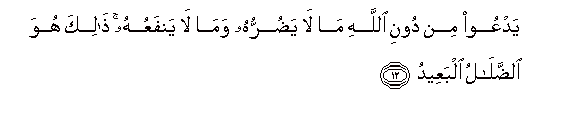
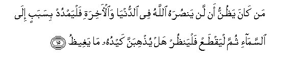
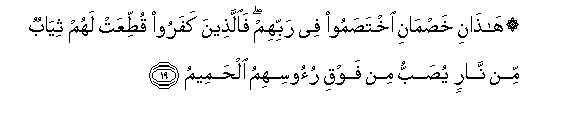

  
[Intangible Textual Heritage](../../index)  [Islam](../index) 
[Index](index)   
[Hypertext Qur'an](../htq/index)  [Unicode](../uq/022.htm#022_011) 
[Palmer](../sbe09/022)  [Pickthall](../pick/022.htm#022_011)  [Yusuf Ali
English](../yaq/yaq022)  [Rodwell](../qr/022)   
  
[Sūra XXII.: Ḥajj, or The Pilgrimage. Index](022)  
  [Previous](02201)  [Next](02203) 

------------------------------------------------------------------------

  
*The Holy Quran*, tr. by Yusuf Ali, \[1934\], at Intangible Textual
Heritage

------------------------------------------------------------------------

# Sūra XXII.: Ḥajj, or The Pilgrimage.

### Section 2

------------------------------------------------------------------------

11. Wamina a**l**nn<u>a</u>si man yaAAbudu All<u>a</u>ha AAal<u>a</u>
<u>h</u>arfin fa-in a<u>sa</u>bahu khayrun i<u>t</u>maanna bihi wa-in
a<u>sa</u>bat-hu fitnatun inqalaba AAal<u>a</u> wajhihi khasira
a**l**dduny<u>a</u> wa**a**l-<u>a</u>khirata <u>tha</u>lika huwa
alkhusr<u>a</u>nu almubeen**u**

11\. There are among men  
Some who serve God,  
As it were, on the verge:  
If good befalls them, they are,  
Therewith, well content; but  
If a trial comes to them,  
They turn on their faces:  
They lose both this world  
And the Hereafter: that  
Is loss for all to see!

------------------------------------------------------------------------

12. YadAAoo min dooni All<u>a</u>hi m<u>a</u> l<u>a</u> ya<u>d</u>urruhu
wam<u>a</u> l<u>a</u> yanfaAAuhu <u>tha</u>lika huwa
a**l**<u>dd</u>al<u>a</u>lu albaAAeed**u**

12\. They call on such deities:  
Besides God, as can neither  
Hurt nor profit them:  
That is straying far indeed  
(From the Way)!

------------------------------------------------------------------------

13. YadAAoo laman <u>d</u>arruhu aqrabu min nafAAihi labi/sa
almawl<u>a</u> walabi/sa alAAasheer**u**

13\. (Perhaps) they call on one  
Whose hurt is nearer  
Than his profit: evil, indeed,  
Is the patron, and evil  
The companion (for help)!

------------------------------------------------------------------------

14. Inna All<u>a</u>ha yudkhilu alla<u>th</u>eena <u>a</u>manoo
waAAamiloo a**l**<u>ssa</u>li<u>ha</u>ti jann<u>a</u>tin tajree min
ta<u>h</u>tih<u>a</u> al-anh<u>a</u>ru inna All<u>a</u>ha yafAAalu
m<u>a</u> yureed**u**

14\. Verily God will admit  
Those who believe and work  
Righteous deeds, to Gardens,  
Beneath which rivers flow:  
For God carries out  
All that He plans,

------------------------------------------------------------------------

15. Man k<u>a</u>na ya*<u>th</u>*unnu an lan yan<u>s</u>urahu
All<u>a</u>hu fee a**l**dduny<u>a</u> wa**a**l-<u>a</u>khirati falyamdud
bisababin il<u>a</u> a**l**ssam<u>a</u>-i thumma liyaq<u>t</u>aAA
falyan*<u>th</u>*ur hal yu<u>th</u>hibanna kayduhu m<u>a</u>
yaghee*<u>th</u>***u**

15\. If any think that God  
Will not help him  
(His Apostle) in this world  
And the Hereafter, let him  
Stretch out a rope  
To the ceiling and cut (himself)  
Off: then let him see  
Whether his plan will remove  
That which enrages (him)!

------------------------------------------------------------------------

16. Waka<u>tha</u>lika anzaln<u>a</u>hu <u>a</u>y<u>a</u>tin
bayyin<u>a</u>tin waanna All<u>a</u>ha yahdee man yureed**u**

16\. Thus have We sent down  
Clear Signs; and verily  
God Both guide whom  
He will!

------------------------------------------------------------------------

17. Inna alla<u>th</u>eena <u>a</u>manoo wa**a**lla<u>th</u>eena
h<u>a</u>doo wa**al**<u>ssa</u>bi-eena wa**al**nna<u>sa</u>r<u>a</u>
wa**a**lmajoosa wa**a**lla<u>th</u>eena ashrakoo inna All<u>a</u>ha
yaf<u>s</u>ilu baynahum yawma alqiy<u>a</u>mati inna All<u>a</u>ha
AAal<u>a</u> kulli shay-in shaheed**un**

17\. Those who believe (in the Qur-ān),  
Those who follow the Jewish (scriptures),  
And the Sabians, Christians,  
Magians, and Polytheists,—  
God will judge between them  
On the Day of Judgment:  
For God is witness  
Of all things.

------------------------------------------------------------------------

18. Alam tara anna All<u>a</u>ha yasjudu lahu man fee
a**l**ssam<u>a</u>w<u>a</u>ti waman fee al-ar<u>d</u>i wa**al**shshamsu
wa**a**lqamaru wa**al**nnujoomu wa**a**ljib<u>a</u>lu wa**al**shshajaru
wa**al**ddaw<u>a</u>bbu wakatheerun mina a**l**nn<u>a</u>si wakatheerun
<u>h</u>aqqa AAalayhi alAAa<u>tha</u>bu waman yuhini All<u>a</u>hu
fam<u>a</u> lahu min mukrimin inna All<u>a</u>ha yafAAalu m<u>a</u>
yash<u>a</u>/**o**

18\. Seest thou not that  
To God bow down in worship  
All things that are  
In the heavens and on earth,—  
The sun, the moon, the stars;  
The hills, the trees, the animals;  
And a great number among  
Mankind? But a great number  
Are (also) such as are  
Fit for Punishment: and such  
As God shall disgrace,  
None can raise to honour:  
For God carries out  
All that He wills.

------------------------------------------------------------------------

19. H<u>atha</u>ni kha<u>s</u>m<u>a</u>ni ikhta<u>s</u>amoo fee rabbihim
fa**a**lla<u>th</u>eena kafaroo qu<u>tt</u>iAAat lahum thiy<u>a</u>bun
min n<u>a</u>rin yu<u>s</u>abbu min fawqi ruoosihimu
al<u>h</u>ameem**u**

19\. These two antagonists dispute  
With each other about their Lord:  
But those who deny (their Lord),—  
For them will be cut out  
A garment of Fire:  
Over their heads will be  
Poured out boiling water.

------------------------------------------------------------------------

20. Yu<u>s</u>haru bihi m<u>a</u> fee bu<u>t</u>oonihim
wa**a**ljulood**u**

20\. With it will be scalded  
What is within their bodies,  
As well as (their) skins.

------------------------------------------------------------------------

21. Walahum maq<u>a</u>miAAu min <u>h</u>adeed**in**

21\. In addition there will be  
Maces of iron (to punish) them.

------------------------------------------------------------------------

22. Kullam<u>a</u> ar<u>a</u>doo an yakhrujoo minh<u>a</u> min ghammin
oAAeedoo feeh<u>a</u> wa<u>th</u>ooqoo AAa<u>tha</u>ba
al<u>h</u>areeq**i**

22\. Every time they wish  
To get away therefrom,  
From anguish, they will be  
Forced back therein, and  
(It will be said), "Taste ye  
The Penalty of Burning!"

------------------------------------------------------------------------

[Next: Section 3 (23-25)](02203)

