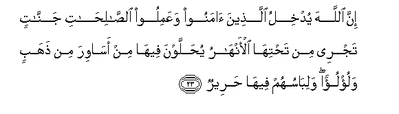

  
[Intangible Textual Heritage](../../index)  [Islam](../index) 
[Index](index)   
[Hypertext Qur'an](../htq/index)  [Unicode](../uq/022.htm#022_023) 
[Palmer](../sbe09/022)  [Pickthall](../pick/022.htm#022_023)  [Yusuf Ali
English](../yaq/yaq022)  [Rodwell](../qr/022)   
  
[Sūra XXII.: Ḥajj, or The Pilgrimage. Index](022)  
  [Previous](02202)  [Next](02204) 

------------------------------------------------------------------------

  
*The Holy Quran*, tr. by Yusuf Ali, \[1934\], at Intangible Textual
Heritage

------------------------------------------------------------------------

# Sūra XXII.: Ḥajj, or The Pilgrimage.

### Section 3

------------------------------------------------------------------------

23. Inna All<u>a</u>ha yudkhilu alla<u>th</u>eena <u>a</u>manoo
waAAamiloo a**l**<u>ssa</u>li<u>ha</u>ti jann<u>a</u>tin tajree min
ta<u>h</u>tih<u>a</u> al-anh<u>a</u>ru yu<u>h</u>allawna feeh<u>a</u>
min as<u>a</u>wira min <u>th</u>ahabin walu/lu-an walib<u>a</u>suhum
feeh<u>a</u> <u>h</u>areer**un**

23\. God will admit those  
Who believe and work righteous deeds,  
To Gardens beneath which  
Rivers flow: they shall be  
Adorned therein with bracelets  
Of gold and pearls; and  
Their garments there  
Will be of silk.

------------------------------------------------------------------------

24. Wahudoo il<u>a</u> a**l**<u>tt</u>ayyibi mina alqawli wahudoo
il<u>a</u> <u>s</u>ir<u>at</u>i al<u>h</u>ameed**i**

24\. For they have been guided  
(In this life) to the purest  
Of speeches; they have been  
Guided to the Path of Him  
Who is Worthy of (all) Praise.

------------------------------------------------------------------------

25. Inna alla<u>th</u>eena kafaroo waya<u>s</u>uddoona AAan sabeeli
All<u>a</u>hi wa**a**lmasjidi al<u>h</u>ar<u>a</u>mi alla<u>th</u>ee
jaAAaln<u>a</u>hu li**l**nn<u>a</u>si saw<u>a</u>an alAA<u>a</u>kifu
feehi wa**a**lb<u>a</u>di waman yurid feehi bi-il<u>ha</u>din
bi*<u>th</u>*ulmin nu<u>th</u>iqhu min AAa<u>tha</u>bin aleem**in**

25\. As to those who have rejected  
(God), and would keep back (men)  
From the Way of God, and  
From the Sacred Mosque, which  
We have made (open) to (all) men—  
Equal is the dweller there  
And the visitor from the country  
And any whose purpose therein  
Is profanity or wrong-doing—  
Them will We cause to taste  
Of a most grievous Penalty.

------------------------------------------------------------------------

[Next: Section 4 (26-33)](02204)

