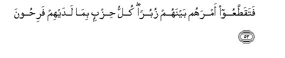

  
[Intangible Textual Heritage](../../index)  [Islam](../index) 
[Index](index)   
[Hypertext Qur'an](../htq/index)  [Unicode](../uq/023.htm#023_051) 
[Palmer](../sbe09/023)  [Pickthall](../pick/023.htm#023_051)  [Yusuf Ali
English](../yaq/yaq023)  [Rodwell](../qr/023)   
  
[Sūra XXIII.: Mu-minūn, or The Believers. Index](023)  
  [Previous](02303)  [Next](02305) 

------------------------------------------------------------------------

  
*The Holy Quran*, tr. by Yusuf Ali, \[1934\], at Intangible Textual
Heritage

------------------------------------------------------------------------

# Sūra XXIII.: Mu-minūn, or The Believers.

### Section 4

------------------------------------------------------------------------

51. Y<u>a</u> ayyuh<u>a</u> a**l**rrusulu kuloo mina
a**l**<u>tt</u>ayyib<u>a</u>ti wa**i**AAmaloo <u>sa</u>li<u>h</u>an
innee bim<u>a</u> taAAmaloona AAaleem**un**

51\. O ye apostles! enjoy  
(All) things good and pure,  
And work righteousness:  
For I am well-acquainted  
With (all) that ye do.

------------------------------------------------------------------------

52. Wa-inna h<u>ath</u>ihi ommatukum ommatan w<u>ah</u>idatan
waan<u>a</u> rabbukum fa**i**ttaqoon**i**

52\. And verily this Brotherhood  
Of yours is a single Brotherhood,  
And I am your Lord  
And Cherisher: therefore  
Fear Me (and no other).

------------------------------------------------------------------------

53. Fataqa<u>tt</u>aAAoo amrahum baynahum zuburan kullu <u>h</u>izbin
bim<u>a</u> ladayhim fari<u>h</u>oon**a**

53\. But people have cut off  
Their affair (of unity),  
Between them, into sects:  
Each party rejoices in that  
Which is with itself.

------------------------------------------------------------------------

54. Fa<u>th</u>arhum fee ghamratihim <u>h</u>att<u>a</u>
<u>h</u>een**in**

54\. But leave them  
In their confused ignorance  
For a time.

------------------------------------------------------------------------

55. Aya<u>h</u>saboona annam<u>a</u> numidduhum bihi min m<u>a</u>lin
wabaneen**a**

55\. Do they think that because  
We have granted them abundance  
Of wealth and sons,

------------------------------------------------------------------------

56. Nus<u>a</u>riAAu lahum fee alkhayr<u>a</u>ti bal l<u>a</u>
yashAAuroon**a**

56\. We would hasten them  
On in every good? Nay,  
They do not understand.

------------------------------------------------------------------------

57. Inna alla<u>th</u>eena hum min khashyati rabbihim mushfiqoon**a**

57\. Verily those who live  
In awe for fear of their Lord;

------------------------------------------------------------------------

58. Wa**a**lla<u>th</u>eena hum bi-<u>a</u>y<u>a</u>ti rabbihim
yu/minoon**a**

58\. Those who believe  
In the Signs of their Lord;

------------------------------------------------------------------------

59. Wa**a**lla<u>th</u>eena hum birabbihim l<u>a</u> yushrikoon**a**

59\. Those who join not (in worship)  
Partners with their Lord;

------------------------------------------------------------------------

60. Wa**a**lla<u>th</u>eena yu/toona m<u>a</u> <u>a</u>taw waquloobuhum
wajilatun annahum il<u>a</u> rabbihim r<u>a</u>jiAAoon**a**

60\. And those who dispense  
Their charity with their hearts  
Full of fear, because  
They will return to their Lord;—

------------------------------------------------------------------------

61. Ol<u>a</u>-ika yus<u>a</u>riAAoona fee alkhayr<u>a</u>ti wahum
lah<u>a</u> s<u>a</u>biqoon**a**

61\. It is these who hasten  
In every good work,  
And these who are  
Foremost in them.

------------------------------------------------------------------------

62. Wal<u>a</u> nukallifu nafsan ill<u>a</u> wusAAah<u>a</u>
waladayn<u>a</u> kit<u>a</u>bun yan<u>t</u>iqu bi**a**l<u>h</u>aqqi
wahum l<u>a</u> yu*<u>th</u>*lamoon**a**

62\. On no soul do We  
Place a burden greater  
Than it can bear:  
Before Us is a record  
Which clearly shows the truth:  
They will never be wronged.

------------------------------------------------------------------------

63. Bal quloobuhum fee ghamratin min h<u>atha</u> walahum
aAAm<u>a</u>lun min dooni <u>tha</u>lika hum lah<u>a</u>
AA<u>a</u>miloon**a**

63\. But their hearts are  
In confused ignorance  
Of this; and there are,  
Besides that, deeds of theirs,  
Which they will (continue)  
To do,—

------------------------------------------------------------------------

64. <u>H</u>att<u>a</u> i<u>tha</u> akha<u>th</u>n<u>a</u> mutrafeehim
bi**a**lAAa<u>tha</u>bi i<u>tha</u> hum yaj-aroon**a**

64\. Until, when We seize  
In Punishment those of them  
Who received the good things  
Of this world, behold,  
They will groan in supplication!

------------------------------------------------------------------------

65. L<u>a</u> taj-aroo alyawma innakum minn<u>a</u> l<u>a</u>
tun<u>s</u>aroon**a**

65\. (It will be said):  
"Groan not in supplication  
This day; for ye shall  
Certainly not be helped by Us.

------------------------------------------------------------------------

66. Qad k<u>a</u>nat <u>a</u>y<u>a</u>tee tutl<u>a</u> AAalaykum
fakuntum AAal<u>a</u> aAAq<u>a</u>bikum tanki<u>s</u>oon**a**

66\. "My Signs used to be  
Rehearsed to you, but ye  
Used to turn back  
On your heels—

------------------------------------------------------------------------

67. Mustakbireena bihi s<u>a</u>miran tahjuroon**a**

67\. "In arrogance: talking nonsense  
About the (Qur-ān), like one  
Telling fables by night."

------------------------------------------------------------------------

68. Afalam yaddabbaroo alqawla am j<u>a</u>ahum m<u>a</u> lam ya/ti
<u>a</u>b<u>a</u>ahumu al-awwaleen**a**

68\. Do they not ponder over  
The Word (of God), or  
Has anything (new) come  
To them that did not  
Come to their fathers of old?

------------------------------------------------------------------------

69. Am lam yaAArifoo rasoolahum fahum lahu munkiroon**a**

69\. Or do they not recognise  
Their Apostle, that they  
Deny him?

------------------------------------------------------------------------

70. Am yaqooloona bihi jinnatun bal j<u>a</u>ahum bi**a**l<u>h</u>aqqi
waaktharuhum lil<u>h</u>aqqi k<u>a</u>rihoon**a**

70\. Or do they say, "he is  
Possessed"? Nay, he has  
Brought them the Truth,  
But most of them  
Hate the Truth.

------------------------------------------------------------------------

71. Walawi ittabaAAa al<u>h</u>aqqu ahw<u>a</u>ahum lafasadati
a**l**ssam<u>a</u>w<u>a</u>tu wa**a**l-ar<u>d</u>u waman feehinna bal
atayn<u>a</u>hum bi<u>th</u>ikrihim fahum AAan <u>th</u>ikrihim
muAAri<u>d</u>oon**a**

71\. If the Truth had been  
In accord with their desires,  
Truly the heavens and the earth,  
And all beings therein  
Would have been in confusion  
And corruption! Nay, We  
Have sent them their admonition,  
But they turn away  
From their admonition.

------------------------------------------------------------------------

72. Am tas-aluhum kharjan fakhar<u>a</u>ju rabbika khayrun wahuwa khayru
a**l**rr<u>a</u>ziqeen**a**

72\. Or is it that thou  
Askest them for some  
Recompense? But the recompense  
Of thy Lord is best:  
He is the Best of those  
Who give sustenance.

------------------------------------------------------------------------

73. Wa-innaka latadAAoohum il<u>a</u> <u>s</u>ir<u>at</u>in
mustaqeem**in**

73\. But verily thou callest them  
To the Straight Way;

------------------------------------------------------------------------

74. Wa-inna alla<u>th</u>eena l<u>a</u> yu/minoona
bi**a**l-<u>a</u>khirati AAani a**l**<u>ss</u>ir<u>at</u>i
lan<u>a</u>kiboon**a**

74\. And verily those who  
Believe not in the Hereafter  
Are deviating from that Way.

------------------------------------------------------------------------

75. Walaw ra<u>h</u>imn<u>a</u>hum wakashafn<u>a</u> m<u>a</u> bihim min
<u>d</u>urrin lalajjoo fee <u>t</u>ughy<u>a</u>nihim yaAAmahoon**a**

75\. If We had mercy on them  
And removed the distress  
Which is on them, they  
Would obstinately persist  
In their transgression,  
Wandering in distraction  
To and fro.

------------------------------------------------------------------------

76. Walaqad akha<u>th</u>n<u>a</u>hum bi**a**lAAa<u>tha</u>bi
fam<u>a</u> istak<u>a</u>noo lirabbihim wam<u>a</u>
yata<u>d</u>arraAAoon**a**

76\. We inflicted Punishment  
On them, but they  
Humbled not themselves  
To their Lord, nor do they  
Submissively entreat (Him)!—

------------------------------------------------------------------------

77. <u>H</u>att<u>a</u> i<u>tha</u> fata<u>h</u>n<u>a</u> AAalayhim
b<u>a</u>ban <u>tha</u> AAa<u>tha</u>bin shadeedin i<u>tha</u> hum feehi
mublisoon**a**

77\. Until We open on them  
A gate leading to  
A severe Punishment: then  
Lo! they will be plunged  
In despair therein!

------------------------------------------------------------------------

[Next: Section 5 (78-92)](02305)

