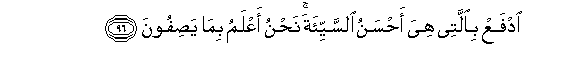
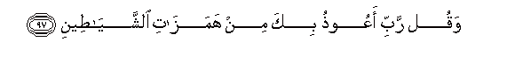
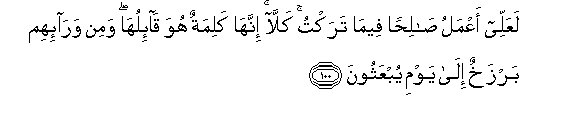
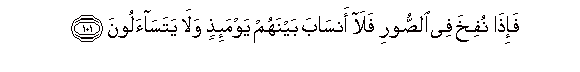
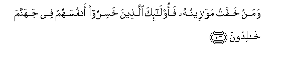
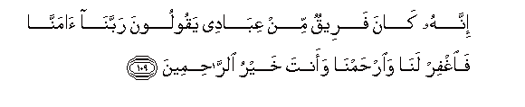
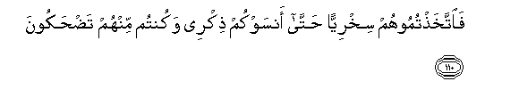
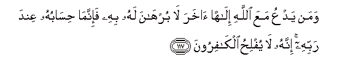
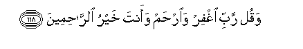

  
[Intangible Textual Heritage](../../index)  [Islam](../index) 
[Index](index)   
[Hypertext Qur'an](../htq/index)  [Unicode](../uq/023.htm#023_093) 
[Palmer](../sbe09/023)  [Pickthall](../pick/023.htm#023_093)  [Yusuf Ali
English](../yaq/yaq023)  [Rodwell](../qr/023)   
  
[Sūra XXIII.: Mu-minūn, or The Believers. Index](023)  
  [Previous](02305)  [Next](02401) 

------------------------------------------------------------------------

  
*The Holy Quran*, tr. by Yusuf Ali, \[1934\], at Intangible Textual
Heritage

------------------------------------------------------------------------

# Sūra XXIII.: Mu-minūn, or The Believers.

### Section 6

------------------------------------------------------------------------

93. Qul rabbi imm<u>a</u> turiyannee m<u>a</u> yooAAadoon**a**

93\. Say: "O my Lord!  
If Thou wilt show me  
(In my lifetime) that which  
They are warned against,—

------------------------------------------------------------------------

94. Rabbi fal<u>a</u> tajAAalnee fee alqawmi
a**l***<u>thth</u>*<u>a</u>limeen**a**

94\. "Then, O my Lord! put me not  
Amongst the people  
Who do wrong!"

------------------------------------------------------------------------

95. Wa-inn<u>a</u> AAal<u>a</u> an nuriyaka m<u>a</u> naAAiduhum
laq<u>a</u>diroon**a**

95\. And We are certainly able  
To show thee (in fulfilment)  
That against which they are warned.

------------------------------------------------------------------------

96. IdfaAA bi**a**llatee hiya a<u>h</u>sanu a**l**ssayyi-ata
na<u>h</u>nu aAAlamu bim<u>a</u> ya<u>s</u>ifoon**a**

96\. Repel evil with that'  
Which is best: We are  
Well acquainted with  
The things they say.

------------------------------------------------------------------------

97. Waqul rabbi aAAoo<u>th</u>u bika min hamaz<u>a</u>ti
a**l**shshay<u>at</u>een**i**

97\. And say "O my Lord!  
I seek refuge with Thee  
From the suggestions  
Of the Evil Ones.

------------------------------------------------------------------------

98. WaaAAoo<u>th</u>u bika rabbi an ya<u>hd</u>uroon**i**

98\. "And I seek refuge with Thee  
O my Lord! lest they  
Should come near me."

------------------------------------------------------------------------

99. <u>H</u>att<u>a</u> i<u>tha</u> j<u>a</u>a a<u>h</u>adahumu almawtu
q<u>a</u>la rabbi irjiAAoon**i**

99\. (In Falsehood will they be)  
Until, when death comes  
To one of them, he says:  
"O my Lord! send me back  
(To life),—

------------------------------------------------------------------------

100. LaAAallee aAAmalu <u>sa</u>li<u>h</u>an feem<u>a</u> taraktu
kall<u>a</u> innah<u>a</u> kalimatun huwa q<u>a</u>-iluh<u>a</u> wamin
war<u>a</u>-ihim barzakhun il<u>a</u> yawmi yubAAathoon**a**

100\. "In order that I may  
Work righteousness in the things  
I neglected."—"By no means!  
It is but a word he says."—  
Before them is a Partition  
Till the Day they are  
Raised up.

------------------------------------------------------------------------

101. Fa-i<u>tha</u> nufikha fee a**l**<u>ss</u>oori fal<u>a</u>
ans<u>a</u>ba baynahum yawma-i<u>th</u>in wal<u>a</u>
yatas<u>a</u>aloon**a**

101\. When the Trumpet  
Is blown, there will be  
No more relationships  
Between them that day,  
Nor will one ask after another!

------------------------------------------------------------------------

102. Faman thaqulat maw<u>a</u>zeenuhu faol<u>a</u>-ika humu
almufli<u>h</u>oon**a**

102\. Then those whose balance  
(Of good deeds) is heavy,—  
They will attain salvation:

------------------------------------------------------------------------

103. Waman khaffat maw<u>a</u>zeenuhu faol<u>a</u>-ika alla<u>th</u>eena
khasiroo anfusahum fee jahannama kh<u>a</u>lidoon**a**

103\. But those whose balance  
Is light, will be those  
Who have lost their souls;  
In Hell will they abide.

------------------------------------------------------------------------

104. Talfa<u>h</u>u wujoohahumu a**l**nn<u>a</u>ru wahum feeh<u>a</u>
k<u>a</u>li<u>h</u>oon**a**

104\. The Fire will burn their faces,  
And they will therein  
Grin, with their lips displaced.

------------------------------------------------------------------------

105. Alam takun <u>a</u>y<u>a</u>tee tutl<u>a</u> AAalaykum fakuntum
bih<u>a</u> tuka<u>thth</u>iboon**a**

105\. "Were not My Signs rehearsed  
To you, and ye did but  
Treat them as falsehoods?"

------------------------------------------------------------------------

106. Q<u>a</u>loo rabban<u>a</u> ghalabat AAalayn<u>a</u>
shiqwatun<u>a</u> wakunn<u>a</u> qawman <u>da</u>lleen**a**

106\. They will say: "Our Lord!  
Our misfortune overwhelmed us,  
And we became a people  
Astray!

------------------------------------------------------------------------

107. Rabban<u>a</u> akhrijn<u>a</u> minh<u>a</u> fa-in AAudn<u>a</u>
fa-inn<u>a</u> *<u>th</u>*<u>a</u>limoon**a**

107\. "Our Lord! Bring us out  
Of this: if ever we return  
(To evil), then shall we be  
Wrong-doers indeed!"

------------------------------------------------------------------------

108. Q<u>a</u>la ikhsaoo feeh<u>a</u> wal<u>a</u> tukallimoon**i**

108\. He will say: "Be ye  
Driven into it (with ignominy)!  
And speak ye not to Me!

------------------------------------------------------------------------

109. Innahu k<u>a</u>na fareequn min AAib<u>a</u>dee yaqooloona
rabban<u>a</u> <u>a</u>mann<u>a</u> fa**i**ghfir lan<u>a</u>
wa**i**r<u>h</u>amn<u>a</u> waanta khayru a**l**rr<u>ah</u>imeen**a**

109\. "A part of My servants  
There was, who used to pray,  
'Our Lord! we believe;  
Then do Thou forgive us,  
And have mercy upon us:  
For Thou art the Best  
Of those who show mercy!'

------------------------------------------------------------------------

110. Fa**i**ttakha<u>th</u>tumoohum sikhriyyan <u>h</u>att<u>a</u>
ansawkum <u>th</u>ikree wakuntum minhum ta<u>dh</u>akoon**a**

110\. "But ye treated them  
With ridicule, so much so  
That (ridicule of) them made you  
Forget My Message while  
Ye were laughing at them!

------------------------------------------------------------------------

111. Innee jazaytuhumu alyawma bim<u>a</u> <u>s</u>abaroo annahum humu
alf<u>a</u>-izoon**a**

111\. "I have rewarded them  
This day for their patience  
And constancy: they are indeed  
The ones that have achieved Bliss:.."

------------------------------------------------------------------------

112. Q<u>a</u>la kam labithtum fee al-ar<u>d</u>i AAadada sineen**a**

112\. He will say: "What number  
Of years did ye stay  
On earth?"

------------------------------------------------------------------------

113. Q<u>a</u>loo labithn<u>a</u> yawman aw baAA<u>d</u>a yawmin
fa**i**s-ali alAA<u>a</u>ddeen**a**

113\. They will say: "We stayed  
A day or part of a day:  
But ask those who  
Keep account."

------------------------------------------------------------------------

114. Q<u>a</u>la in labithtum ill<u>a</u> qaleelan law annakum kuntum
taAAlamoon**a**

114\. He will say: "Ye stayed  
Not but a little,—  
If ye had only known!

------------------------------------------------------------------------

115. Afa<u>h</u>asibtum annam<u>a</u> khalaqn<u>a</u>kum AAabathan
waannakum ilayn<u>a</u> l<u>a</u> turjaAAoon**a**

115\. "Did ye then think  
That We had created you  
In jest, and that ye  
Would not be brought back  
To Us (for account)?"

------------------------------------------------------------------------

116. FataAA<u>a</u>l<u>a</u> All<u>a</u>hu almaliku al<u>h</u>aqqu
l<u>a</u> il<u>a</u>ha ill<u>a</u> huwa rabbu alAAarshi alkareem**i**

116\. Therefore exalted be God,  
The King, the Reality:  
There is no god but He,  
The Lord of the Throne  
Of Honour!

------------------------------------------------------------------------

117. Waman yadAAu maAAa All<u>a</u>hi il<u>a</u>han <u>a</u>khara
l<u>a</u> burh<u>a</u>na lahu bihi fa-innam<u>a</u>
<u>h</u>is<u>a</u>buhu AAinda rabbihi innahu l<u>a</u> yufli<u>h</u>u
alk<u>a</u>firoon**a**

117\. If anyone invokes, besides God,  
Any other god, he has  
No authority therefor;  
And his reckoning will be  
Only with his Lord!  
And verily the Unbelievers  
Will fail to win through

------------------------------------------------------------------------

118. Waqul rabbi ighfir wa**i**r<u>h</u>am waanta khayru
a**l**rr<u>ah</u>imeen**a**

118\. So say: "O my Lord!  
Grant Thou forgiveness and mercy!  
For Thou art the Best  
Of those who show mercy!"

------------------------------------------------------------------------

[Next: Section 1 (1-10)](02401)

