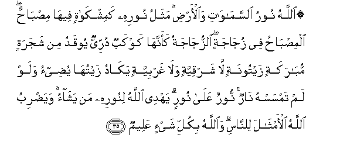
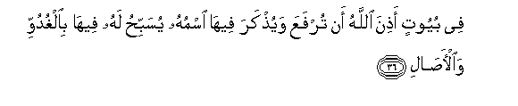
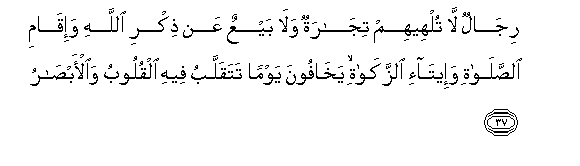
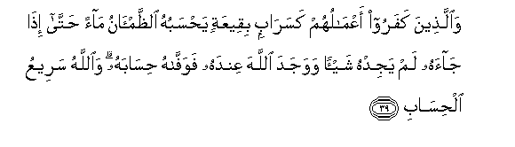
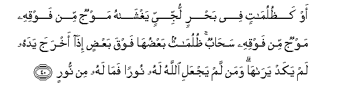

  
[Intangible Textual Heritage](../../index)  [Islam](../index) 
[Index](index)   
[Hypertext Qur'an](../htq/index)  [Unicode](../uq/024.htm#024_035) 
[Palmer](../sbe09/024)  [Pickthall](../pick/024.htm#024_035)  [Yusuf Ali
English](../yaq/yaq024)  [Rodwell](../qr/024)   
  
[Sūra XXIV.: Nūr, or Light. Index](024)  
  [Previous](02404)  [Next](02406) 

------------------------------------------------------------------------

  
*The Holy Quran*, tr. by Yusuf Ali, \[1934\], at Intangible Textual
Heritage

------------------------------------------------------------------------

# Sūra XXIV.: Nūr, or Light.

### Section 5

------------------------------------------------------------------------

35. All<u>a</u>hu nooru a**l**ssam<u>a</u>w<u>a</u>ti
wa**a**l-ar<u>d</u>i mathalu noorihi kamishk<u>a</u>tin feeh<u>a</u>
mi<u>s</u>b<u>ah</u>un almi<u>s</u>b<u>ah</u>u fee zuj<u>a</u>jatin
a**l**zzuj<u>a</u>jatu kaannah<u>a</u> kawkabun durriyyun yooqadu min
shajaratin mub<u>a</u>rakatin zaytoonatin l<u>a</u> sharqiyyatin
wal<u>a</u> gharbiyyatin yak<u>a</u>du zaytuh<u>a</u> yu<u>d</u>ee-o
walaw lam tamsas-hu n<u>a</u>run noorun AAal<u>a</u> noorin yahdee
All<u>a</u>hu linoorihi man yash<u>a</u>o waya<u>d</u>ribu All<u>a</u>hu
al-amth<u>a</u>la li**l**nn<u>a</u>si wa**A**ll<u>a</u>hu bikulli
shay-in AAaleem**un**

35\. God is the Light  
Of the heavens and the earth.  
The parable of His Light  
Is as if there were a Niche  
And within it a Lamp:  
The Lamp enclosed in Glass:  
The glass as it were  
A brilliant star:  
Lit from a blessed Tree,  
An Olive, neither of the East  
Nor of the West,  
Whose Oil is well-nigh  
Luminous,  
Though fire scarce touched it  
Light upon Light!  
God doth guide  
Whom He will  
To His Light:  
God doth set forth Parables  
For men: and God  
Doth know all things.

------------------------------------------------------------------------

36. Fee buyootin a<u>th</u>ina All<u>a</u>hu an turfaAAa
wayu<u>th</u>kara feeh<u>a</u> ismuhu yusabbi<u>h</u>u lahu feeh<u>a</u>
bi**a**lghuduwwi wa**a**l-<u>asa</u>l**i**

36\. (Lit is such a Light)  
In houses, which God  
Hath permitted to be raised  
To honour; for the celebration,  
In them, of His name:  
In them is He glorified  
In the mornings and  
In the evenings, (again and again),

------------------------------------------------------------------------

37. Rij<u>a</u>lun l<u>a</u> tulheehim tij<u>a</u>ratun wal<u>a</u>
bayAAun AAan <u>th</u>ikri All<u>a</u>hi wa-iq<u>a</u>mi
a**l**<u>ss</u>al<u>a</u>ti wa-eet<u>a</u>-i a**l**zzak<u>a</u>ti
yakh<u>a</u>foona yawman tataqallabu feehi alquloobu
wa**a**l-ab<u>sa</u>r**u**

37\. By men whom neither  
Traffic nor merchandise  
Can divert from the Remembrance  
Of God, nor from regular Prayer,  
Nor from the practice  
Of regular Charity:  
Their (only) fear is  
For the Day when  
Hearts and eyes  
Will be transformed  
(In a world wholly new),—

------------------------------------------------------------------------

38. Liyajziyahumu All<u>a</u>hu a<u>h</u>sana m<u>a</u> AAamiloo
wayazeedahum min fa<u>d</u>lihi wa**A**ll<u>a</u>hu yarzuqu man
yash<u>a</u>o bighayri <u>h</u>is<u>a</u>b**in**

38\. That God may reward them  
According to the best  
Of their deeds, and add  
Even more for them  
Out of His Grace:  
For God doth provide  
For those whom He will,  
Without measure.

------------------------------------------------------------------------

39. Wa**a**lla<u>th</u>eena kafaroo aAAm<u>a</u>luhum kasar<u>a</u>bin
biqeeAAatin ya<u>h</u>sabuhu a**l***<u>thth</u>*am-<u>a</u>nu
m<u>a</u>an <u>h</u>att<u>a</u> i<u>tha</u> j<u>a</u>ahu lam yajidhu
shay-an wawajada All<u>a</u>ha AAindahu fawaff<u>a</u>hu
<u>h</u>is<u>a</u>bahu wa**A**ll<u>a</u>hu sareeAAu
al<u>h</u>is<u>a</u>b**i**

39\. but the Unbelievers,—  
Their deeds are like a mirage  
In sandy deserts, which  
The man parched with thirst  
Mistakes for water; until  
When he comes up to it,  
He finds it to be nothing:  
But he finds God  
(Ever) with him, and God  
Will pay him his account:  
And God is swift  
In taking account.

------------------------------------------------------------------------

40. Aw ka*<u>th</u>*ulum<u>a</u>tin fee ba<u>h</u>rin lujjiyyin
yaghsh<u>a</u>hu mawjun min fawqihi mawjun min fawqihi sa<u>ha</u>bun
*<u>th</u>*ulum<u>a</u>tun baAA<u>d</u>uh<u>a</u> fawqa baAA<u>d</u>in
i<u>tha</u> akhraja yadahu lam yakad yar<u>a</u>h<u>a</u> waman lam
yajAAali All<u>a</u>hu lahu nooran fam<u>a</u> lahu min noor**in**

40\. Or (the Unbelievers’ state)  
Is like the depths of darkness  
In a vast deep ocean,  
Overwhelmed with billow  
Topped by billow,  
Topped by (dark) clouds:  
Depths of darkness, one  
Above another: if a man  
Stretches out his hand,  
He can hardly see it!  
For any to whom God  
Giveth not light,  
There is no light!

------------------------------------------------------------------------

[Next: Section 6 (41-50)](02406)

