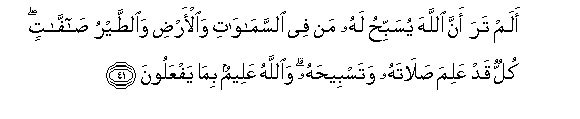
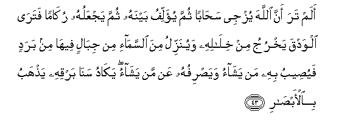
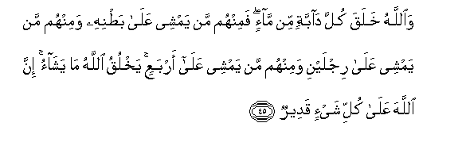
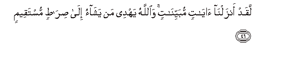
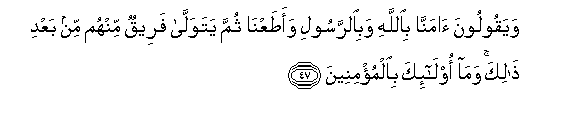
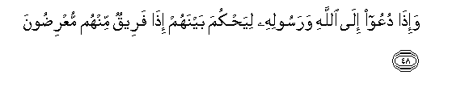
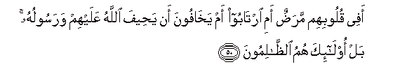

  
[Intangible Textual Heritage](../../index)  [Islam](../index) 
[Index](index)   
[Hypertext Qur'an](../htq/index)  [Unicode](../uq/024.htm#024_041) 
[Palmer](../sbe09/024)  [Pickthall](../pick/024.htm#024_041)  [Yusuf Ali
English](../yaq/yaq024)  [Rodwell](../qr/024)   
  
[Sūra XXIV.: Nūr, or Light. Index](024)  
  [Previous](02405)  [Next](02407) 

------------------------------------------------------------------------

  
*The Holy Quran*, tr. by Yusuf Ali, \[1934\], at Intangible Textual
Heritage

------------------------------------------------------------------------

# Sūra XXIV.: Nūr, or Light.

### Section 6

------------------------------------------------------------------------

41. Alam tara anna All<u>a</u>ha yusabbi<u>h</u>u lahu man fee
a**l**ssam<u>a</u>w<u>a</u>ti wa**a**l-ar<u>d</u>i wa**al**<u>tt</u>ayru
<u>sa</u>ff<u>a</u>tin kullun qad AAalima <u>s</u>al<u>a</u>tahu
watasbee<u>h</u>ahu wa**A**ll<u>a</u>hu AAaleemun bim<u>a</u>
yafAAaloon**a**

41\. Seest thou not that it is  
God Whose praises all beings  
In the heavens and on earth  
Do celebrate, and the birds  
(Of the air) with wings  
Outspread? Each one knows  
Its own (mode of) prayer  
And praise. And God  
Knows well all that they do.

------------------------------------------------------------------------

42. Walill<u>a</u>hi mulku a**l**ssam<u>a</u>w<u>a</u>ti
wa**a**l-ar<u>d</u>i wa-il<u>a</u> All<u>a</u>hi alma<u>s</u>eer**u**

42\. Yea, to God belongs  
The dominion of the heavens  
And the earth; and to God  
Is the final goal (of all).

------------------------------------------------------------------------

43. Alam tara anna All<u>a</u>ha yuzjee sa<u>ha</u>ban thumma yu-allifu
baynahu thumma yajAAaluhu ruk<u>a</u>man fatar<u>a</u> alwadqa yakhruju
min khil<u>a</u>lihi wayunazzilu mina a**l**ssam<u>a</u>-i min
jib<u>a</u>lin feeh<u>a</u> min baradin fayu<u>s</u>eebu bihi man
yash<u>a</u>o waya<u>s</u>rifuhu AAan man yash<u>a</u>o yak<u>a</u>du
san<u>a</u> barqihi ya<u>th</u>habu bi**a**l-ab<u>sa</u>r**i**

43\. Seest thou not that God  
Makes the clouds move  
Gently, then joins them  
Together, then makes them  
Into a heap?—then wilt thou  
See rain issue forth  
From their midst. And He  
Sends down from the sky  
Mountain masses (of clouds)  
Wherein is hail: He strikes  
Therewith whom He pleases  
And He turns it away  
From whom He pleases.  
The vivid flash of His lightning  
Well-nigh blinds the sight.

------------------------------------------------------------------------

44. Yuqallibu All<u>a</u>hu allayla wa**al**nnah<u>a</u>ra inna fee
<u>tha</u>lika laAAibratan li-olee al-ab<u>sa</u>r**i**

44\. It is God Who alternates  
The Night and the Day:  
Verily in these things  
Is an instructive example  
For those who have vision!

------------------------------------------------------------------------

45. Wa**A**ll<u>a</u>hu khalaqa kulla d<u>a</u>bbatin min m<u>a</u>-in
faminhum man yamshee AAal<u>a</u> ba<u>t</u>nihi waminhum man yamshee
AAal<u>a</u> rijlayni waminhum man yamshee AAal<u>a</u> arbaAAin
yakhluqu All<u>a</u>hu m<u>a</u> yash<u>a</u>o inna All<u>a</u>ha
AAal<u>a</u> kulli shay-in qadeer**un**

45\. And God has created  
Every animal from water: sort  
Of them there are some  
That creep on their bellies;  
Some that walk on two legs;  
And some that walk on four.  
God creates what He wills;  
For verily God has power  
Over all things.

------------------------------------------------------------------------

46. Laqad anzaln<u>a</u> <u>a</u>y<u>a</u>tin mubayyin<u>a</u>tin
wa**A**ll<u>a</u>hu yahdee man yash<u>a</u>o il<u>a</u>
<u>s</u>ir<u>at</u>in mustaqeem**in**

46\. We have indeed sent down  
Signs that make things manifest:  
And God guides whom He wills  
To a Way that is straight.

------------------------------------------------------------------------

47. Wayaqooloona <u>a</u>mann<u>a</u> bi**A**ll<u>a</u>hi
wabi**al**rrasooli waa<u>t</u>aAAn<u>a</u> thumma yatawall<u>a</u>
fareequn minhum min baAAdi <u>tha</u>lika wam<u>a</u> ol<u>a</u>-ika
bi**a**lmu/mineen**a**

47\. They say, "We believe  
In God and in the Apostle,  
And we obey": but  
Even after that, some of them  
Turn away: they are not  
(Really) Believers.

------------------------------------------------------------------------

48. Wa-i<u>tha</u> duAAoo il<u>a</u> All<u>a</u>hi warasoolihi
liya<u>h</u>kuma baynahum i<u>tha</u> fareequn minhum
muAAri<u>d</u>oon**a**

48\. When they are summoned  
To God and His Apostle,  
In order that he may judge  
Between them, behold, some  
Of them decline (to come).

------------------------------------------------------------------------

49. Wa-in yakun lahumu al<u>h</u>aqqu ya/too ilayhi
mu<u>th</u>AAineen**a**

49\. But if the right is  
On their side, they come  
To him with all submission

------------------------------------------------------------------------

50. Afee quloobihim mara<u>d</u>un ami irt<u>a</u>boo am
yakh<u>a</u>foona an ya<u>h</u>eefa All<u>a</u>hu AAalayhim warasooluhu
bal ol<u>a</u>-ika humu a**l***<u>thth</u>*<u>a</u>limoon**a**

50\. Is it that there is  
A disease in their hearts  
Or do they doubt,  
Or are they in fear,  
That God and His Apostle  
Will deal unjustly with them?  
Nay, it is they themselves  
Who do wrong.

------------------------------------------------------------------------

[Next: Section 7 (51-57)](02407)

