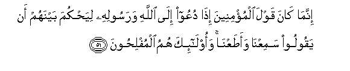
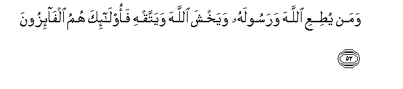
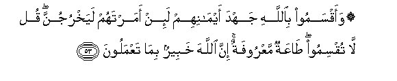
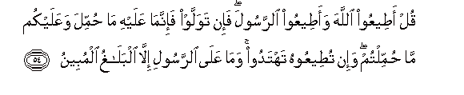
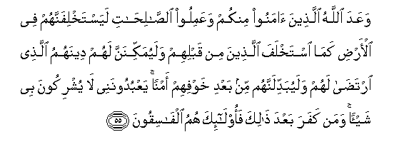
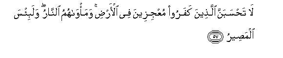

  
[Intangible Textual Heritage](../../index)  [Islam](../index) 
[Index](index)   
[Hypertext Qur'an](../htq/index)  [Unicode](../uq/024.htm#024_051) 
[Palmer](../sbe09/024)  [Pickthall](../pick/024.htm#024_051)  [Yusuf Ali
English](../yaq/yaq024)  [Rodwell](../qr/024)   
  
[Sūra XXIV.: Nūr, or Light. Index](024)  
  [Previous](02406)  [Next](02408) 

------------------------------------------------------------------------

  
*The Holy Quran*, tr. by Yusuf Ali, \[1934\], at Intangible Textual
Heritage

------------------------------------------------------------------------

# Sūra XXIV.: Nūr, or Light.

### Section 7

------------------------------------------------------------------------

51. Innam<u>a</u> k<u>a</u>na qawla almu/mineena i<u>tha</u> duAAoo
il<u>a</u> All<u>a</u>hi warasoolihi liya<u>h</u>kuma baynahum an
yaqooloo samiAAn<u>a</u> waa<u>t</u>aAAn<u>a</u> waol<u>a</u>-ika humu
almufli<u>h</u>oon**a**

51\. The answer of the Believers,  
When summoned to God  
And His Apostle, in order  
That he may judge between them,  
Is no other than this:  
They say, "We hear and we obey":  
It is such as these  
That will attain felicity.

------------------------------------------------------------------------

52. Waman yu<u>t</u>iAAi All<u>a</u>ha warasoolahu wayakhsha
All<u>a</u>ha wayattaqhi faol<u>a</u>-ika humu alf<u>a</u>-izoon**a**

52\. It is such as obey  
God and His Apostle,  
And fear God and do  
Right, that will win  
(In the end).

------------------------------------------------------------------------

53. Waaqsamoo bi**A**ll<u>a</u>hi jahda aym<u>a</u>nihim la-in amartahum
layakhrujunna qul l<u>a</u> tuqsimoo <u>ta</u>AAatun maAAroofatun inna
All<u>a</u>ha khabeerun bim<u>a</u> taAAmaloon**a**

53\. They swear their strongest oaths  
By God that, if only thou  
Wouldst command them, they  
Would leave (their homes).  
Say: "Swear ye not;  
Obedience is (more) reasonable;  
Verily, God is well acquainted  
With all that ye do."

------------------------------------------------------------------------

54. Qul a<u>t</u>eeAAoo All<u>a</u>ha waa<u>t</u>eeAAoo a**l**rrasoola
fa-in tawallaw fa-innam<u>a</u> AAalayhi m<u>a</u> <u>h</u>ummila
waAAalaykum m<u>a</u> <u>h</u>ummiltum wa-in tu<u>t</u>eeAAoohu tahtadoo
wam<u>a</u> AAal<u>a</u> a**l**rrasooli ill<u>a</u> albal<u>a</u>ghu
almubeen**a**

54\. Say: "Obey God, and obey  
The Apostle: but if ye turn  
Away, he is only responsible  
For the duty placed on him  
And ye for that placed  
On you. If ye obey him,  
Ye shall be on right guidance.  
The Apostle's duty is only  
To preach the clear (Message).

------------------------------------------------------------------------

55. WaAAada All<u>a</u>hu alla<u>th</u>eena <u>a</u>manoo minkum
waAAamiloo a**l**<u>ssa</u>li<u>ha</u>ti layastakhlifannahum fee
al-ar<u>d</u>i kam<u>a</u> istakhlafa alla<u>th</u>eena min qablihim
walayumakkinanna lahum deenahumu alla<u>th</u>ee irta<u>da</u> lahum
walayubaddilannahum min baAAdi khawfihim amnan yaAAbudoonanee l<u>a</u>
yushrikoona bee shay-an waman kafara baAAda <u>tha</u>lika
faol<u>a</u>-ika humu alf<u>a</u>siqoon**a**

55\. God has promised, to those  
Among you who believe  
And work righteous deeds, that He  
Will, of a surety, grant them  
In the land, inheritance  
(Of power), as He granted it  
To those before them; that  
He will establish in authority  
Their religion—the one  
Which He has chosen for them;  
And that He will change  
(Their state), after the fear  
In which they (lived), to one  
Of security and peace:  
'They will worship Me (alone)  
And not associate aught with Me.'  
If any do reject Faith  
After this, they are  
Rebellious and wicked.

------------------------------------------------------------------------

56. Waaqeemoo a**l**<u>ss</u>al<u>a</u>ta wa<u>a</u>too
a**l**zzak<u>a</u>ta waa<u>t</u>eeAAoo a**l**rrasoola laAAallakum
tur<u>h</u>amoon**a**

56\. So establish regular Prayer  
And give regular Charity;  
And obey the Apostle;  
That ye may receive mercy.

------------------------------------------------------------------------

57. L<u>a</u> ta<u>h</u>sabanna alla<u>th</u>eena kafaroo muAAjizeena
fee al-ar<u>d</u>i wama/w<u>a</u>humu a**l**nn<u>a</u>ru walabi/sa
alma<u>s</u>eer**u**

57\. Never think thou  
That the Unbelievers  
Are going to frustrate  
(God's Plan) on earth:  
Their abode is the Fire,—  
And it is indeed  
An evil refuge!

------------------------------------------------------------------------

[Next: Section 8 (58-61)](02408)

