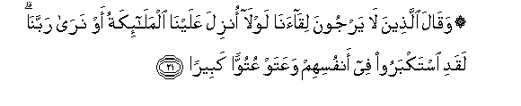
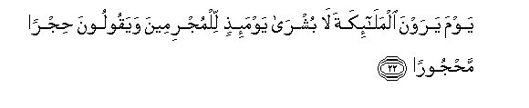
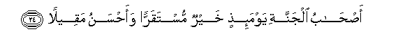
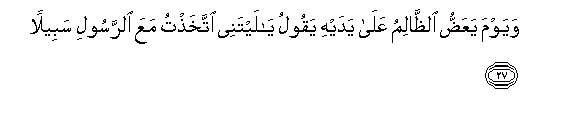
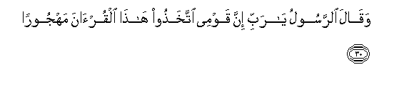
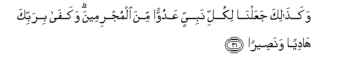
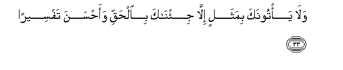

  
[Intangible Textual Heritage](../../index)  [Islam](../index) 
[Index](index)   
[Hypertext Qur'an](../htq/index)  [Unicode](../uq/025.htm#025_021) 
[Palmer](../sbe09/025)  [Pickthall](../pick/025.htm#025_021)  [Yusuf Ali
English](../yaq/yaq025)  [Rodwell](../qr/025)   
  
[Sūra XXV.: Furqān, or The Criterion. Index](025)  
  [Previous](02502)  [Next](02504) 

------------------------------------------------------------------------

  
*The Holy Quran*, tr. by Yusuf Ali, \[1934\], at Intangible Textual
Heritage

------------------------------------------------------------------------

# Sūra XXV.: Furqān, or The Criterion.

### Section 3

------------------------------------------------------------------------

21. Waq<u>a</u>la alla<u>th</u>eena l<u>a</u> yarjoona
liq<u>a</u>an<u>a</u> lawl<u>a</u> onzila AAalayn<u>a</u>
almal<u>a</u>-ikatu aw nar<u>a</u> rabban<u>a</u> laqadi istakbaroo fee
anfusihim waAAataw AAutuwwan kabeer<u>a</u>**n**

21\. Such as fear not  
The meeting with Us  
(For Judgment) say:  
"Why are not the angels  
Sent down to us, or  
(Why) do we not see  
Our Lord?" Indeed they  
Have an arrogant conceit  
Of themselves, and mighty  
Is the insolence of their impiety!

------------------------------------------------------------------------

22. Yawma yarawna almal<u>a</u>-ikata l<u>a</u> bushr<u>a</u>
yawma-i<u>th</u>in lilmujrimeena wayaqooloona <u>h</u>ijran
ma<u>h</u>joor<u>a</u>**n**

22\. The Day they see the angels,—  
No joy will there be  
To the sinners that Day:  
The (angels) will say:  
"There is a barrier  
Forbidden (to you) altogether!

------------------------------------------------------------------------

23. Waqadimn<u>a</u> il<u>a</u> m<u>a</u> AAamiloo min AAamalin
fajaAAaln<u>a</u>hu hab<u>a</u>an manthoor<u>a</u>**n**

23\.

------------------------------------------------------------------------

24. A<u>s</u>-<u>ha</u>bu aljannati yawma-i<u>th</u>in khayrun
mustaqarran waa<u>h</u>sanu maqeel<u>a</u>**n**

24\. The Companions of the Garden  
Will be well, that Day,  
In their abode, and have  
The fairest of places for repose:

------------------------------------------------------------------------

25. Wayawma tashaqqaqu a**l**ssam<u>a</u>o bi**a**lgham<u>a</u>mi
wanuzzila almal<u>a</u>-ikatu tanzeel<u>a</u>**n**

25\. The Day the heaven shall be  
Rent asunder with clouds,  
And angels shall be sent down,  
Descending (in ranks),—

------------------------------------------------------------------------

26. Almulku yawma-i<u>th</u>in al<u>h</u>aqqu
li**l**rra<u>h</u>m<u>a</u>ni wak<u>a</u>na yawman AAal<u>a</u>
alk<u>a</u>fireena AAaseer<u>a</u>**n**

26\. That Day, the dominion  
As of right and truth,  
Shall be (wholly) for (God)  
Most Merciful: it will be  
A Day of dire difficulty  
For the Misbelievers.

------------------------------------------------------------------------

27. Wayawma yaAAa<u>dd</u>u a**l***<u>thth</u>*<u>a</u>limu AAal<u>a</u>
yadayhi yaqoolu y<u>a</u> laytanee ittakha<u>th</u>tu maAAa
a**l**rrasooli sabeel<u>a</u>**n**

27\. I the Day that the wrong-doer  
Will bite at his hands,  
He will say, "Oh! would that  
I had taken a (straight) path  
With the Apostle!

------------------------------------------------------------------------

28. Y<u>a</u> waylat<u>a</u> laytanee lam attakhi<u>th</u>
ful<u>a</u>nan khaleel<u>a</u>**n**

28\. "Ah! woe is me!  
Would that I had never  
Taken such a one  
For a friend!

------------------------------------------------------------------------

29. Laqad a<u>d</u>allanee AAani a**l**<u>thth</u>ikri baAAda i<u>th</u>
j<u>a</u>anee wak<u>a</u>na a**l**shshay<u>ta</u>nu lil-ins<u>a</u>ni
kha<u>th</u>ool<u>a</u>**n**

29\. "He did lead me astray  
From the Message (of God)  
After it had come to me!  
Ah! the Evil One is  
But a traitor to man!  
Then the Apostle will say:

------------------------------------------------------------------------

30. Waq<u>a</u>la a**l**rrasoolu y<u>a</u> rabbi inna qawmee
ittakha<u>th</u>oo h<u>atha</u> alqur-<u>a</u>na mahjoor<u>a</u>**n**

30\. "

------------------------------------------------------------------------

31. Waka<u>tha</u>lika jaAAaln<u>a</u> likulli nabiyyin AAaduwwan mina
almujrimeena wakaf<u>a</u> birabbika h<u>a</u>diyan
wana<u>s</u>eer<u>a</u>**n**

31\. Thus have We made  
For every prophet an enemy  
Among the sinners: but enough  
Is thy Lord to guide  
And to help.

------------------------------------------------------------------------

32. Waq<u>a</u>la alla<u>th</u>eena kafaroo lawl<u>a</u> nuzzila
AAalayhi alqur-<u>a</u>nu jumlatan w<u>ah</u>idatan ka<u>tha</u>lika
linuthabbita bihi fu-<u>a</u>daka warattaln<u>a</u>hu
tarteel<u>a</u>**n**

32\. Whose who reject Faith  
Say: "Why is not the Qur-ān  
Revealed to him all at once?  
Thus (is it revealed), that We  
May strengthen thy heart  
Thereby, and We have  
Rehearsed it to thee in slow,  
Well-arranged stages, gradually.

------------------------------------------------------------------------

33. Wal<u>a</u> ya/toonaka bimathalin ill<u>a</u> ji/n<u>a</u>ka
bi**a**l<u>h</u>aqqi waa<u>h</u>sana tafseer<u>a</u>**n**

33\. And no question do they  
Bring to thee but We  
Reveal to thee the truth  
And the best explanation (thereof),

------------------------------------------------------------------------

34. Alla<u>th</u>eena yu<u>h</u>sharoona AAal<u>a</u> wujoohihim
il<u>a</u> jahannama ol<u>a</u>-ika sharrun mak<u>a</u>nan
waa<u>d</u>allu sabeel<u>a</u>**n**

34\. Whose who will be gathered  
To Hell (prone) on their faces,—  
They will be in an evil  
Plight, and, as to Path,  
Most astray.

------------------------------------------------------------------------

[Next: Section 4 (35-44)](02504)

