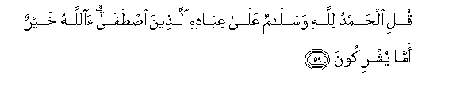
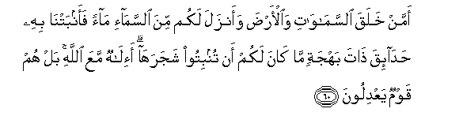
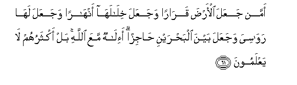
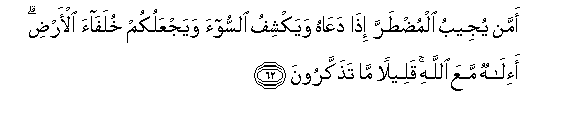
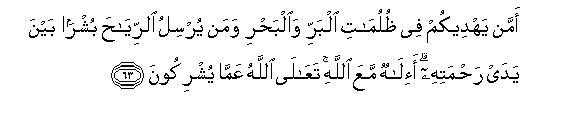
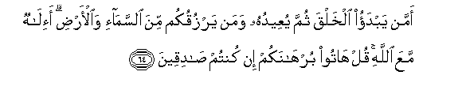
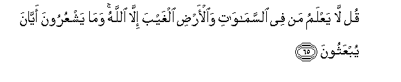
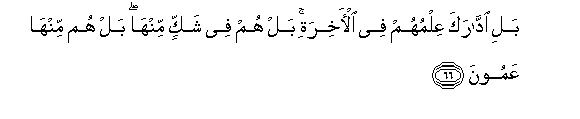

  
[Intangible Textual Heritage](../../index)  [Islam](../index) 
[Index](index)   
[Hypertext Qur'an](../htq/index)  [Unicode](../uq/027.htm#027_059) 
[Palmer](../sbe09/027)  [Pickthall](../pick/027.htm#027_059)  [Yusuf Ali
English](../yaq/yaq027)  [Rodwell](../qr/027)   
  
[Sūra XXVII.: Naml, or the Ants. Index](027)  
  [Previous](02704)  [Next](02706) 

------------------------------------------------------------------------

  
*The Holy Quran*, tr. by Yusuf Ali, \[1934\], at Intangible Textual
Heritage

------------------------------------------------------------------------

# Sūra XXVII.: Naml, or the Ants.

### Section 5

------------------------------------------------------------------------

59. Quli al<u>h</u>amdu lill<u>a</u>hi wasal<u>a</u>mun AAal<u>a</u>
AAib<u>a</u>dihi alla<u>th</u>eena i<u>st</u>af<u>a</u>
<u>a</u>ll<u>a</u>hu khayrun amm<u>a</u> yushrikoon**a**

59\. Say: Praise be to God,  
And Peace on His servants  
Whom He has chosen  
(For His Message). (Who)  
Is better?—God or  
The false gods they associate  
(With Him)?

------------------------------------------------------------------------

60. Amman khalaqa a**l**ssam<u>a</u>w<u>a</u>ti wa**a**l-ar<u>d</u>a
waanzala lakum mina a**l**ssam<u>a</u>-i m<u>a</u>an faanbatn<u>a</u>
bihi <u>h</u>ad<u>a</u>-iqa <u>tha</u>ta bahjatin m<u>a</u> k<u>a</u>na
lakum an tunbitoo shajarah<u>a</u> a-il<u>a</u>hun maAAa All<u>a</u>hi
bal hum qawmun yaAAdiloon**a**

60\. Or, who has created  
The heavens and the earth,  
And who sends you down  
Rain from the sky?  
Yea, with it We cause  
To grow well-planted orchards  
Full of beauty and delight:  
It is not in your power  
To cause the growth  
Of the trees in them. (Can there be  
Another) god besides God?  
Nay, they are a people  
Who swerve from justice.

------------------------------------------------------------------------

61. Amman jaAAala al-ar<u>d</u>a qar<u>a</u>ran wajaAAala
khil<u>a</u>lah<u>a</u> anh<u>a</u>ran wajaAAala lah<u>a</u>
raw<u>a</u>siya wajaAAala bayna alba<u>h</u>rayni <u>ha</u>jizan
a-il<u>a</u>hun maAAa All<u>a</u>hi bal aktharuhum l<u>a</u>
yaAAlamoon**a**

61\. Or, who has made the earth  
Firm to live in; made  
Rivers in its midst; set  
Thereon mountains immovable;  
And made a separating bar  
Between the two bodies  
Of flowing water?  
(Can there be another) god  
Besides God? Nay, most  
Of them know not.

------------------------------------------------------------------------

62. Amman yujeebu almu<u>dt</u>arra i<u>tha</u> daAA<u>a</u>hu
wayakshifu a**l**ssoo-a wayajAAalukum khulaf<u>a</u>a al-ar<u>d</u>i
a-il<u>a</u>hun maAAa All<u>a</u>hi qaleelan m<u>a</u>
ta<u>th</u>akkaroon**a**

62\. Or, who listens to the (soul)  
Distressed when it calls  
On Him, and who relieves  
Its suffering, and makes you  
(Mankind) inheritors of the earth?'  
(Can there be another) god  
Besides God? Little it is  
That ye heed!

------------------------------------------------------------------------

63. Amman yahdeekum fee *<u>th</u>*ulum<u>a</u>ti albarri
wa**a**lba<u>h</u>ri waman yursilu a**l**rriy<u>ah</u>a bushran bayna
yaday ra<u>h</u>matihi a-il<u>a</u>hun maAAa All<u>a</u>hi
taAA<u>a</u>l<u>a</u> All<u>a</u>hu AAamm<u>a</u> yushrikoon**a**

63\. Or, who guides you  
Through the depths of darkness  
On land and sea, and who  
Sends the winds as heralds  
Of glad tidings, going before  
His Mercy? (Can there be  
Another) god besides God?—  
High is God above what  
They associate with Him!

------------------------------------------------------------------------

64. Amman yabdao alkhalqa thumma yuAAeeduhu waman yarzuqukum mina
a**l**ssam<u>a</u>-i wa**a**l-ar<u>d</u>i a-il<u>a</u>hun maAAa
All<u>a</u>hi qul h<u>a</u>too burh<u>a</u>nakum in kuntum
<u>sa</u>diqeen**a**

64\. Or, who originates Creation,  
Then repeats it,  
And who gives you sustenance  
From heaven and earth?  
(Can there be another) god  
Besides God? Say, "Bring forth  
Your argument, if ye  
Are telling the truth!"

------------------------------------------------------------------------

65. Qul l<u>a</u> yaAAlamu man fee a**l**ssam<u>a</u>w<u>a</u>ti
wa**a**l-ar<u>d</u>i alghayba ill<u>a</u> All<u>a</u>hu wam<u>a</u>
yashAAuroona ayy<u>a</u>na yubAAathoon**a**

65\. Say: None in the heavens  
Or on earth, except God,  
Knows what is hidden:  
Nor can they perceive  
When they shall be raised  
Up (for Judgment).

------------------------------------------------------------------------

66. Bali idd<u>a</u>raka AAilmuhum fee al-<u>a</u>khirati bal hum fee
shakkin minh<u>a</u> bal hum minh<u>a</u> AAamoon**a**

66\. Still less can their knowledge  
Comprehend the Hereafter: nay,  
They are in doubt and uncertainty  
Thereanent; nay, they are blind  
Thereunto!

------------------------------------------------------------------------

[Next: Section 6 (67-82)](02706)

