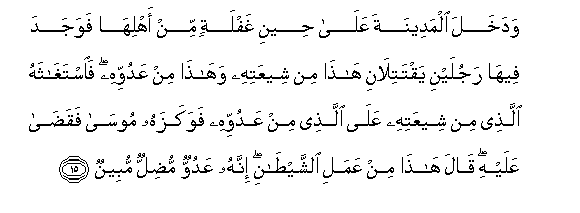
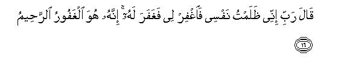
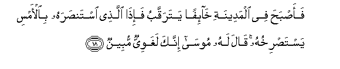
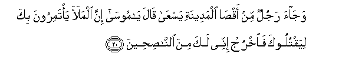

  
[Intangible Textual Heritage](../../index)  [Islam](../index) 
[Index](index)   
[Hypertext Qur'an](../htq/index)  [Unicode](../uq/028.htm#028_014) 
[Palmer](../sbe09/028)  [Pickthall](../pick/028.htm#028_014)  [Yusuf Ali
English](../yaq/yaq028)  [Rodwell](../qr/028)   
  
[Sūra XXVIII.: Qaṣaṣ, or the Narration. Index](028)  
  [Previous](02801)  [Next](02803) 

------------------------------------------------------------------------

  
*The Holy Quran*, tr. by Yusuf Ali, \[1934\], at Intangible Textual
Heritage

------------------------------------------------------------------------

# Sūra XXVIII.: Qaṣaṣ, or the Narration.

### Section 2

------------------------------------------------------------------------

14. Walamm<u>a</u> balagha ashuddahu wa**i**staw<u>a</u>
<u>a</u>tayn<u>a</u>hu <u>h</u>ukman waAAilman waka<u>tha</u>lika najzee
almu<u>h</u>sineen**a**

14\. When he reached full age,  
And was firmly established  
(In life), We bestowed on him  
Wisdom and knowledge: for thus  
Do We reward those  
Who do good.

------------------------------------------------------------------------

15. Wadakhala almadeenata AAal<u>a</u> <u>h</u>eeni ghaflatin min
ahlih<u>a</u> fawajada feeh<u>a</u> rajulayni yaqtatil<u>a</u>ni
h<u>atha</u> min sheeAAatihi wah<u>atha</u> min AAaduwwihi
fa**i**stagh<u>a</u>thahu alla<u>th</u>ee min sheeAAatihi AAal<u>a</u>
alla<u>th</u>ee min AAaduwwihi fawakazahu moos<u>a</u> faqa<u>da</u>
AAalayhi q<u>a</u>la h<u>atha</u> min AAamali a**l**shshay<u>ta</u>ni
innahu AAaduwwun mu<u>d</u>illun mubeen**un**

15\. And he entered the City  
At a time when its people  
Were not watching: and he  
Found there two men fighting,—  
One of his own religion,  
And the other, of his foes.  
Now the man of his own  
Religion appealed to him  
Against his foe, and Moses  
Struck him with his fist  
And made an end of him.  
He said: "This is a work  
Of Evil (Satan): for he is  
An enemy that manifestly  
Misleads!"

------------------------------------------------------------------------

16. Q<u>a</u>la rabbi innee *<u>th</u>*alamtu nafsee fa**i**ghfir lee
faghafara lahu innahu huwa alghafooru a**l**rra<u>h</u>eem**u**

16\. He prayed: "O my Lord!  
I have indeed wronged my soul!  
Do Thou then forgive me!"  
So (God) forgave him: for He  
Is the Oft-Forgiving, Most Merciful.

------------------------------------------------------------------------

17. Q<u>a</u>la rabbi bim<u>a</u> anAAamta AAalayya falan akoona
*<u>th</u>*aheeran lilmujrimeen**a**

17\. He said: "O my Lord!  
For that Thou hast bestowed  
Thy Grace on me, never  
Shall I be a help  
To those who sin!"

------------------------------------------------------------------------

18. Faa<u>s</u>ba<u>h</u>a fee almadeenati kh<u>a</u>-ifan yataraqqabu
fa-i<u>tha</u> alla<u>th</u>ee istan<u>s</u>arahu bi**a**l-amsi
yasta<u>s</u>rikhuhu q<u>a</u>la lahu moos<u>a</u> innaka laghawiyyun
mubeen**un**

18\. So he saw the morning  
In the City, looking about,  
In a state of fear, when  
Behold, the man who had,  
The day before, sought his help  
Called aloud for his help  
(Again). Moses said to him:  
"Thou art truly, it is clear,  
A quarrelsome fellow!"

------------------------------------------------------------------------

19. Falamm<u>a</u> an ar<u>a</u>da an yab<u>t</u>isha
bi**a**lla<u>th</u>ee huwa AAaduwwun lahum<u>a</u> q<u>a</u>la y<u>a</u>
moos<u>a</u> atureedu an taqtulanee kam<u>a</u> qatalta nafsan
bi**a**l-amsi in tureedu ill<u>a</u> an takoona jabb<u>a</u>ran fee
al-ar<u>d</u>i wam<u>a</u> tureedu an takoona mina
almu<u>s</u>li<u>h</u>een**a**

19\. Then, when he decided to lay  
Hold of the man who was  
An enemy to both of them,  
That man said: "O Moses!  
Is it thy intention to slay me  
As thou slewest a man  
Yesterday? Thy intention is  
None other than to become  
A powerful violent man  
In the land, and not to be  
One who sets things right!

------------------------------------------------------------------------

20. Waj<u>a</u>a rajulun min aq<u>sa</u> almadeenati yasAA<u>a</u>
q<u>a</u>la y<u>a</u> moos<u>a</u> inna almalaa ya/tamiroona bika
liyaqtulooka fa**o**khruj innee laka mina
a**l**nn<u>as</u>i<u>h</u>een**a**

20\. And there came a man,  
Running, from the furthest end  
Of the City. He said:  
"O Moses! the Chiefs  
Are taking counsel together  
About thee, to slay thee:  
So get thee away, for I  
Do give thee sincere advice."

------------------------------------------------------------------------

21. Fakharaja minh<u>a</u> kh<u>a</u>-ifan yataraqqabu q<u>a</u>la rabbi
najjinee mina alqawmi a**l***<u>thth</u>*<u>a</u>limeen**a**

21\. He therefore got away therefrom,  
Looking about, in a state  
Of fear. He prayed:  
"O my Lord! save me  
From people given to wrong-doing."

------------------------------------------------------------------------

[Next: Section 3 (22-28)](02803)

