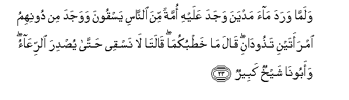
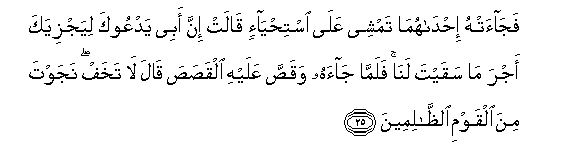

  
[Intangible Textual Heritage](../../index)  [Islam](../index) 
[Index](index)   
[Hypertext Qur'an](../htq/index)  [Unicode](../uq/028.htm#028_022) 
[Palmer](../sbe09/028)  [Pickthall](../pick/028.htm#028_022)  [Yusuf Ali
English](../yaq/yaq028)  [Rodwell](../qr/028)   
  
[Sūra XXVIII.: Qaṣaṣ, or the Narration. Index](028)  
  [Previous](02802)  [Next](02804) 

------------------------------------------------------------------------

  
*The Holy Quran*, tr. by Yusuf Ali, \[1934\], at Intangible Textual
Heritage

------------------------------------------------------------------------

# Sūra XXVIII.: Qaṣaṣ, or the Narration.

### Section 3

------------------------------------------------------------------------

22. Walamm<u>a</u> tawajjaha tilq<u>a</u>a madyana q<u>a</u>la
AAas<u>a</u> rabbee an yahdiyanee saw<u>a</u>a a**l**ssabeel**i**

22\. When, when he turned his face  
Towards (the land of) Madyan,  
He said: "I do hope  
That my Lord will show me  
The smooth and straight Path."

------------------------------------------------------------------------

23. Walamm<u>a</u> warada m<u>a</u>a madyana wajada AAalayhi ommatan
mina a**l**nn<u>a</u>si yasqoona wawajada min doonihimu imraatayni
ta<u>th</u>ood<u>a</u>ni q<u>a</u>la m<u>a</u> kha<u>t</u>bukum<u>a</u>
q<u>a</u>lat<u>a</u> l<u>a</u> nasqee <u>h</u>att<u>a</u> yu<u>s</u>dira
a**l**rriAA<u>a</u>o waaboon<u>a</u> shaykhun kabeer**un**

23\. And when he arrived at  
The watering (place) in Madyan;  
He found there a group  
Of men watering (their flocks),  
And besides them he found  
Two women who were keeping  
Back (their flocks). He said:  
"What is the matter with you?"  
They said: "We cannot water  
(Our flocks) until the shepherds  
Take back (their flocks):  
And our father is  
A very old man."

------------------------------------------------------------------------

24. Fasaq<u>a</u> lahum<u>a</u> thumma tawall<u>a</u> il<u>a</u>
a**l***<u>thth</u>*illi faq<u>a</u>la rabbi innee lim<u>a</u> anzalta
ilayya min khayrin faqeer**un**

24\. So he watered (their flocks)  
For them; then he turned back  
To the shade, and said:  
"O my Lord!  
Truly am I  
In (desperate) need  
Of any good  
That Thou dost send me!"

------------------------------------------------------------------------

25. Faj<u>a</u>at-hu i<u>h</u>d<u>a</u>hum<u>a</u> tamshee AAal<u>a</u>
isti<u>h</u>y<u>a</u>-in q<u>a</u>lat inna abee yadAAooka liyajziyaka
ajra m<u>a</u> saqayta lan<u>a</u> falamm<u>a</u> j<u>a</u>ahu
waqa<u>ss</u>a AAalayhi alqa<u>s</u>a<u>s</u>a q<u>a</u>la l<u>a</u>
takhaf najawta mina alqawmi a**l***<u>thth</u>*<u>a</u>limeen**a**

25\. Afterwards one of the (damsels)  
Came (back) to him, walking  
Bashfully. She said: "My father  
Invites thee that he may  
Reward thee for having watered  
(Our flocks) for us." So when  
He came to him and narrated  
The story, he said:  
"Fear thou not: (well) hast thou  
Escaped from unjust people."

------------------------------------------------------------------------

26. Q<u>a</u>lat i<u>h</u>d<u>a</u>hum<u>a</u> y<u>a</u> abati
ista/jirhu inna khayra mani ista/jarta alqawiyyu al-ameen**u**

26\. Said one of the (damsels):  
"O my (dear) father! engage  
Him on wages: truly the best  
Of men for thee to employ is  
The (man) who is strong and trusty"…

------------------------------------------------------------------------

27. Q<u>a</u>la innee oreedu an onki<u>h</u>aka i<u>h</u>d<u>a</u>
ibnatayya h<u>a</u>tayni AAal<u>a</u> an ta/juranee tham<u>a</u>niya
<u>h</u>ijajin fa-in atmamta AAashran famin AAindika wam<u>a</u> oreedu
an ashuqqa AAalayka satajidunee in sh<u>a</u>a All<u>a</u>hu mina
a**l**<u>ssa</u>li<u>h</u>een**a**

27\. He said: "I intend to wed  
One of these my daughters  
To thee, on, condition that  
Thou serve me for eight years;  
But if thou complete ten years,  
It will be (grace) from thee.  
But I intend not to place  
Thee under a difficulty:  
Thou wilt find me,  
Indeed, if God wills,  
One of the righteous."

------------------------------------------------------------------------

28. Q<u>a</u>la <u>tha</u>lika baynee wabaynaka ayyam<u>a</u>
al-ajalayni qa<u>d</u>aytu fal<u>a</u> AAudw<u>a</u>na AAalayya
wa**A**ll<u>a</u>hu AAal<u>a</u> m<u>a</u> naqoolu wakeel**un**

28\. He said: "Be that (the agreement)  
Between me and thee:  
Whichever of the two terms  
I fulfil, let there be  
No ill-will to me.  
Be God a witness  
To what we say."

------------------------------------------------------------------------

[Next: Section 4 (29-42)](02804)

