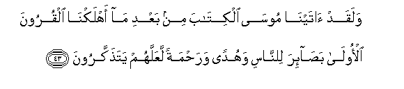
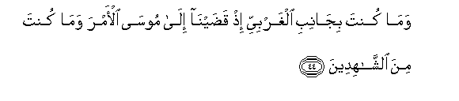
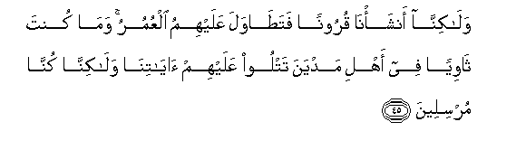
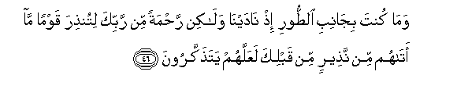
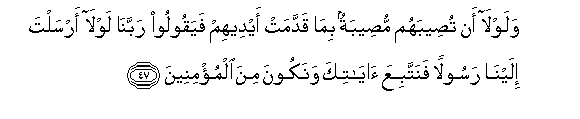
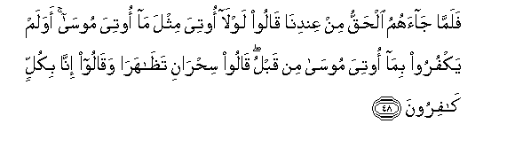
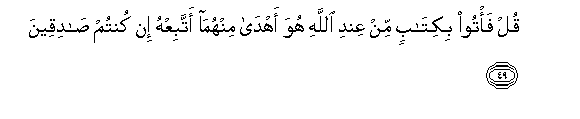
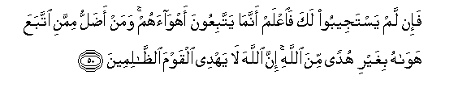

  
[Intangible Textual Heritage](../../index)  [Islam](../index) 
[Index](index)   
[Hypertext Qur'an](../htq/index)  [Unicode](../uq/028.htm#028_043) 
[Palmer](../sbe09/028)  [Pickthall](../pick/028.htm#028_043)  [Yusuf Ali
English](../yaq/yaq028)  [Rodwell](../qr/028)   
  
[Sūra XXVIII.: Qaṣaṣ, or the Narration. Index](028)  
  [Previous](02804)  [Next](02806) 

------------------------------------------------------------------------

  
*The Holy Quran*, tr. by Yusuf Ali, \[1934\], at Intangible Textual
Heritage

------------------------------------------------------------------------

# Sūra XXVIII.: Qaṣaṣ, or the Narration.

### Section 5

------------------------------------------------------------------------

43. Walaqad <u>a</u>tayn<u>a</u> moos<u>a</u> alkit<u>a</u>ba min baAAdi
m<u>a</u> ahlakn<u>a</u> alquroona al-ool<u>a</u> ba<u>sa</u>-ira
li**l**nn<u>a</u>si wahudan wara<u>h</u>matan laAAallahum
yata<u>th</u>akkaroon**a**

43\. We did reveal to Moses  
The Book after We had  
Destroyed the earlier generations,  
(To give) Insight to men,  
And Guidance and Mercy,  
That they might receive admonition.

------------------------------------------------------------------------

44. Wam<u>a</u> kunta bij<u>a</u>nibi algharbiyyi i<u>th</u>
qa<u>d</u>ayn<u>a</u> il<u>a</u> moos<u>a</u> al-amra wam<u>a</u> kunta
mina a**l**shsh<u>a</u>hideen**a**

44\. Thou wast not on the Western  
Side when We decreed  
The Commission to Moses,  
Nor wast thou a witness  
(Of those events).

------------------------------------------------------------------------

45. Wal<u>a</u>kinn<u>a</u> ansha-n<u>a</u> quroonan fata<u>ta</u>wala
AAalayhimu alAAumuru wam<u>a</u> kunta th<u>a</u>wiyan fee ahli madyana
tatloo AAalayhim <u>a</u>y<u>a</u>tin<u>a</u> wal<u>a</u>kinn<u>a</u>
kunn<u>a</u> mursileen**a**

45\. But We raised up (new)  
Generations, and long were the ages  
That passed over them;  
But thou vast not a dweller  
Among the people of Madyan,  
Rehearsing Our Signs to them;  
But it is We Who send  
Apostles (with inspiration).

------------------------------------------------------------------------

46. Wam<u>a</u> kunta bij<u>a</u>nibi a**l**<u>tt</u>oori i<u>th</u>
n<u>a</u>dayn<u>a</u> wal<u>a</u>kin ra<u>h</u>matan min rabbika
litun<u>th</u>ira qawman m<u>a</u> at<u>a</u>hum min na<u>th</u>eerin
min qablika laAAallahum yata<u>th</u>akkaroon**a**

46\. Nor wast thou at the side  
Of (the Mountain of) Ṭūr  
When We called (to Moses).  
Yet (art thou sent)  
As a Mercy from thy Lord,  
To give warning to a people  
To whom no warner had come  
Before thee: in order that  
They may receive admonition.

------------------------------------------------------------------------

47. Walawl<u>a</u> an tu<u>s</u>eebahum mu<u>s</u>eebatun bim<u>a</u>
qaddamat aydeehim fayaqooloo rabban<u>a</u> lawl<u>a</u> arsalta
ilayn<u>a</u> rasoolan fanattabiAAa <u>a</u>y<u>a</u>tika wanakoona mina
almu/mineen**a**

47\. If (We had) not (sent thee  
To the Quraish),—in case  
A calamity should seize them  
For (the deeds) that their hands  
Have sent forth, they might say:  
"Our Lord! why didst Thou not  
Send us an apostle? We  
Should then have followed  
Thy Signs and been amongst  
Those who believe!"

------------------------------------------------------------------------

48. Falamm<u>a</u> j<u>a</u>ahumu al<u>h</u>aqqu min AAindin<u>a</u>
q<u>a</u>loo lawl<u>a</u> ootiya mithla m<u>a</u> ootiya moos<u>a</u>
awa lam yakfuroo bim<u>a</u> ootiya moos<u>a</u> min qablu q<u>a</u>loo
si<u>h</u>r<u>a</u>ni ta*<u>th</u>*<u>a</u>har<u>a</u> waq<u>a</u>loo
inn<u>a</u> bikullin k<u>a</u>firoon**a**

48\. But (now), when the Truth  
Has come to them from Ourselves,  
They say, "Why are not  
(Signs) sent to him, like  
Those which were sent to Moses?"  
Do they not then reject  
(The Signs) which were formerly  
Sent to Moses? They say:  
"Two kinds of sorcery,  
Each assisting the other .  
And they say: "For us,  
We reject all (such things)!"

------------------------------------------------------------------------

49. Qul fa/too bikit<u>a</u>bin min AAindi All<u>a</u>hi huwa
ahd<u>a</u> minhum<u>a</u> attabiAAhu in kuntum <u>sa</u>diqeen**a**

49\. Say: "Then bring ye  
A Book from God,  
Which is a better Guide  
Than either of them,  
That I may follow it!  
(Do), if ye are truthful!"

------------------------------------------------------------------------

50. Fa-in lam yastajeeboo laka fa**i**AAlam annam<u>a</u> yattabiAAoona
ahw<u>a</u>ahum waman a<u>d</u>allu mimmani ittabaAAa haw<u>a</u>hu
bighayri hudan mina All<u>a</u>hi inna All<u>a</u>ha l<u>a</u> yahdee
alqawma a**l***<u>thth</u>*<u>a</u>limeen**a**

50\. But if they hearken not  
To thee, know that they  
Only follow their own lusts:  
And who is more astray  
Than one who follows his own  
Lusts, devoid of guidance  
From God? For God guides not  
People given to wrong-doing.

------------------------------------------------------------------------

[Next: Section 6 (51-60)](02806)

