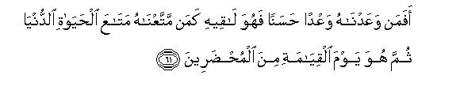
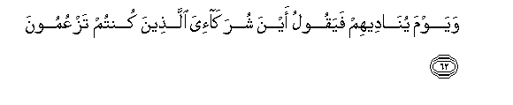
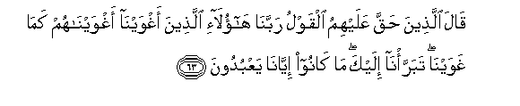
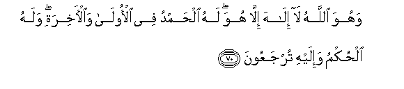
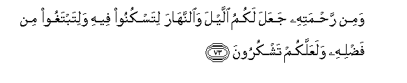

  
[Intangible Textual Heritage](../../index)  [Islam](../index) 
[Index](index)   
[Hypertext Qur'an](../htq/index)  [Unicode](../uq/028.htm#028_061) 
[Palmer](../sbe09/028)  [Pickthall](../pick/028.htm#028_061)  [Yusuf Ali
English](../yaq/yaq028)  [Rodwell](../qr/028)   
  
[Sūra XXVIII.: Qaṣaṣ, or the Narration. Index](028)  
  [Previous](02806)  [Next](02808) 

------------------------------------------------------------------------

  
*The Holy Quran*, tr. by Yusuf Ali, \[1934\], at Intangible Textual
Heritage

------------------------------------------------------------------------

# Sūra XXVIII.: Qaṣaṣ, or the Narration.

### Section 7

------------------------------------------------------------------------

61. Afaman waAAadn<u>a</u>hu waAAdan <u>h</u>asanan fahuwa
l<u>a</u>qeehi kaman mattaAAn<u>a</u>hu mat<u>a</u>AAa
al<u>h</u>ay<u>a</u>ti a**l**dduny<u>a</u> thumma huwa yawma
alqiy<u>a</u>mati mina almu<u>hd</u>areen**a**

61\. Are (these two) alike?—  
One to whom We have made  
A goodly promise, and who  
Is going to reach its (fulfilment),  
And one to whom We have  
Given the good things of this  
Life, but who, on the Day  
Of Judgment, is to be among  
Those brought up (for punishment)?

------------------------------------------------------------------------

62. Wayawma yun<u>a</u>deehim fayaqoolu ayna shurak<u>a</u>-iya
alla<u>th</u>eena kuntum tazAAumoon**a**

62\. That Day (God) will  
Call to them, and say:  
"Where are My 'partners'?—  
Whom ye imagined (to be such)?"

------------------------------------------------------------------------

63. Q<u>a</u>la alla<u>th</u>eena <u>h</u>aqqa AAalayhimu alqawlu
rabban<u>a</u> h<u>a</u>ol<u>a</u>-i alla<u>th</u>eena aghwayn<u>a</u>
aghwayn<u>a</u>hum kam<u>a</u> ghawayn<u>a</u> tabarra/n<u>a</u> ilayka
m<u>a</u> k<u>a</u>noo iyy<u>a</u>n<u>a</u> yaAAbudoon**a**

63\. Those against whom the charge  
Will be proved, will say:  
"Our Lord! These are the ones  
Whom we led astray:  
We led them astray, as we  
Were astray ourselves: we free  
Ourselves (from them) in Thy presence:  
It was not us they worshipped."

------------------------------------------------------------------------

64. Waqeela odAAoo shurak<u>a</u>akum fadaAAawhum falam yastajeeboo
lahum waraawoo alAAa<u>tha</u>ba law annahum k<u>a</u>noo yahtadoon**a**

64\. It will be said (to them):  
"Call upon your 'partners'  
(For help)": they will call  
Upon them, but they will not  
Listen to them; and they  
Will see the Penalty (before them);  
(How they will wish)  
'If only they had been  
Open to guidance!'

------------------------------------------------------------------------

65. Wayawma yun<u>a</u>deehim fayaqoolu m<u>atha</u> ajabtumu
almursaleen**a**

65\. That Day (God) will  
Call to them, and say:  
"What was the answer  
Ye gave to the apostles?"

------------------------------------------------------------------------

66. FaAAamiyat AAalayhimu al-anb<u>a</u>o yawma-i<u>th</u>in fahum
l<u>a</u> yatas<u>a</u>aloon**a**

66\. Then the (whole) story that day  
Will seem obscure to them  
(Like light to the blind)  
And they will not be able  
(Even) to question each other.

------------------------------------------------------------------------

67. Faamm<u>a</u> man t<u>a</u>ba wa<u>a</u>mana waAAamila
<u>sa</u>li<u>h</u>an faAAas<u>a</u> an yakoona mina
almufli<u>h</u>een**a**

67\. But any that (in this life)  
Had repented, believed, and worked  
Righteousness, will have hopes  
To be among those who  
Achieve salvation.

------------------------------------------------------------------------

68. Warabbuka yakhluqu m<u>a</u> yash<u>a</u>o wayakht<u>a</u>ru
m<u>a</u> k<u>a</u>na lahumu alkhiyaratu sub<u>ha</u>na All<u>a</u>hi
wataAA<u>a</u>l<u>a</u> AAamm<u>a</u> yushrikoon**a**

68\. Why by Lord does create and choose  
As He pleases: no choice  
Have they (in the matter):  
Glory to God! and far  
Is He above the partners  
They ascribe (to Him)!

------------------------------------------------------------------------

69. Warabbuka yaAAlamu m<u>a</u> tukinnu <u>s</u>udooruhum wam<u>a</u>
yuAAlinoon**a**

69\. And thy Lord knows all  
That their hearts conceal  
And all that they reveal.

------------------------------------------------------------------------

70. Wahuwa All<u>a</u>hu l<u>a</u> il<u>a</u>ha ill<u>a</u> huwa lahu
al<u>h</u>amdu fee al-ool<u>a</u> wa**a**l-<u>a</u>khirati walahu
al<u>h</u>ukmu wa-ilayhi turjaAAoon**a**

70\. And He is God: there is  
No god. but He. To Him  
Be praise, at the first  
And at the last:  
For Him is the Command,  
And to Him shall ye  
(All) be brought back.

------------------------------------------------------------------------

71. Qul araaytum in jaAAala All<u>a</u>hu AAalaykumu allayla sarmadan
il<u>a</u> yawmi alqiy<u>a</u>mati man il<u>a</u>hun ghayru
All<u>a</u>hi ya/teekum bi<u>d</u>iy<u>a</u>-in afal<u>a</u>
tasmaAAoon**a**

71\. Say: See ye? If God  
Were to make the Night  
Perpetual over you to the Day  
Of Judgment, what god  
Is there other than God,  
Who can give you enlightenment?  
Will ye not then hearken?

------------------------------------------------------------------------

72. Qul araaytum in jaAAala All<u>a</u>hu AAalaykumu
a**l**nnah<u>a</u>ra sarmadan il<u>a</u> yawmi alqiy<u>a</u>mati man
il<u>a</u>hun ghayru All<u>a</u>hi ya/teekum bilaylin taskunoona feehi
afal<u>a</u> tub<u>s</u>iroon**a**

72\. Say: See ye? If God  
Were to make the Day  
Perpetual over you to the Day  
Of Judgment, what god  
Is there other than God,  
Who can give you a Night  
In which ye can rest?  
Will ye not then see?

------------------------------------------------------------------------

73. Wamin ra<u>h</u>matihi jaAAala lakumu allayla wa**al**nnah<u>a</u>ra
litaskunoo feehi walitabtaghoo min fa<u>d</u>lihi walaAAallakum
tashkuroon**a**

73\. It is out of His Mercy  
That He has made for you  
Night and Day,—that ye  
May rest therein, and that  
Ye may seek of His Grace;—  
And in order that ye  
May be grateful.

------------------------------------------------------------------------

74. Wayawma yun<u>a</u>deehim fayaqoolu ayna shurak<u>a</u>-iya
alla<u>th</u>eena kuntum tazAAumoon**a**

74\. The Day that He will  
Call on them, He will say:  
"Where are My 'partners'?—  
Whom ye imagined (to be such)?"

------------------------------------------------------------------------

75. WanazaAAn<u>a</u> min kulli ommatin shaheedan faquln<u>a</u>
h<u>a</u>too burh<u>a</u>nakum faAAalimoo anna al<u>h</u>aqqa
lill<u>a</u>hi wa<u>d</u>alla AAanhum m<u>a</u> k<u>a</u>noo
yaftaroon**a**

75\. And from each people  
Shall We draw a witness,  
And We shall say: "Produce  
Your Proof": then shall they  
Know that the Truth is in  
God (alone), and the (lies)  
Which they invented will  
Leave them in the lurch.

------------------------------------------------------------------------

[Next: Section 8 (76-82)](02808)

