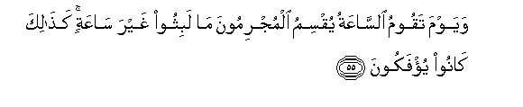
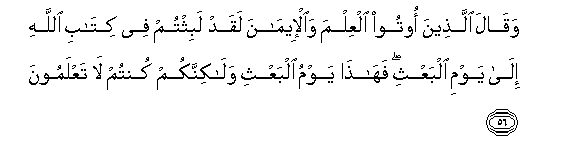
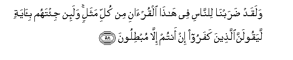

  
[Intangible Textual Heritage](../../index)  [Islam](../index) 
[Index](index)   
[Hypertext Qur'an](../htq/index)  [Unicode](../uq/030.htm#030_054) 
[Palmer](../sbe09/030)  [Pickthall](../pick/030.htm#030_054)  [Yusuf Ali
English](../yaq/yaq030)  [Rodwell](../qr/030)   
  
[Sūra XXX.: Rūm, or The Roman Empire. Index](030)  
  [Previous](03005)  [Next](03101) 

------------------------------------------------------------------------

  
*The Holy Quran*, tr. by Yusuf Ali, \[1934\], at Intangible Textual
Heritage

------------------------------------------------------------------------

# Sūra XXX.: Rūm, or The Roman Empire.

### Section 6

------------------------------------------------------------------------

54. All<u>a</u>hu alla<u>th</u>ee khalaqakum min <u>d</u>aAAfin thumma
jaAAala min baAAdi <u>d</u>aAAfin quwwatan thumma jaAAala min baAAdi
quwwatin <u>d</u>aAAfan washaybatan yakhluqu m<u>a</u> yash<u>a</u>o
wahuwa alAAaleemu alqadeer**u**

54\. It is God Who  
Created you in a state  
Of (helpless) weakness, then  
Gave (you) strength after weakness,  
Then, after strength, gave (you)  
Weakness and a hoary head:  
He creates as He wills,  
And it is He Who has  
All knowledge and power.

------------------------------------------------------------------------

55. Wayawma taqoomu a**l**ss<u>a</u>AAatu yuqsimu almujrimoona m<u>a</u>
labithoo ghayra s<u>a</u>AAatin ka<u>tha</u>lika k<u>a</u>noo
yu/fakoon**a**

55\. On the Day that  
The Hour (of reckoning)  
Will be established,  
The transgressors will swear  
That they tarried not  
But an hour: thus were  
They used to being deluded!

------------------------------------------------------------------------

56. Waq<u>a</u>la alla<u>th</u>eena ootoo alAAilma
wa**a**l-eem<u>a</u>na laqad labithtum fee kit<u>a</u>bi All<u>a</u>hi
il<u>a</u> yawmi albaAAthi fah<u>atha</u> yawmu albaAAthi
wal<u>a</u>kinnakum kuntum l<u>a</u> taAAlamoon**a**

56\. But those endued with knowledge  
And faith will say:  
"Indeed ye did tarry,  
Within God's Decree,  
To the Day of Resurrection,  
And this is the Day  
Of Resurrection: but ye—  
Ye were not aware!"

------------------------------------------------------------------------

57. Fayawma-i<u>th</u>in l<u>a</u> yanfaAAu alla<u>th</u>eena
*<u>th</u>*alamoo maAA<u>th</u>iratuhum wal<u>a</u> hum
yustaAAtaboon**a**

57\. So on that Day no excuse  
Of theirs will  
Avail the Transgressors,  
Nor will they be invited (then)  
To seek grace (by repentance).

------------------------------------------------------------------------

58. Walaqad <u>d</u>arabn<u>a</u> li**l**nn<u>a</u>si fee h<u>atha</u>
alqur-<u>a</u>ni min kulli mathalin wala-in ji/tahum bi-<u>a</u>yatin
layaqoolanna alla<u>th</u>eena kafaroo in antum ill<u>a</u>
mub<u>t</u>iloon**a**

58\. Verily We have propounded  
For men, in this Qur-ān.  
Every kind of Parable:  
But if thou bring to them  
Any Sign, the Unbelievers  
Are sure to say, "Ye  
Do nothing but talk vanities."

------------------------------------------------------------------------

59. Ka<u>tha</u>lika ya<u>t</u>baAAu All<u>a</u>hu AAal<u>a</u> quloobi
alla<u>th</u>eena l<u>a</u> yaAAlamoon**a**

59\. Thus does God seal up  
The hearts of those  
Who understand not.

------------------------------------------------------------------------

60. Fa**i**<u>s</u>bir inna waAAda All<u>a</u>hi <u>h</u>aqqun
wal<u>a</u> yastakhiffannaka alla<u>th</u>eena l<u>a</u> yooqinoon**a**

60\. So patiently persevere: for  
Verily the promise of God  
Is true: nor let those  
Shake thy firmness, who have  
(Themselves) no certainty of faith.

------------------------------------------------------------------------

[Next: Section 1 (1-11)](03101)

