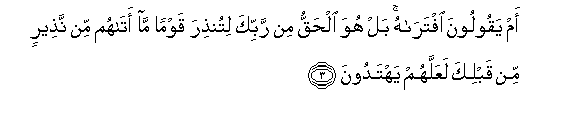
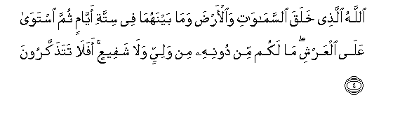
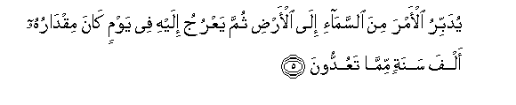
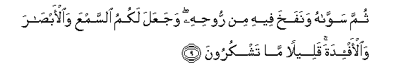
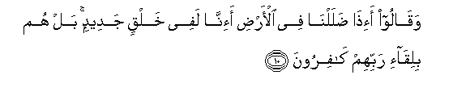
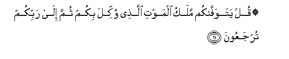

  
[Intangible Textual Heritage](../../index)  [Islam](../index) 
[Index](index)   
[Hypertext Qur'an](../htq/index)  [Unicode](../uq/032.htm#032_001) 
[Palmer](../sbe09/032)  [Pickthall](../pick/032.htm#032_001)  [Yusuf Ali
English](../yaq/yaq032)  [Rodwell](../qr/032)   
  
[Sūra XXXII: Sajda, or Adoration. Index](032)  
  [Previous](03104)  [Next](03202) 

------------------------------------------------------------------------

  
*The Holy Quran*, tr. by Yusuf Ali, \[1934\], at Intangible Textual
Heritage

------------------------------------------------------------------------

# Sūra XXXII: Sajda, or Adoration.

### Section 1

1. Alif-l<u>a</u>m-meem

1\. A. L. M.

------------------------------------------------------------------------

2. Tanzeelu alkit<u>a</u>bi l<u>a</u> rayba feehi min rabbi
alAA<u>a</u>lameen**a**

2\. (This is) the revelation  
Of the Book in which  
There is no doubt,—  
From the Lord of the Worlds.

------------------------------------------------------------------------

3. Am yaqooloona iftar<u>a</u>hu bal huwa al<u>h</u>aqqu min rabbika
litun<u>th</u>ira qawman m<u>a</u> at<u>a</u>hum min na<u>th</u>eerin
min qablika laAAallahum yahtadoon**a**

3\. Or do they say,  
"He has forged it"?  
Nay, it is the Truth  
From thy Lord, that thou  
Mayest admonish a people  
To whom no warner  
Has come before thee:  
In order that they  
May receive guidance.

------------------------------------------------------------------------

4. All<u>a</u>hu alla<u>th</u>ee khalaqa a**l**ssam<u>a</u>w<u>a</u>ti
wa**a**l-ar<u>d</u>a wam<u>a</u> baynahum<u>a</u> fee sittati
ayy<u>a</u>min thumma istaw<u>a</u> AAal<u>a</u> alAAarshi m<u>a</u>
lakum min doonihi min waliyyin wal<u>a</u> shafeeAAin afal<u>a</u>
tata<u>th</u>akkaroon**a**

4\. It is God Who has  
Created the heavens  
And the earth, and all  
Between them, in six Days,  
And is firmly established  
On the Throne (of authority):  
Ye have none, besides Him,  
To protect or intercede (for you):  
Will ye not then  
Receive admonition?

------------------------------------------------------------------------

5. Yudabbiru al-amra mina a**l**ssam<u>a</u>-i il<u>a</u> al-ar<u>d</u>i
thumma yaAAruju ilayhi fee yawmin k<u>a</u>na miqd<u>a</u>ruhu alfa
sanatin mimm<u>a</u> taAAuddoon**a**

5\. He rules (all) affairs  
From the heavens  
To the earth: in the end  
Will (all affairs) go up  
To Him, on a Day,  
The space whereof will be  
(As) a thousand years  
Of your reckoning.

------------------------------------------------------------------------

6. <u>Tha</u>lika AA<u>a</u>limu alghaybi wa**al**shshah<u>a</u>dati
alAAazeezu a**l**rra<u>h</u>eem**u**

6\. Such is He, the Knower  
Of all things, hidden  
And open, the Exalted  
(In power), the Merciful;—

------------------------------------------------------------------------

7. Alla<u>th</u>ee a<u>h</u>sana kulla shay-in khalaqahu wabadaa khalqa
al-ins<u>a</u>ni min <u>t</u>een**in**

7\. He Who has made  
Everything which He has created  
Most Good: He began  
The creation of man  
With (nothing more than) clay,

------------------------------------------------------------------------

8. Thumma jaAAala naslahu min sul<u>a</u>latin min m<u>a</u>-in
maheen**in**

8\. And made his progeny  
From a quintessence  
Of the nature of  
A fluid despised:

------------------------------------------------------------------------

9. Thumma saww<u>a</u>hu wanafakha feehi min roo<u>h</u>ihi wajaAAala
lakumu a**l**ssamAAa wa**a**l-ab<u>sa</u>ra wa**a**l-af-idata qaleelan
m<u>a</u> tashkuroon**a**

9\. But He fashioned him  
In due proportion, and breathed  
Into him something of  
His spirit. And He gave  
You (the faculties of) hearing  
And sight and feeling  
(And understanding):  
Little thanks do ye give!

------------------------------------------------------------------------

10. Waq<u>a</u>loo a-i<u>tha</u> <u>d</u>al<u>a</u>ln<u>a</u> fee
al-ar<u>d</u>i a-inn<u>a</u> lafee khalqin jadeedin bal hum
biliq<u>a</u>-i rabbihim k<u>a</u>firoon**a**

10\. And they say: "What!  
When we lie, hidden  
And lost, in the earth,  
Shall we indeed be  
In a Creation renewed?  
Nay, they deny the Meeting  
With their Lord!"

------------------------------------------------------------------------

11. Qul yatawaff<u>a</u>kum malaku almawti alla<u>th</u>ee wukkila bikum
thumma il<u>a</u> rabbikum turjaAAoon**a**

11\. Say: "The Angel of Death,  
Put in charge of you,  
Will (duly) take your souls:  
Then shall ye be brought  
Back to your Lord."

------------------------------------------------------------------------

[Next: Section 2 (12-22)](03202)

