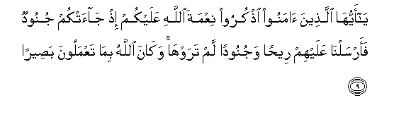
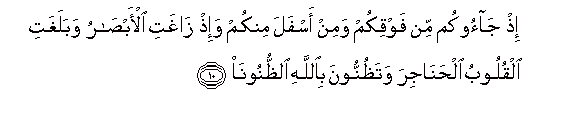
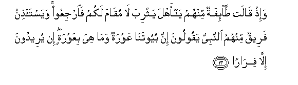
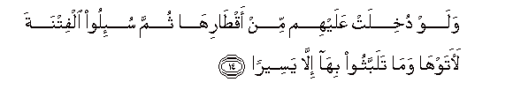
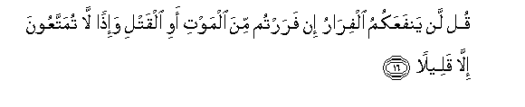
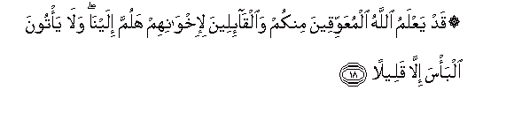
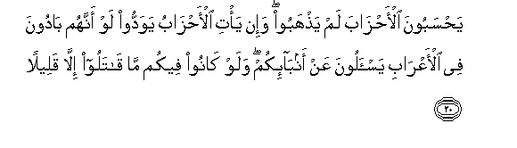

  
[Intangible Textual Heritage](../../index)  [Islam](../index) 
[Index](index)   
[Hypertext Qur'an](../htq/index)  [Unicode](../uq/033.htm#033_009) 
[Palmer](../sbe09/033)  [Pickthall](../pick/033.htm#033_009)  [Yusuf Ali
English](../yaq/yaq033)  [Rodwell](../qr/033)   
  
[Sūra XXXIII.: Aḥzāb, or The Confederates. Index](033)  
  [Previous](03301)  [Next](03303) 

------------------------------------------------------------------------

  
*The Holy Quran*, tr. by Yusuf Ali, \[1934\], at Intangible Textual
Heritage

------------------------------------------------------------------------

# Sūra XXXIII.: Aḥzāb, or The Confederates.

### Section 2

------------------------------------------------------------------------

9. Y<u>a</u> ayyuh<u>a</u> alla<u>th</u>eena <u>a</u>manoo
o<u>th</u>kuroo niAAmata All<u>a</u>hi AAalaykum i<u>th</u>
j<u>a</u>atkum junoodun faarsaln<u>a</u> AAalayhim ree<u>h</u>an
wajunoodan lam tarawh<u>a</u> wak<u>a</u>na All<u>a</u>hu bim<u>a</u>
taAAmaloona ba<u>s</u>eer<u>a</u>**n**

9\. O ye who believe!  
Remember the Grace of God,  
(Bestowed) on you, when  
There came down on you  
Hosts (to overwhelm you):  
But We sent against them  
A hurricane and forces  
That ye saw not:  
But God sees (clearly)  
All that ye do.

------------------------------------------------------------------------

10. I<u>th</u> j<u>a</u>ookum min fawqikum wamin asfala minkum
wa-i<u>th</u> z<u>a</u>ghati al-ab<u>sa</u>ru wabalaghati alquloobu
al<u>h</u>an<u>a</u>jira wata*<u>th</u>*unnoona bi**A**ll<u>a</u>hi
a**l***<u>thth</u>*unoon<u>a</u>

10\. Behold! they came on you  
From above you and from  
Below you, and behold,  
The eyes became dim  
And the hearts gaped  
Up to the throats,  
And ye imagined various  
(Vain) thoughts about God!

------------------------------------------------------------------------

11. Hun<u>a</u>lika ibtuliya almu-minoona wazulziloo zilz<u>a</u>lan
shadeed<u>a</u>**n**

11\. In that situation  
Were the Believers tried:  
They were shaken as by  
A tremendous shaking.

------------------------------------------------------------------------

12. Wa-i<u>th</u> yaqoolu almun<u>a</u>fiqoona wa**a**lla<u>th</u>eena
fee quloobihim mara<u>d</u>un m<u>a</u> waAAadan<u>a</u> All<u>a</u>hu
warasooluhu ill<u>a</u> ghuroor<u>a</u>**n**

12\. Find behold! The Hypocrites  
And those in whose hearts  
Is a disease (even) say: "God  
And His Apostle promised us  
Nothing but delusions!"

------------------------------------------------------------------------

13. Wa-i<u>th</u> q<u>a</u>lat <u>ta</u>-ifatun minhum y<u>a</u> ahla
yathriba l<u>a</u> muq<u>a</u>ma lakum fa**i**rjiAAoo
wayasta/<u>th</u>inu fareequn minhumu a**l**nnabiyya yaqooloona inna
buyootan<u>a</u> AAawratun wam<u>a</u> hiya biAAawratin in yureedoona
ill<u>a</u> fir<u>a</u>r<u>a</u>**n**

13\. Behold! A party among them  
Said: "Ye men of Ya<u>th</u>rib!  
Ye cannot stand (the attack)!  
Therefore go back!"  
And a band of them  
Ask for leave of the Prophet,  
Saying, "Truly our houses  
Are bare and exposed," though  
They were not exposed:  
They intended nothing but  
To run away.

------------------------------------------------------------------------

14. Walaw dukhilat AAalayhim min aq<u>ta</u>rih<u>a</u> thumma su-iloo
alfitnata la<u>a</u>tawh<u>a</u> wam<u>a</u> talabbathoo bih<u>a</u>
ill<u>a</u> yaseer<u>a</u>**n**

14\. And if an entry had  
Been effected to them  
From the sides of the (City),  
And they had been  
Incited to sedition.  
They would certainly have  
Brought it to pass, with  
None but a brief delay!

------------------------------------------------------------------------

15. Walaqad k<u>a</u>noo AA<u>a</u>hadoo All<u>a</u>ha min qablu
l<u>a</u> yuwalloona al-adb<u>a</u>ra wak<u>a</u>na AAahdu All<u>a</u>hi
mas-ool<u>a</u>**n**

15\. And yet they had already  
Covenanted with God not to turn  
Their backs, and a covenant  
With God must (surely)  
Be answered for.

------------------------------------------------------------------------

16. Qul lan yanfaAAakumu alfir<u>a</u>ru in farartum mina almawti awi
alqatli wa-i<u>th</u>an l<u>a</u> tumattaAAoona ill<u>a</u>
qaleel<u>a</u>**n**

16\. Say: "Running away will not  
Profit you if ye are  
Running away from death  
Or slaughter; and even if  
(Ye do escape), no more  
Than a brief (respite)  
Will ye be allowed to enjoy!"

------------------------------------------------------------------------

17. Qul man <u>tha</u> alla<u>th</u>ee yaAA<u>s</u>imukum mina
All<u>a</u>hi in ar<u>a</u>da bikum soo-an aw ar<u>a</u>da bikum
ra<u>h</u>matan wal<u>a</u> yajidoona lahum min dooni All<u>a</u>hi
waliyyan wal<u>a</u> na<u>s</u>eer<u>a</u>**n**

17\. Say: "Who is it that can  
Screen you from God  
If it be His wish  
To give you Punishment  
Or to give you Mercy?"  
Nor will they find for themselves,  
Besides God, any protector  
Or helper.

------------------------------------------------------------------------

18. Qad yaAAlamu All<u>a</u>hu almuAAawwiqeena minkum
wa**a**lq<u>a</u>-ileena li-ikhw<u>a</u>nihim halumma ilayn<u>a</u>
wal<u>a</u> ya/toona alba/sa ill<u>a</u> qaleel<u>a</u>**n**

18\. Verily God knows those  
Among you who keep back  
(Men) and those who say  
To their brethren, "Come along  
To us", but come not  
To the fight except  
For just a little while,

------------------------------------------------------------------------

19. Ashi<u>hh</u>atan AAalaykum fa-i<u>tha</u> j<u>a</u>a alkhawfu
raaytahum yan*<u>th</u>*uroona ilayka tadooru aAAyunuhum
ka**a**lla<u>th</u>ee yughsh<u>a</u> AAalayhi mina almawti
fa-i<u>tha</u> <u>th</u>ahaba alkhawfu salaqookum bi-alsinatin
<u>h</u>id<u>a</u>din ashi<u>hh</u>atan AAal<u>a</u> alkhayri
ol<u>a</u>-ika lam yu/minoo faa<u>h</u>ba<u>t</u>a All<u>a</u>hu
aAAm<u>a</u>lahum wak<u>a</u>na <u>tha</u>lika AAal<u>a</u>
All<u>a</u>hi yaseer<u>a</u>**n**

19\. Covetous over you  
Then when fear comes,  
Thou wilt see them looking  
To thee, their eyes revolving,  
Like (those of) one over whom  
Hovers death: but when  
The fear is past,  
They will smite you  
With sharp tongues, covetous  
Of goods. Such men have  
No faith, and so God  
Has made their deeds  
Of none effect: and that  
Is easy for God.

------------------------------------------------------------------------

20. Ya<u>h</u>saboona al-a<u>h</u>z<u>a</u>ba lam ya<u>th</u>haboo wa-in
ya/ti al-a<u>h</u>z<u>a</u>bu yawaddoo law annahum b<u>a</u>doona fee
al-aAAr<u>a</u>bi yas-aloona AAan anb<u>a</u>-ikum walaw k<u>a</u>noo
feekum m<u>a</u> q<u>a</u>taloo ill<u>a</u> qaleel<u>a</u>**n**

20\. They think that the Confederates  
Have not withdrawn; and if  
The Confederates should come (again),  
They would wish they were  
In the deserts (wandering)  
Among the Bedouins, and  
Seeking news about you  
(From a safe distance);  
And if they were  
In your midst, they  
Would fight but little.

------------------------------------------------------------------------

[Next: Section 3 (20-27)](03303)

