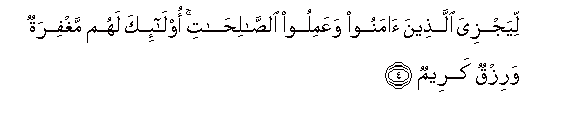
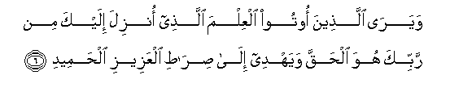

  
[Intangible Textual Heritage](../../index)  [Islam](../index) 
[Index](index)   
[Hypertext Qur'an](../htq/index)  [Unicode](../uq/034.htm#034_001) 
[Palmer](../sbe09/034)  [Pickthall](../pick/034.htm#034_001)  [Yusuf Ali
English](../yaq/yaq034)  [Rodwell](../qr/034)   
  
[Sūra XXXIV.: Sabā, or the City of Sabā Index](034)  
  [Previous](03309)  [Next](03402) 

------------------------------------------------------------------------

  
*The Holy Quran*, tr. by Yusuf Ali, \[1934\], at Intangible Textual
Heritage

------------------------------------------------------------------------

# Sūra XXXIV.: Sabā, or the City of Sabā

### Section 1

1. Al<u>h</u>amdu lill<u>a</u>hi alla<u>th</u>ee lahu m<u>a</u> fee
a**l**ssam<u>a</u>w<u>a</u>ti wam<u>a</u> fee al-ar<u>d</u>i walahu
al<u>h</u>amdu fee al-<u>a</u>khirati wahuwa al<u>h</u>akeemu
alkhabeer**u**

1\. Praise be to God,  
To Whom belong all things  
In the heavens and on earth:  
To Him be Praise  
In the Hereafter:  
And He is Full of Wisdom,  
Acquainted with all things.

------------------------------------------------------------------------

2. YaAAlamu m<u>a</u> yaliju fee al-ar<u>d</u>i wam<u>a</u> yakhruju
minh<u>a</u> wam<u>a</u> yanzilu mina a**l**ssam<u>a</u>-i wam<u>a</u>
yaAAruju feeh<u>a</u> wahuwa a**l**rra<u>h</u>eemu alghafoor**u**

2\. He knows all that goes  
Into the earth, and all that  
Comes out thereof; all that  
Comes down from the sky  
And all that ascends thereto  
And He is the Most Merciful,  
The Oft-Forgiving.

------------------------------------------------------------------------

3. Waq<u>a</u>la alla<u>th</u>eena kafaroo l<u>a</u> ta/teen<u>a</u>
a**l**ss<u>a</u>AAatu qul bal<u>a</u> warabbee lata/tiyannakum
AA<u>a</u>limi alghaybi l<u>a</u> yaAAzubu AAanhu mithq<u>a</u>lu
<u>th</u>arratin fee a**l**ssam<u>a</u>w<u>a</u>ti wal<u>a</u> fee
al-ar<u>d</u>i wal<u>a</u> a<u>s</u>gharu min <u>tha</u>lika wal<u>a</u>
akbaru ill<u>a</u> fee kit<u>a</u>bin mubeen**in**

3\. The Unbelievers say,  
"Never to us will come  
The Hour": say, "Nay!  
But most surely,  
By my Lord, it will come  
Upon you;—by Him  
Who knows the unseen,—  
From Whom is not hidden  
The least little atom  
In the Heavens or on earth:  
Nor is there anything less  
Than that, or greater, but  
Is in the Record Perspicuous:

------------------------------------------------------------------------

4. Liyajziya alla<u>th</u>eena <u>a</u>manoo waAAamiloo
a**l**<u>ssa</u>li<u>ha</u>ti ol<u>a</u>-ika lahum maghfiratun warizqun
kareem**un**

4\. That He may reward  
Those who believe and work  
Deeds of righteousness: for such  
Is Forgiveness and a Sustenance  
Most Generous."

------------------------------------------------------------------------

5. Wa**a**lla<u>th</u>eena saAAaw fee <u>a</u>y<u>a</u>tin<u>a</u>
muAA<u>a</u>jizeena ol<u>a</u>-ika lahum AAa<u>tha</u>bun min rijzin
aleem**in**

5\. But those who strive  
Against Our Signs, to frustrate  
Them,—for such will be  
A Penalty,—a Punishment  
Most humiliating.

------------------------------------------------------------------------

6. Wayar<u>a</u> alla<u>th</u>eena ootoo alAAilma alla<u>th</u>ee onzila
ilayka min rabbika huwa al<u>h</u>aqqa wayahdee il<u>a</u>
<u>s</u>ir<u>at</u>i alAAazeezi al<u>h</u>ameed**i**

6\. And those to whom  
Knowledge has come see  
That the (Revelation) sent down  
To thee from thy Lord—  
That is the Truth,  
And that it guides  
To the Path of the Exalted  
(In Might), Worthy  
Of all praise.

------------------------------------------------------------------------

7. Waq<u>a</u>la alla<u>th</u>eena kafaroo hal nadullukum AAal<u>a</u>
rajulin yunabbi-okum i<u>tha</u> muzziqtum kulla mumazzaqin innakum
lafee khalqin jadeed**in**

7\. The Unbelievers say  
(In ridicule): "Shall we  
Point out to you a man  
That will tell you,  
When ye are all scattered  
To pieces in disintegration,  
That ye shall (then be  
Raised) in a New Creation?

------------------------------------------------------------------------

8. Aftar<u>a</u> AAal<u>a</u> All<u>a</u>hi ka<u>th</u>iban am bihi
jinnatun bali alla<u>th</u>eena l<u>a</u> yu/minoona
bi**a**l-<u>a</u>khirati fee alAAa<u>tha</u>bi
wa**al**<u>dd</u>al<u>a</u>li albaAAeed**i**

8\. "Has he invented a falsehood  
Against God, or has  
A spirit (seized) him?"—  
Nay, it is those who  
Believe not in the Hereafter,  
That are in (real) Penalty,  
And in farthest Error.

------------------------------------------------------------------------

9. Afalam yaraw il<u>a</u> m<u>a</u> bayna aydeehim wam<u>a</u>
khalfahum mina a**l**ssam<u>a</u>-i wa**a**l-ar<u>d</u>i in nasha/
nakhsif bihimu al-ar<u>d</u>a aw nusqi<u>t</u> AAalayhim kisafan mina
a**l**ssam<u>a</u>-i inna fee <u>tha</u>lika la<u>a</u>yatan likulli
AAabdin muneeb**in**

9\. See they not what is  
Before them and behind them,  
Of the sky and the earth  
If We wished, We could  
Cause the earth to swallow  
Them up, or cause a piece  
Of the sky to fall upon them.  
Verily in this is a Sign  
For every devotee that  
Turns to God (in repentance).

------------------------------------------------------------------------

[Next: Section 2 (10-21)](03402)

