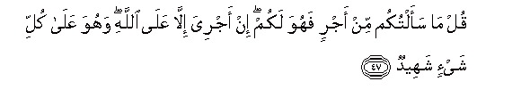

  
[Intangible Textual Heritage](../../index)  [Islam](../index) 
[Index](index)   
[Hypertext Qur'an](../htq/index)  [Unicode](../uq/034.htm#034_046) 
[Palmer](../sbe09/034)  [Pickthall](../pick/034.htm#034_046)  [Yusuf Ali
English](../yaq/yaq034)  [Rodwell](../qr/034)   
  
[Sūra XXXIV.: Sabā, or the City of Sabā Index](034)  
  [Previous](03405)  [Next](03501) 

------------------------------------------------------------------------

  
*The Holy Quran*, tr. by Yusuf Ali, \[1934\], at Intangible Textual
Heritage

------------------------------------------------------------------------

# Sūra XXXIV.: Sabā, or the City of Sabā

### Section 6

------------------------------------------------------------------------

46. Qul innam<u>a</u> aAAi*<u>th</u>*ukum biw<u>ah</u>idatin an taqoomoo
lill<u>a</u>hi mathn<u>a</u> wafur<u>a</u>d<u>a</u> thumma tatafakkaroo
m<u>a</u> bi<u>sah</u>ibikum min jinnatin in huwa ill<u>a</u>
na<u>th</u>eerun lakum bayna yaday AAa<u>tha</u>bin shadeed**in**

46\. Say: "I do admonish you  
On one point: that ye  
Do stand up before God,—  
(It may be) in pairs,  
Or (it may be) singly,—  
And reflect (within yourselves):  
Your Companion is not  
Possessed: he is no less  
Than a Warner to you,  
In face of a terrible  
Penalty."

------------------------------------------------------------------------

47. Qul m<u>a</u> saaltukum min ajrin fahuwa lakum in ajriya ill<u>a</u>
AAal<u>a</u> All<u>a</u>hi wahuwa AAal<u>a</u> kulli shay-in
shaheed**un**

47\. Say: "No reward do I  
Ask of you: it is (all)  
In your interest: my reward  
Is only due from God:  
And He is Witness  
To all things."

------------------------------------------------------------------------

48. Qul inna rabbee yaq<u>th</u>ifu bi**a**l<u>h</u>aqqi AAall<u>a</u>mu
alghuyoob**i**

48\. Say: "Verily my Lord  
Doth cast the (mantle  
Of) Truth (over His servants),—  
He that has full knowledge  
Of (all) that is hidden."

------------------------------------------------------------------------

49. Qul j<u>a</u>a al<u>h</u>aqqu wam<u>a</u> yubdi-o alb<u>at</u>ilu
wam<u>a</u> yuAAeed**u**

49\. Say: "The Truth has arrived,  
And Falsehood neither creates  
Anything new, nor restores  
Anything."

------------------------------------------------------------------------

50. Qul in <u>d</u>alaltu fa-innam<u>a</u> a<u>d</u>illu AAal<u>a</u>
nafsee wa-ini ihtadaytu fabim<u>a</u> yoo<u>h</u>ee ilayya rabbee innahu
sameeAAun qareeb**un**

50\. Say: "If I am astray,  
I only stray to the loss  
Of my own soul: but if  
I receive guidance, it is seen  
Because of the inspiration  
Of my Lord to me:  
It is He Who hears  
All things, and is (ever) near."

------------------------------------------------------------------------

51. Walaw tar<u>a</u> i<u>th</u> faziAAoo fal<u>a</u> fawta
waokhi<u>th</u>oo min mak<u>a</u>nin qareeb**in**

51\. If thou couldst but see  
When they will quake  
With terror; but then  
There will be no escape  
(For them), and they will he  
Seized from a position  
(Quite) near.

------------------------------------------------------------------------

52. Waq<u>a</u>loo <u>a</u>mann<u>a</u> bihi waann<u>a</u> lahumu
a**l**ttan<u>a</u>wushu min mak<u>a</u>nin baAAeed**in**

52\. And they will say,  
"We do believe (now)  
In the (Truth)"; but how  
Could they receive (Faith)  
From a position (so) far off,—

------------------------------------------------------------------------

53. Waqad kafaroo bihi min qablu wayaq<u>th</u>ifoona bi**a**lghaybi min
mak<u>a</u>nin baAAeed**in**

53\. Seeing that they did reject  
Faith (entirely) before, and  
That they (continually) cast  
(Slanders) on the Unseen  
From a position far off?

------------------------------------------------------------------------

54. Wa<u>h</u>eela baynahum wabayna m<u>a</u> yashtahoona kam<u>a</u>
fuAAila bi-ashy<u>a</u>AAihim min qablu innahum k<u>a</u>noo fee shakkin
mureeb**in**

54\. And between them  
And their desires,  
Is placed a barrier,  
As was done in the past  
With their partisans:  
For they were indeed  
In suspicious (disquieting) doubt.

------------------------------------------------------------------------

[Next: Section 1 (1-7)](03501)

