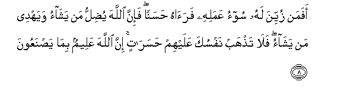
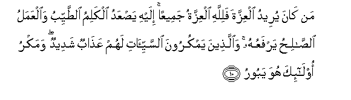
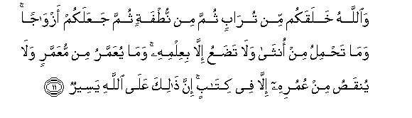
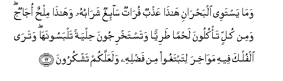
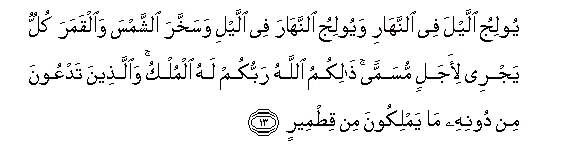

  
[Intangible Textual Heritage](../../index)  [Islam](../index) 
[Index](index)   
[Hypertext Qur'an](../htq/index)  [Unicode](../uq/035.htm#035_008) 
[Palmer](../sbe09/035)  [Pickthall](../pick/035.htm#035_008)  [Yusuf Ali
English](../yaq/yaq035)  [Rodwell](../qr/035)   
  
[Sūra XXXV.: Fāṭir, or The Originator of Creation; or Malāïka, or The
Angels. Index](035)  
  [Previous](03501)  [Next](03503) 

------------------------------------------------------------------------

  
*The Holy Quran*, tr. by Yusuf Ali, \[1934\], at Intangible Textual
Heritage

------------------------------------------------------------------------

# Sūra XXXV.: Fāṭir, or The Originator of Creation; or Malāïka, or The Angels.

### Section 2

------------------------------------------------------------------------

8. Afaman zuyyina lahu soo-o AAamalihi fara<u>a</u>hu <u>h</u>asanan
fa-inna All<u>a</u>ha yu<u>d</u>illu man yash<u>a</u>o wayahdee man
yash<u>a</u>o fal<u>a</u> ta<u>th</u>hab nafsuka AAalayhim
<u>h</u>asar<u>a</u>tin inna All<u>a</u>ha AAaleemun bim<u>a</u>
ya<u>s</u>naAAoon**a**

8\. Is he, then, to whom  
The evil of his conduct  
Is made alluring, so  
That he looks upon it  
As good, (equal to one  
Who is rightly guided)?  
For God leaves to stray  
Whom He wills, and guides  
Whom He wills. So  
Let not thy soul go out  
In (vainly) sighing after them:  
For God knows well  
All that they do!

------------------------------------------------------------------------

9. Wa**A**ll<u>a</u>hu alla<u>th</u>ee arsala a**l**rriy<u>ah</u>a
fatutheeru sa<u>ha</u>ban fasuqn<u>a</u>hu il<u>a</u> baladin mayyitin
faa<u>h</u>yayn<u>a</u> bihi al-ar<u>d</u>a baAAda mawtih<u>a</u>
ka<u>tha</u>lika a**l**nnushoor**u**

9\. It is God Who sends  
Forth the Winds, so that  
They raise up the Clouds,  
And We drive them  
To a land that is dead,  
And revive the earth therewith  
After its death: even so  
(Will be) the Resurrection!

------------------------------------------------------------------------

10. Man k<u>a</u>na yureedu alAAizzata falill<u>a</u>hi alAAizzatu
jameeAAan ilayhi ya<u>s</u>AAadu alkalimu a**l**<u>tt</u>ayyibu
wa**a**lAAamalu a**l**<u>ssa</u>li<u>h</u>u yarfaAAuhu
wa**a**lla<u>th</u>eena yamkuroona a**l**ssayyi-<u>a</u>ti lahum
AAa<u>tha</u>bun shadeedun wamakru ol<u>a</u>-ika huwa yaboor**u**

10\. If any do seek  
For glory and power,—  
To God belong  
All glory and power.  
To Him mount up  
(All) Words of Purity:  
It is He Who exalts  
Each Deed of Righteousness.  
Those that lay Plots  
Of Evil,—for them  
Is a Penalty terrible;  
And the plotting of such  
Will be void (of result).

------------------------------------------------------------------------

11. Wa**A**ll<u>a</u>hu khalaqakum min tur<u>a</u>bin thumma min
nu<u>t</u>fatin thumma jaAAalakum azw<u>a</u>jan wam<u>a</u>
ta<u>h</u>milu min onth<u>a</u> wal<u>a</u> ta<u>d</u>aAAu ill<u>a</u>
biAAilmihi wam<u>a</u> yuAAammaru min muAAammarin wal<u>a</u>
yunqa<u>s</u>u min AAumurihi ill<u>a</u> fee kit<u>a</u>bin inna
<u>tha</u>lika AAal<u>a</u> All<u>a</u>hi yaseer**un**

11\. And God did create  
You from dust;  
Then from a sperm-drop;  
Then He made you  
In pairs. And no female  
Conceives, or lays down  
(Her load), but with His  
Knowledge. Nor is a man  
Long-lived granted length  
Of days, nor is a part  
Cut off from his life,  
But is in a Decree  
(Ordained). All this  
Is easy to God.

------------------------------------------------------------------------

12. Wam<u>a</u> yastawee alba<u>h</u>r<u>a</u>ni h<u>atha</u>
AAa<u>th</u>bun fur<u>a</u>tun s<u>a</u>-ighun shar<u>a</u>buhu
wah<u>atha</u> mil<u>h</u>un oj<u>a</u>jun wamin kullin ta/kuloona
la<u>h</u>man <u>t</u>ariyyan watastakhrijoona <u>h</u>ilyatan
talbasoonah<u>a</u> watar<u>a</u> alfulka feehi maw<u>a</u>khira
litabtaghoo min fa<u>d</u>lihi walaAAallakum tashkuroon**a**

12\. Nor are the two bodies  
Of flowing water alike,—  
The one palatable, sweet,  
And pleasant to drink,  
And the other, salt  
And bitter. Yet from each  
(Kind of water) do ye  
Eat flesh fresh and tender,  
And ye extract ornaments  
To wear; and thou seest  
The ships therein that plough  
The waves, that ye may  
Seek (thus) of the Bounty  
Of God that ye  
May be grateful.

------------------------------------------------------------------------

13. Yooliju allayla fee a**l**nnah<u>a</u>ri wayooliju
a**l**nnah<u>a</u>ra fee allayli wasakhkhara a**l**shshamsa
wa**a**lqamara kullun yajree li-ajalin musamman <u>tha</u>likumu
All<u>a</u>hu rabbukum lahu almulku wa**a**lla<u>th</u>eena tadAAoona
min doonihi m<u>a</u> yamlikoona min qi<u>t</u>meer**in**

13\. He merges Night into Day,  
And He merges Day  
Into Night, and He has  
Subjected the sun and  
The moon (to His Law):  
Each one runs its course  
For a term appointed.  
Such is God your Lord:  
To Him belongs all Dominion.  
And those whom ye invoke  
Besides Him have not  
The least power.

------------------------------------------------------------------------

14. In tadAAoohum l<u>a</u> yasmaAAoo duAA<u>a</u>akum walaw samiAAoo
m<u>a</u> istaj<u>a</u>boo lakum wayawma alqiy<u>a</u>mati yakfuroona
bishirkikum wal<u>a</u> yunabbi-oka mithlu khabeer**in**

14\. If ye invoke them,  
They will not listen  
To your call, and if  
They were to listen,  
They cannot answer  
Your (prayer). On the Day  
Of Judgment they will reject  
Your "Partnership". And none,  
(O man!) can tell thee  
(The Truth) like the One  
Who is acquainted with all things.

------------------------------------------------------------------------

[Next: Section 3 (15-26)](03503)

