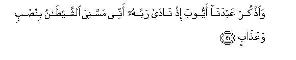
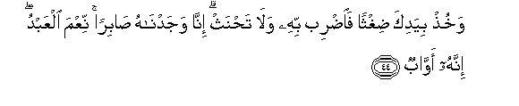

  
[Intangible Textual Heritage](../../index)  [Islam](../index) 
[Index](index)   
[Hypertext Qur'an](../htq/index)  [Unicode](../uq/038.htm#038_041) 
[Palmer](../sbe09/038)  [Pickthall](../pick/038.htm#038_041)  [Yusuf Ali
English](../yaq/yaq038)  [Rodwell](../qr/038)   
  
[Sūra XXXVIII.: Ṣād (being one of the Abbreviated Letters).
Index](038)  
  [Previous](03803)  [Next](03805) 

------------------------------------------------------------------------

  
*The Holy Quran*, tr. by Yusuf Ali, \[1934\], at Intangible Textual
Heritage

------------------------------------------------------------------------

# Sūra XXXVIII.: Ṣād (being one of the Abbreviated Letters).

### Section 4

------------------------------------------------------------------------

41. Wa**o**<u>th</u>kur AAabdan<u>a</u> ayyooba i<u>th</u>
n<u>a</u>d<u>a</u> rabbahu annee massaniya a**l**shshay<u>ta</u>nu
binu<u>s</u>bin waAAa<u>tha</u>b**in**

41\. Commemorate Our Servant Job.  
Behold he cried to his Lord:  
"The Evil One has afflicted  
Me with distress and suffering!"

------------------------------------------------------------------------

42. Orku<u>d</u> birijlika h<u>atha</u> mughtasalun b<u>a</u>ridun
washar<u>a</u>b**un**

42\. (The command was given:)  
"Strike with thy foot:  
Here is (water) wherein  
To wash, coal and refreshing,  
And (water) to drink."

------------------------------------------------------------------------

43. Wawahabn<u>a</u> lahu ahlahu wamithlahum maAAahum ra<u>h</u>matan
minn<u>a</u> wa<u>th</u>ikr<u>a</u> li-olee al-alb<u>a</u>b**i**

43\. And We gave him (back)  
His people, and doubled  
Their number,—as a Grace  
From Ourselves, and a thing  
For commemoration, for all  
Who have Understanding.

------------------------------------------------------------------------

44. Wakhu<u>th</u> biyadika <u>d</u>ighthan fa**i**<u>d</u>rib bihi
wal<u>a</u> ta<u>h</u>nath inn<u>a</u> wajadn<u>a</u>hu <u>sa</u>biran
niAAma alAAabdu innahu aww<u>a</u>b**un**

44\. "And take in thy hand  
A little grass, and strike  
Therewith: and break not  
(Thy oath)." Truly We found  
Him full of patience and constancy.  
How excellent in Our service!  
Ever did he turn (to Us)!

------------------------------------------------------------------------

45. Wa**o**<u>th</u>kur AAib<u>a</u>dan<u>a</u> ibr<u>a</u>heema
wa-is<u>ha</u>qa wayaAAqooba olee al-aydee wa**a**l-ab<u>sa</u>r**i**

45\. And commemorate Our Servants  
Abraham, Isaac, and Jacob,  
Possessors of Power and Vision.

------------------------------------------------------------------------

46. Inn<u>a</u> akhla<u>s</u>n<u>a</u>hum bikh<u>a</u>li<u>s</u>atin
<u>th</u>ikr<u>a</u> a**l**dd<u>a</u>r**i**

46\. Verily We did choose them  
For a special (purpose)—  
Proclaiming the Message  
Of the Hereafter.

------------------------------------------------------------------------

47. Wa-innahum AAindan<u>a</u> lamina almu<u>st</u>afayna
al-akhy<u>a</u>r**i**

47\. They were, in Our sight,  
Truly, of the company  
Of the Elect and the Good.

------------------------------------------------------------------------

48. Wa**o**<u>th</u>kur ism<u>a</u>AAeela wa-ilyasaAAa wa<u>tha</u>
alkifli wakullun mina al-akhy<u>a</u>r**i**

48\. And commemorate Ismā‘īl,  
Elisha, and Ẓul-Kifl:  
Each of them was  
Of the company of the Good.

------------------------------------------------------------------------

49. H<u>atha</u> <u>th</u>ikrun wa-inna lilmuttaqeena la<u>h</u>usna
ma<u>a</u>b**in**

49\. This is a Message  
(Of admonition): and verily,  
For the Righteous,  
Is a beautiful place  
Of (final) Return,—

------------------------------------------------------------------------

50. Jann<u>a</u>ti AAadnin mufatta<u>h</u>atan lahumu
al-abw<u>a</u>b**u**

50\. Gardens of Eternity,  
Whose doors will (ever)  
Be open to them;

------------------------------------------------------------------------

51. Muttaki-eena feeh<u>a</u> yadAAoona feeh<u>a</u> bif<u>a</u>kihatin
katheeratin washar<u>a</u>b**in**

51\. Therein will they  
Recline (at ease);  
Therein can they  
Call (at pleasure)  
For fruit in abundance,  
And (delicious) drink;

------------------------------------------------------------------------

52. WaAAindahum q<u>as</u>ir<u>a</u>tu a**l**<u>tt</u>arfi
atr<u>a</u>b**un**

52\. And beside them will be  
Chaste women restraining  
Their glances, (companions)  
Of equal age.

------------------------------------------------------------------------

53. H<u>atha</u> m<u>a</u> tooAAadoona liyawmi
al<u>h</u>is<u>a</u>b**i**

53\. Such is the Promise  
Made to you  
For the Day of Account!

------------------------------------------------------------------------

54. Inna h<u>atha</u> larizqun<u>a</u> m<u>a</u> lahu min
naf<u>a</u>d**in**

54\. Truly such will be  
Our Bounty (to you);  
It will never fail;—

------------------------------------------------------------------------

55. H<u>atha</u> wa-inna li**l**<u>tta</u>gheena lasharra
ma<u>a</u>b**in**

55\. ''Yea, such! But  
For the wrong-doers  
Will be an evil place  
Of (final) Return!—

------------------------------------------------------------------------

56. Jahannama ya<u>s</u>lawnah<u>a</u> fabi/sa almih<u>a</u>d**u**

56\. Hell!—they will burn  
Therein,—an evil bed  
(Indeed, to lie on)!—

------------------------------------------------------------------------

57. H<u>atha</u> falya<u>th</u>ooqoohu <u>h</u>ameemun
waghass<u>a</u>q**un**

57\. Yea, such!—Then  
Shall they taste it,  
A boiling fluid, and a fluid  
Dark, murky, intensely cold!—

------------------------------------------------------------------------

58. Wa<u>a</u>kharu min shaklihi azw<u>a</u>j**un**

58\. And other Penalties  
Of a similar kind,  
To match them!

------------------------------------------------------------------------

59. H<u>atha</u> fawjun muqta<u>h</u>imun maAAakum l<u>a</u>
mar<u>h</u>aban bihim innahum <u>sa</u>loo a**l**nn<u>a</u>r**i**

59\. Here is a troop  
Rushing headlong with you!  
No welcome for them!  
Truly, they shall burn  
In the Fire!

------------------------------------------------------------------------

60. Q<u>a</u>loo bal antum l<u>a</u> mar<u>h</u>aban bikum antum
qaddamtumoohu lan<u>a</u> fabi/sa alqar<u>a</u>r**u**

60\. (The followers shall cry  
To the misleaders:)  
"Nay, ye (too)! No welcome  
For you! It is ye who  
Have brought this upon us!  
Now evil is (this) place  
To stay in!"

------------------------------------------------------------------------

61. Q<u>a</u>loo rabban<u>a</u> man qaddama lan<u>a</u> h<u>atha</u>
fazidhu AAa<u>tha</u>ban <u>d</u>iAAfan fee a**l**nn<u>a</u>r**i**

61\. They will say: "Our Lord!  
Whoever brought this upon us,—  
Add to him a double  
Penalty in the Fire!"

------------------------------------------------------------------------

62. Waq<u>a</u>loo m<u>a</u> lan<u>a</u> l<u>a</u> nar<u>a</u>
rij<u>a</u>lan kunn<u>a</u> naAAudduhum mina al-ashr<u>a</u>r**i**

62\. And they will say:  
"What has happened to us  
That we see not men  
Whom we used to number  
Among the bad ones?

------------------------------------------------------------------------

63. Attakha<u>th</u>n<u>a</u>hum sikhriyyan am z<u>a</u>ghat AAanhumu
al-ab<u>sa</u>r**u**

63\. "Did we treat them  
(As such) in ridicule,  
Or have (our) eyes  
Failed to perceive them?"

------------------------------------------------------------------------

64. Inna <u>tha</u>lika la<u>h</u>aqqun takh<u>as</u>umu ahli
a**l**nn<u>a</u>r**i**

64\. Truly that is just and fitting,—  
The mutual recriminations  
Of the People of the Fire!

------------------------------------------------------------------------

[Next: Section 5 (65-88)](03805)

