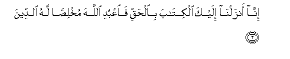
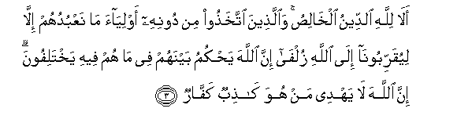
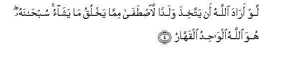
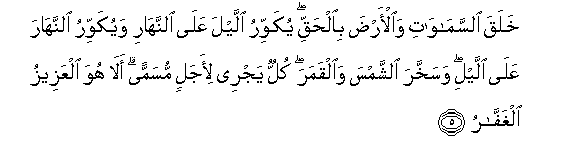
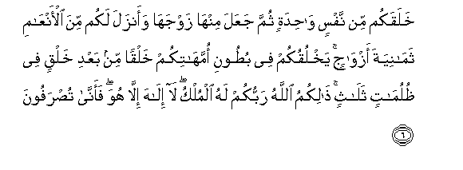
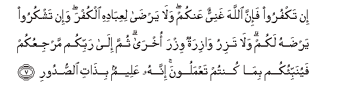
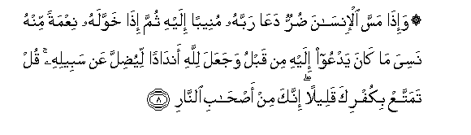
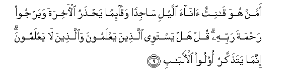

  
[Intangible Textual Heritage](../../index)  [Islam](../index) 
[Index](index)   
[Hypertext Qur'an](../htq/index)  [Unicode](../uq/039.htm#039_001) 
[Palmer](../sbe09/039)  [Pickthall](../pick/039.htm#039_001)  [Yusuf Ali
English](../yaq/yaq039)  [Rodwell](../qr/039)   
  
[Sūra XXXIX.: Zumar, or the Crowds. Index](039)  
  [Previous](03805)  [Next](03902) 

------------------------------------------------------------------------

  
*The Holy Quran*, tr. by Yusuf Ali, \[1934\], at Intangible Textual
Heritage

------------------------------------------------------------------------

# Sūra XXXIX.: Zumar, or the Crowds.

### Section 1

1. Tanzeelu alkit<u>a</u>bi mina All<u>a</u>hi alAAazeezi
al<u>h</u>akeem**i**

1\. The revelation  
Of this Book  
Is from God,  
The Exalted in Power,  
Full of Wisdom.

------------------------------------------------------------------------

2. Inn<u>a</u> anzaln<u>a</u> ilayka alkit<u>a</u>ba
bi**a**l<u>h</u>aqqi fa**o**AAbudi All<u>a</u>ha mukhli<u>s</u>an lahu
a**l**ddeen**a**

2\. Verily it is We Who have  
Revealed the Book to thee  
In Truth: so serve God,  
Offering Him sincere devotion.

------------------------------------------------------------------------

3. Al<u>a</u> lill<u>a</u>hi a**l**ddeenu alkh<u>a</u>li<u>s</u>u
wa**a**lla<u>th</u>eena ittakha<u>th</u>oo min doonihi awliy<u>a</u>a
m<u>a</u> naAAbuduhum ill<u>a</u> liyuqarriboon<u>a</u> il<u>a</u>
All<u>a</u>hi zulf<u>a</u> inna All<u>a</u>ha ya<u>h</u>kumu baynahum
fee m<u>a</u> hum feehi yakhtalifoona inna All<u>a</u>ha l<u>a</u>
yahdee man huwa k<u>ath</u>ibun kaff<u>a</u>r**un**

3\. Is it not to God  
That sincere devotion  
Is due? But those who  
Take for protectors others  
Than God (say): "We only  
Serve them in order that  
They may bring us nearer  
To God." Truly God  
Will judge between them  
In that wherein they differ.  
But God guides not  
Such as are false  
And ungrateful.

------------------------------------------------------------------------

4. Law ar<u>a</u>da All<u>a</u>hu an yattakhi<u>th</u>a waladan
la**i**<u>st</u>af<u>a</u> mimm<u>a</u> yakhluqu m<u>a</u> yash<u>a</u>o
sub<u>ha</u>nahu huwa All<u>a</u>hu alw<u>ah</u>idu alqahh<u>a</u>r**u**

4\. Had God wished  
To take to Himself  
A son, He could have  
Chosen whom He pleased  
Out of those whom He  
Doth create: but Glory  
Be to Him! (He is above  
Such things.) He is God,  
The One, the Irresistible.

------------------------------------------------------------------------

5. Khalaqa a**l**ssam<u>a</u>w<u>a</u>ti wa**a**l-ar<u>d</u>a
bi**a**l<u>h</u>aqqi yukawwiru allayla AAal<u>a</u> a**l**nnah<u>a</u>ri
wayukawwiru a**l**nnah<u>a</u>ra AAal<u>a</u> allayli wasakhkhara
a**l**shshamsa wa**a**lqamara kullun yajree li-ajalin musamman
al<u>a</u> huwa alAAazeezu alghaff<u>a</u>r**u**

5\. He created the heavens  
And the earth  
In true (proportions):  
He makes the Night  
Overlap the Day, and the Day  
Overlap the Night:  
He has subjected  
The sun and the moon  
(To His law):  
Each one follows a course  
For a time appointed.  
Is not He the Exalted  
In Power—He Who forgives  
Again and again?

------------------------------------------------------------------------

6. Khalaqakum min nafsin w<u>ah</u>idatin thumma jaAAala minh<u>a</u>
zawjah<u>a</u> waanzala lakum mina al-anAA<u>a</u>mi tham<u>a</u>niyata
azw<u>a</u>jin yakhluqukum fee bu<u>t</u>ooni ommah<u>a</u>tikum khalqan
min baAAdi khalqin fee *<u>th</u>*ulum<u>a</u>tin thal<u>a</u>thin
<u>tha</u>likumu All<u>a</u>hu rabbukum lahu almulku l<u>a</u>
il<u>a</u>ha ill<u>a</u> huwa faann<u>a</u> tu<u>s</u>rafoon**a**

6\. He created you (all)  
From a single Person:  
Then created, of like nature,  
His mate; and He  
Sent down for you eight head  
Of cattle in pairs:  
He makes you,  
In the wombs  
Of your mothers,  
In stages, one after another,  
In three veils of darkness.  
Such is God, your Lord  
And Cherisher: to Him belongs  
(All) dominion. There is  
No god but He: then  
How are ye turned away  
(From your true Centre)?

------------------------------------------------------------------------

7. In takfuroo fa-inna All<u>a</u>ha ghaniyyun AAankum wal<u>a</u>
yar<u>da</u> liAAib<u>a</u>dihi alkufra wa-in tashkuroo yar<u>d</u>ahu
lakum wal<u>a</u> taziru w<u>a</u>ziratun wizra okhr<u>a</u> thumma
il<u>a</u> rabbikum marjiAAukum fayunabbi-okum bim<u>a</u> kuntum
taAAmaloona innahu AAaleemun bi<u>tha</u>ti a**l**<u>ss</u>udoor**i**

7\. If ye reject (God),  
Truly God hath no need  
Of you; but He liketh not  
Ingratitude from His servants:  
If ye are grateful, He  
Is pleased with you.  
No bearer of burdens  
Can bear the burden  
Of another. In the End,  
To your Lord is your Return,  
When He will tell you  
The truth of all  
That ye did (in this life).  
For He knoweth well  
All that is in (men's) hearts.

------------------------------------------------------------------------

8. Wa-i<u>tha</u> massa al-ins<u>a</u>na <u>d</u>urrun daAA<u>a</u>
rabbahu muneeban ilayhi thumma i<u>tha</u> khawwalahu niAAmatan minhu
nasiya m<u>a</u> k<u>a</u>na yadAAoo ilayhi min qablu wajaAAala
lill<u>a</u>hi and<u>a</u>dan liyu<u>d</u>illa AAan sabeelihi qul
tamattaAA bikufrika qaleelan innaka min a<u>s</u>-<u>ha</u>bi
a**l**nn<u>a</u>r**i**

8\. When some trouble toucheth man,  
He crieth unto his Lord,  
Turning to Him in repentance:  
But when He bestoweth  
A favour upon him  
As from Himself, (man)  
Doth forget what he cried  
And prayed for before,  
And he doth set up  
Rivals unto God,  
Thus misleading others  
From God's Path.  
Say, "Enjoy thy blasphemy  
For a little while:  
Verily thou art (one)  
Of the Companions of the Fire!"

------------------------------------------------------------------------

9. Amman huwa q<u>a</u>nitun <u>a</u>n<u>a</u>a allayli s<u>a</u>jidan
waq<u>a</u>-iman ya<u>hth</u>aru al-<u>a</u>khirata wayarjoo
ra<u>h</u>mata rabbihi qul hal yastawee alla<u>th</u>eena yaAAlamoona
wa**a**lla<u>th</u>eena l<u>a</u> yaAAlamoona innam<u>a</u>
yata<u>th</u>akkaru oloo al-alb<u>a</u>b**i**

9\. Is one who worships devoutly  
During the hours of the night  
Prostrating himself or standing  
(In adoration), who takes heed  
Of the Hereafter, and who  
Places his hope in the Mercy  
Of his Lord—(like one  
Who does not)? Say:  
"Are those equal, those who know  
And those who do not know?  
It is those who are  
Endued with understanding  
That receive admonition.

------------------------------------------------------------------------

[Next: Section 2 (10-21)](03902)

