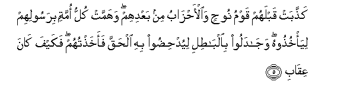
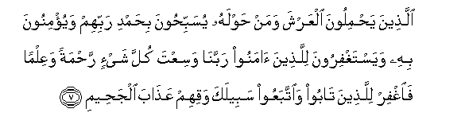
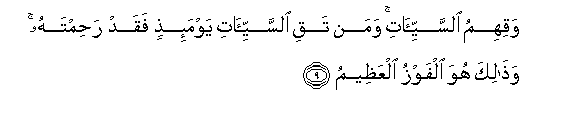

  
[Intangible Textual Heritage](../../index)  [Islam](../index) 
[Index](index)   
[Hypertext Qur'an](../htq/index)  [Unicode](../uq/040.htm#040_001) 
[Palmer](../sbe09/040)  [Pickthall](../pick/040.htm#040_001)  [Yusuf Ali
English](../yaq/yaq040)  [Rodwell](../qr/040)   
  
[Sūra XL.: Mū-min, or The Believer. Index](040)  
  [Previous](03908)  [Next](04002) 

------------------------------------------------------------------------

  
*The Holy Quran*, tr. by Yusuf Ali, \[1934\], at Intangible Textual
Heritage

------------------------------------------------------------------------

# Sūra XL.: Mū-min, or The Believer.

### Section 1

1. <u>Ha</u>-meem

1\. Hā-Mīm.

------------------------------------------------------------------------

2. Tanzeelu alkit<u>a</u>bi mina All<u>a</u>hi alAAazeezi alAAaleem**i**

2\. The revelation  
Of this Book  
Is from God,  
Exalted in Power,  
Full of Knowledge,—

------------------------------------------------------------------------

3. Gh<u>a</u>firi a**l**<u>thth</u>anbi waq<u>a</u>bili a**l**ttawbi
shadeedi alAAiq<u>a</u>bi <u>th</u>ee a**l**<u>tt</u>awli l<u>a</u>
il<u>a</u>ha ill<u>a</u> huwa ilayhi alma<u>s</u>eer**u**

3\. Who forgiveth Sin,  
Accepteth Repentance,  
Is Strict in Punishment,  
And hath a Long Reach  
(In all things).  
There is no god  
But He: to Him  
Is the Final Goal.

------------------------------------------------------------------------

4. M<u>a</u> yuj<u>a</u>dilu fee <u>a</u>y<u>a</u>ti All<u>a</u>hi
ill<u>a</u> alla<u>th</u>eena kafaroo fal<u>a</u> yaghrurka taqallubuhum
fee albil<u>a</u>d**i**

4\. None can dispute  
About the Signs of God  
But the Unbelievers.  
Let not, then,  
Their strutting about  
Through the land  
Deceive thee!

------------------------------------------------------------------------

5. Ka<u>thth</u>abat qablahum qawmu noo<u>h</u>in
wa**a**l-a<u>h</u>z<u>a</u>bu min baAAdihim wahammat kullu ommatin
birasoolihim liya/khu<u>th</u>oohu waj<u>a</u>daloo
bi**a**lb<u>at</u>ili liyud<u>h</u>i<u>d</u>oo bihi al<u>h</u>aqqa
faakha<u>th</u>tuhum fakayfa k<u>a</u>na AAiq<u>a</u>b**i**

5\. But (there were people) before them,  
Who denied (the Signs),—  
The People of Noah,  
And the Confederates  
(Of Evil) after them;  
And every People plotted  
Against their prophet,  
To seize him, and disputed  
By means of vanities,  
Therewith to condemn  
The Truth: but it was I  
That seized them!  
And how (terrible)  
Was My Requital!

------------------------------------------------------------------------

6. Waka<u>tha</u>lika <u>h</u>aqqat kalimatu rabbika AAal<u>a</u>
alla<u>th</u>eena kafaroo annahum a<u>s</u>-<u>ha</u>bu
a**l**nn<u>a</u>r**i**

6\. Thus was the Decree  
Of thy Lord proved true  
Against the Unbelievers  
That truly they are  
Companions of the Fire!

------------------------------------------------------------------------

7. Alla<u>th</u>eena ya<u>h</u>miloona alAAarsha waman <u>h</u>awlahu
yusabbi<u>h</u>oona bi<u>h</u>amdi rabbihim wayu/minoona bihi
wayastaghfiroona lilla<u>th</u>eena <u>a</u>manoo rabban<u>a</u>
wasiAAta kulla shay-in ra<u>h</u>matan waAAilman fa**i**ghfir
lilla<u>th</u>eena t<u>a</u>boo wa**i**ttabaAAoo sabeelaka waqihim
AAa<u>tha</u>ba alja<u>h</u>eem**i**

7\. Those who sustain  
The Throne (of God)  
And those around it  
Sing Glory and Praise  
To their Lord; believe  
In Him; and implore Forgiveness  
For those who believe:  
"Our Lord! Thy Reach  
Is over all things,  
In Mercy and Knowledge.  
Forgive, then, those who  
Turn in Repentance, and follow  
Thy Path; and preserve them  
From the Penalty  
Of the Blazing Fire!

------------------------------------------------------------------------

8. Rabban<u>a</u> waadkhilhum jann<u>a</u>ti AAadnin allatee waAAadtahum
waman <u>s</u>ala<u>h</u>a min <u>a</u>b<u>a</u>-ihim waazw<u>a</u>jihim
wa<u>th</u>urriyy<u>a</u>tihim innaka anta alAAazeezu
al<u>h</u>akeem**u**

8\. "And grant, our Lord!  
That they enter  
The Gardens of Eternity,  
Which Thou hast promised  
To them, and to the righteous  
Among their fathers,  
Their wives, and their posterity!  
For Thou art (He),  
The Exalted in Might,  
Full of Wisdom.

------------------------------------------------------------------------

9. Waqihimu a**l**ssayyi-<u>a</u>ti waman taqi a**l**ssayyi-<u>a</u>ti
yawma-i<u>th</u>in faqad ra<u>h</u>imtahu wa<u>tha</u>lika huwa alfawzu
alAAa*<u>th</u>*eem**u**

9\. "And preserve them  
From (all) ills;  
And any whom Thou  
Dost preserve from ills  
That Day,—on them  
Wilt Thou have bestowed  
Mercy indeed: and that  
Will be truly (for them)  
The highest Achievement".

------------------------------------------------------------------------

[Next: Section 2 (10-20)](04002)

