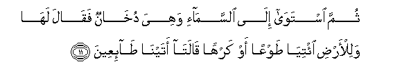
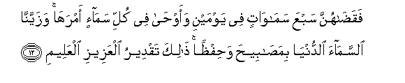
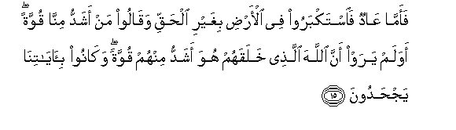
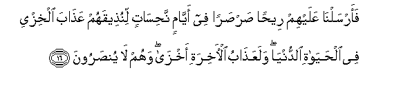
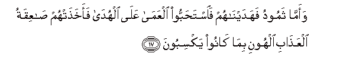

  
[Intangible Textual Heritage](../../index)  [Islam](../index) 
[Index](index)   
[Hypertext Qur'an](../htq/index)  [Unicode](../uq/041.htm#041_009) 
[Palmer](../sbe09/041)  [Pickthall](../pick/041.htm#041_009)  [Yusuf Ali
English](../yaq/yaq041)  [Rodwell](../qr/041)   
  
[Sūra XLI.: Ḥā-mīm (Abbreviated Letters), or Ḥā-Mīm Sajda, or Fuṣṣilat
Index](041)  
  [Previous](04101)  [Next](04103) 

------------------------------------------------------------------------

  
*The Holy Quran*, tr. by Yusuf Ali, \[1934\], at Intangible Textual
Heritage

------------------------------------------------------------------------

# Sūra XLI.: Ḥā-mīm (Abbreviated Letters), or Ḥā-Mīm Sajda, or Fuṣṣilat

### Section 2

------------------------------------------------------------------------

9. Qul a-innakum latakfuroona bi**a**lla<u>th</u>ee khalaqa
al-ar<u>d</u>a fee yawmayni watajAAaloona lahu and<u>a</u>dan
<u>tha</u>lika rabbu alAA<u>a</u>lameen**a**

9\. Say: Is it that ye  
Deny Him Who created  
The earth in two Days?  
And do ye join equals  
With Him? He is  
The Lord of (all)  
The Worlds.

------------------------------------------------------------------------

10. WajaAAala feeh<u>a</u> raw<u>a</u>siya min fawqih<u>a</u>
wab<u>a</u>raka feeh<u>a</u> waqaddara feeh<u>a</u>
aqw<u>a</u>tah<u>a</u> fee arbaAAati ayy<u>a</u>min saw<u>a</u>an
li**l**ss<u>a</u>-ileen**a**

10\. He set on the (earth),  
Mountains standing firm,  
High above it,  
And bestowed blessings on  
The earth, and measured therein  
All things to give them  
Nourishment in due proportion,  
In four Days, in accordance  
With (the needs of)  
Those who seek (sustenance).

------------------------------------------------------------------------

11. Thumma istaw<u>a</u> il<u>a</u> a**l**ssam<u>a</u>-i wahiya
dukh<u>a</u>nun faq<u>a</u>la lah<u>a</u> walil-ar<u>d</u>i
i/tiy<u>a</u> <u>t</u>awAAan aw karhan q<u>a</u>lat<u>a</u>
atayn<u>a</u> <u>ta</u>-iAAeen**a**

11\. Moreover He comprehended  
In His design the sky,  
And it had been (as) smoke:  
He said to it  
And to the earth:  
"Come ye together,  
Willingly or unwillingly."  
They said: "We do come  
(Together), in willing obedience."

------------------------------------------------------------------------

12. Faqa<u>da</u>hunna sabAAa sam<u>a</u>w<u>a</u>tin fee yawmayni
waaw<u>ha</u> fee kulli sam<u>a</u>-in amrah<u>a</u> wazayyann<u>a</u>
a**l**ssam<u>a</u>a a**l**dduny<u>a</u> bima<u>sa</u>bee<u>h</u>a
wa<u>h</u>if*<u>th</u>*an <u>tha</u>lika taqdeeru alAAazeezi
alAAaleem**i**

12\. So he completed them  
As seven firmaments  
In two Days, and He  
Assigned to each heaven  
Its duty and command.  
And We adorned  
The lower heaven  
With lights, and (provided it)  
With guard. Such  
Is the Decree of (Him)  
The Exalted in Might,  
Full of knowledge.

------------------------------------------------------------------------

13. Fa-in aAAra<u>d</u>oo fuqul an<u>th</u>artukum <u>sa</u>AAiqatan
mithla <u>sa</u>AAiqati AA<u>a</u>din wathamood**a**

13\. But if they turn away,  
Say thou: "I have warned  
You of a stunning Punishment  
(As of thunder and lightning)  
Like that which (overtook)  
The ‘Ād and the <u>Th</u>amūd!"

------------------------------------------------------------------------

14. I<u>th</u> j<u>a</u>at-humu a**l**rrusulu min bayni aydeehim wamin
khalfihim all<u>a</u> taAAbudoo ill<u>a</u> All<u>a</u>ha q<u>a</u>loo
law sh<u>a</u>a rabbun<u>a</u> laanzala mal<u>a</u>-ikatan
fa-inn<u>a</u> bim<u>a</u> orsiltum bihi k<u>a</u>firoon**a**

14\. Behold, the apostles came  
To them, from before them  
And behind them, (preaching):  
"Serve none but God."  
They said, "If our Lord  
Had so pleased, He would  
Certainly have sent down angels  
(To preach): now we reject  
Your mission (altogether)."

------------------------------------------------------------------------

15. Faamm<u>a</u> AA<u>a</u>dun fa**i**stakbaroo fee al-ar<u>d</u>i
bighayri al<u>h</u>aqqi waq<u>a</u>loo man ashaddu minn<u>a</u> quwwatan
awa lam yaraw anna All<u>a</u>ha alla<u>th</u>ee khalaqahum huwa ashaddu
minhum quwwatan wak<u>a</u>noo bi-<u>a</u>y<u>a</u>tin<u>a</u>
yaj<u>h</u>adoon**a**

15\. Now the ‘Ād behaved  
Arrogantly through the land,  
Against (all) truth and reason,  
And said: "Who is superior  
To us in strength?" What!  
Did they not see that  
God, Who created them,  
Was superior to them  
In strength? But they  
Continued to reject Our Signs!

------------------------------------------------------------------------

16. Faarsaln<u>a</u> AAalayhim ree<u>h</u>an <u>s</u>ar<u>s</u>aran fee
ayy<u>a</u>min na<u>h</u>is<u>a</u>tin linu<u>th</u>eeqahum
AAa<u>tha</u>ba alkhizyi fee al<u>h</u>ay<u>a</u>ti a**l**dduny<u>a</u>
walaAAa<u>tha</u>bu al-<u>a</u>khirati akhz<u>a</u> wahum l<u>a</u>
yun<u>s</u>aroon**a**

16\. So We sent against them  
A furious Wind through days  
Of disaster, that We might  
Give them a taste  
Of a Penalty of humiliation  
In this Life; but the Penalty  
Of a Hereafter will be  
More humiliating still:  
And they will find  
No help.

------------------------------------------------------------------------

17. Waamm<u>a</u> thamoodu fahadayn<u>a</u>hum fa**i**sta<u>h</u>abboo
alAAam<u>a</u> AAal<u>a</u> alhud<u>a</u> faakha<u>th</u>at-hum
<u>sa</u>AAiqatu alAAa<u>tha</u>bi alhooni bim<u>a</u> k<u>a</u>noo
yaksiboon**a**

17\. As to the <u>Th</u>amūd,  
We gave them guidance,  
But they preferred blindness  
(Of heart) to Guidance:  
So the stunning Punishment  
Of humiliation seized them,  
Because of what they had earned.

------------------------------------------------------------------------

18. Wanajjayn<u>a</u> alla<u>th</u>eena <u>a</u>manoo wak<u>a</u>noo
yattaqoon**a**

18\. But We delivered those  
Who believed and practised righteousness.

------------------------------------------------------------------------

[Next: Section 3 (19-25)](04103)

