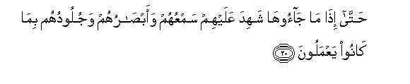
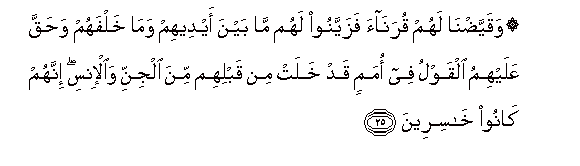

  
[Intangible Textual Heritage](../../index)  [Islam](../index) 
[Index](index)   
[Hypertext Qur'an](../htq/index)  [Unicode](../uq/041.htm#041_019) 
[Palmer](../sbe09/041)  [Pickthall](../pick/041.htm#041_019)  [Yusuf Ali
English](../yaq/yaq041)  [Rodwell](../qr/041)   
  
[Sūra XLI.: Ḥā-mīm (Abbreviated Letters), or Ḥā-Mīm Sajda, or Fuṣṣilat
Index](041)  
  [Previous](04102)  [Next](04104) 

------------------------------------------------------------------------

  
*The Holy Quran*, tr. by Yusuf Ali, \[1934\], at Intangible Textual
Heritage

------------------------------------------------------------------------

# Sūra XLI.: Ḥā-mīm (Abbreviated Letters), or Ḥā-Mīm Sajda, or Fuṣṣilat

### Section 3

------------------------------------------------------------------------

19. Wayawma yu<u>h</u>sharu aAAd<u>a</u>o All<u>a</u>hi il<u>a</u>
a**l**nn<u>a</u>ri fahum yoozaAAoon**a**

19\. On the Day that  
The enemies of God  
Will be gathered together  
To the Fire, they will  
Be marched in ranks.

------------------------------------------------------------------------

20. <u>H</u>att<u>a</u> i<u>tha</u> m<u>a</u> j<u>a</u>ooh<u>a</u>
shahida AAalayhim samAAuhum waab<u>sa</u>ruhum wajulooduhum bim<u>a</u>
k<u>a</u>noo yaAAmaloon**a**

20\. At length, when they reach  
The (Fire), their hearing,  
Their sight, and their skins  
Will bear witness against them,  
As to (all) their deeds.

------------------------------------------------------------------------

21. Waq<u>a</u>loo lijuloodihim lima shahidtum AAalayn<u>a</u>
q<u>a</u>loo an<u>t</u>aqan<u>a</u> All<u>a</u>hu alla<u>th</u>ee
an<u>t</u>aqa kulla shay-in wahuwa khalaqakum awwala marratin wa-ilayhi
turjaAAoon**a**

21\. They will say to their skins:  
"Why bear ye witness  
Against us?" They will say:  
"God hath given us speech,—  
(He) Who giveth speech  
To everything: He created  
You for the first time,  
And unto Him were ye  
To return.

------------------------------------------------------------------------

22. Wam<u>a</u> kuntum tastatiroona an yashhada AAalaykum samAAukum
wal<u>a</u> ab<u>sa</u>rukum wal<u>a</u> juloodukum wal<u>a</u>kin
*<u>th</u>*anantum anna All<u>a</u>ha l<u>a</u> yaAAlamu katheeran
mimm<u>a</u> taAAmaloon**a**

22\. "Ye did not seek  
To hide yourselves, lest  
Your hearing, your sight,  
And your skins should bear  
Witness against you! But  
Ye did think that God  
Knew not many of [the](errata.htm#6) things  
That ye used to do!

------------------------------------------------------------------------

23. Wa<u>tha</u>likum *<u>th</u>*annukumu alla<u>th</u>ee
*<u>th</u>*anantum birabbikum ard<u>a</u>kum faa<u>s</u>ba<u>h</u>tum
mina alkh<u>a</u>sireen**a**

23\. "But this thought of yours  
Which ye did entertain  
Concerning your Lord, hath  
Brought you to destruction,  
And (now) have ye become  
Of those utterly lost!"

------------------------------------------------------------------------

24. Fa-in ya<u>s</u>biroo fa**al**nn<u>a</u>ru mathwan lahum wa-in
yastaAAtiboo fam<u>a</u> hum mina almuAAtabeen**a**

24\. If, then, they have patience,  
The Fire will be  
A Home for them!  
And if they beg  
To be received into favour,  
Into favour will they not  
(Then) be received.

------------------------------------------------------------------------

25. Waqayya<u>d</u>n<u>a</u> lahum quran<u>a</u>a fazayyanoo lahum
m<u>a</u> bayna aydeehim wam<u>a</u> khalfahum wa<u>h</u>aqqa AAalayhimu
alqawlu fee omamin qad khalat min qablihim mina aljinni wa**a**l-insi
innahum k<u>a</u>noo kh<u>a</u>sireen**a**

25\. And We have destined  
For them intimate companions  
(Of like nature), who made  
Alluring to them what was  
Before them and behind them;  
And the sentence among  
The previous generations of Jinns  
And men; who have passed away,  
Is proved against them;  
For they are utterly lost.

------------------------------------------------------------------------

[Next: Section 4 (26-32)](04104)

