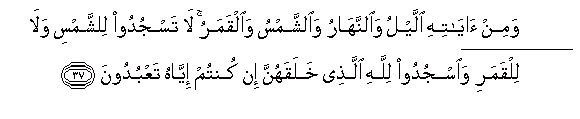
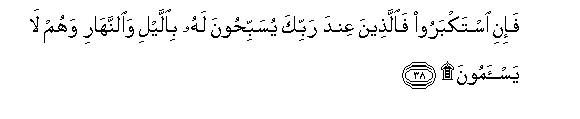
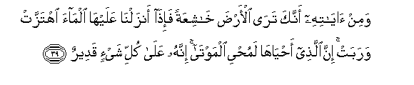
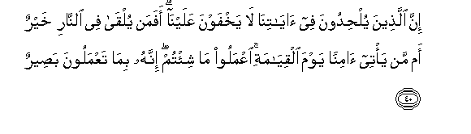
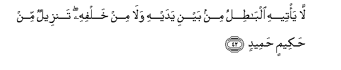
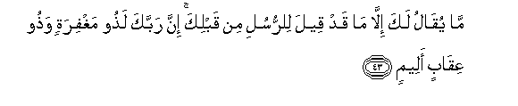
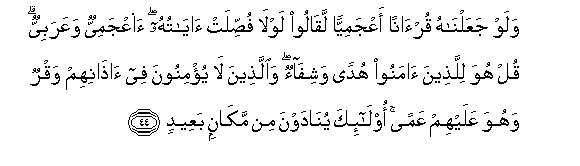

  
[Intangible Textual Heritage](../../index)  [Islam](../index) 
[Index](index)   
[Hypertext Qur'an](../htq/index)  [Unicode](../uq/041.htm#041_033) 
[Palmer](../sbe09/041)  [Pickthall](../pick/041.htm#041_033)  [Yusuf Ali
English](../yaq/yaq041)  [Rodwell](../qr/041)   
  
[Sūra XLI.: Ḥā-mīm (Abbreviated Letters), or Ḥā-Mīm Sajda, or Fuṣṣilat
Index](041)  
  [Previous](04104)  [Next](04106) 

------------------------------------------------------------------------

  
*The Holy Quran*, tr. by Yusuf Ali, \[1934\], at Intangible Textual
Heritage

------------------------------------------------------------------------

# Sūra XLI.: Ḥā-mīm (Abbreviated Letters), or Ḥā-Mīm Sajda, or Fuṣṣilat

### Section 5

------------------------------------------------------------------------

33. Waman a<u>h</u>sanu qawlan mimman daAA<u>a</u> il<u>a</u>
All<u>a</u>hi waAAamila <u>sa</u>li<u>h</u>an waq<u>a</u>la innanee mina
almuslimeen**a**

33\. Who is better in speech  
Than one who calls (men)  
To God, works righteousness,  
And says, "I am of those  
Who bow in Islam"?

------------------------------------------------------------------------

34. Wal<u>a</u> tastawee al<u>h</u>asanatu wal<u>a</u> a**l**ssayyi-atu
idfaAA bi**a**llatee hiya a<u>h</u>sanu fa-i<u>tha</u> alla<u>th</u>ee
baynaka wabaynahu AAad<u>a</u>watun kaannahu waliyyun
<u>h</u>ameem**un**

34\. Nor can Goodness and Evil  
Be equal. Repel (Evil)  
With what is better:  
Then will he between whom  
And thee was hatred  
Become as it were  
Thy friend and intimate!

------------------------------------------------------------------------

35. Wam<u>a</u> yulaqq<u>a</u>h<u>a</u> ill<u>a</u> alla<u>th</u>eena
<u>s</u>abaroo wam<u>a</u> yulaqq<u>a</u>h<u>a</u> ill<u>a</u>
<u>th</u>oo <u>h</u>a*<u>thth</u>*in AAa*<u>th</u>*eem**in**

35\. And no one will be  
Granted such goodness  
Except those who exercise  
Patience and self-restraint,—  
None but persons of  
The greatest good fortune.

------------------------------------------------------------------------

36. Wa-imm<u>a</u> yanzaghannaka mina a**l**shshay<u>ta</u>ni nazghun
fa**i**staAAi<u>th</u> bi**A**ll<u>a</u>hi innahu huwa a**l**ssameeAAu
alAAaleem**u**

36\. And if (at any time)  
An incitement to discord  
Is made to thee  
By the Evil One,  
Seek refuge in God.  
He is the One  
Who hears and knows  
All things.

------------------------------------------------------------------------

37. Wamin <u>a</u>y<u>a</u>tihi allaylu wa**al**nnah<u>a</u>ru
wa**al**shshamsu wa**a**lqamaru l<u>a</u> tasjudoo li**l**shshamsi
wal<u>a</u> lilqamari wa**o**sjudoo lill<u>a</u>hi ala<u>th</u>ee
khalaqahunna in kuntum iyy<u>a</u>hu taAAbudoon**a**

37\. Among His Signs are  
The Night and the Day,  
And the Sun and the Moon.  
Adore not the sun  
And the moon, but adore  
God, Who created them,  
If it is. Him ye wish  
To serve.

------------------------------------------------------------------------

38. Fa-ini istakbaroo fa**a**lla<u>th</u>eena AAinda rabbika
yusabbi<u>h</u>oona lahu bi**a**llayli wa**al**nnah<u>a</u>ri wahum
l<u>a</u> yas-amoon**a**

38\. But if the (Unbelievers)  
Are arrogant, (no matter):  
For in the presence  
Of thy Lord are those  
Who celebrate His praises  
By night and by day.  
And they never flag  
(Nor feel themselves  
Above it).

------------------------------------------------------------------------

39. Wamin <u>a</u>y<u>a</u>tihi annaka tar<u>a</u> al-ar<u>d</u>a
kh<u>a</u>shiAAatan fa-i<u>tha</u> anzaln<u>a</u> AAalayh<u>a</u>
alm<u>a</u>a ihtazzat warabat inna alla<u>th</u>ee
a<u>h</u>y<u>a</u>h<u>a</u> lamu<u>h</u>yee almawt<u>a</u> innahu
AAal<u>a</u> kulli shay-in qadeer**un**

39\. And among His Signs  
In this: thou seest  
The earth barren and desolate;  
But when We send down  
Rain to it, it is stirred  
To life and yields increase.  
Truly, He Who gives life  
To the (dead) earth  
Can surely give life  
To (men) who are dead.  
For He has power  
Over all things.

------------------------------------------------------------------------

40. Inna alla<u>th</u>eena yul<u>h</u>idoona fee
<u>a</u>y<u>a</u>tin<u>a</u> l<u>a</u> yakhfawna AAalayn<u>a</u> afaman
yulq<u>a</u> fee a**l**nn<u>a</u>ri khayrun amman ya/tee <u>a</u>minan
yawma alqiy<u>a</u>mati iAAmaloo m<u>a</u> shi/tum innahu bim<u>a</u>
taAAmaloona ba<u>s</u>eer**un**

40\. Those who pervert  
The Truth in Our Signs  
Are not hidden from Us.  
Which is better?—he that  
Is cast into the Fire,  
Or he that comes safe through,  
On the Day of Judgment?  
Do what ye will:  
Verily He seeth (clearly)  
All that ye do.

------------------------------------------------------------------------

41. Inna alla<u>th</u>eena kafaroo bi**al**<u>thth</u>ikri lamm<u>a</u>
j<u>a</u>ahum wa-innahu lakit<u>a</u>bun AAazeez**un**

41\. Those who reject the Message  
When it comes to them  
(Are not hidden from Us).  
And indeed it is a Book  
Of exalted power.

------------------------------------------------------------------------

42. L<u>a</u> ya/teehi alb<u>at</u>ilu min bayni yadayhi wal<u>a</u> min
khalfihi tanzeelun min <u>h</u>akeemin <u>h</u>ameed**in**

42\. No falsehood can approach it  
From before or behind it:  
It is sent down  
By One Full of Wisdom,  
Worthy of all Praise.

------------------------------------------------------------------------

43. M<u>a</u> yuq<u>a</u>lu laka ill<u>a</u> m<u>a</u> qad qeela
li**l**rrusuli min qablika inna rabbaka la<u>th</u>oo maghfiratin
wa<u>th</u>oo AAiq<u>a</u>bin aleem**in**

43\. Nothing is said to thee  
That was not said  
To the apostles before thee:  
That thy Lord has  
At His command (all) Forgiveness  
As well as a most  
Grievous Penalty.

------------------------------------------------------------------------

44. Walaw jaAAaln<u>a</u>hu qur-<u>a</u>nan aAAjamiyyan laq<u>a</u>loo
lawl<u>a</u> fu<u>ss</u>ilat <u>a</u>y<u>a</u>tuhu aaAAjamiyyun
waAAarabiyyun qul huwa lilla<u>th</u>eena <u>a</u>manoo hudan
washif<u>a</u>on wa**a**lla<u>th</u>eena l<u>a</u> yu/minoona fee
<u>atha</u>nihim waqrun wahuwa AAalayhim AAaman ol<u>a</u>-ika
yun<u>a</u>dawna min mak<u>a</u>nin baAAeed**in**

44\. Had We sent this as  
A Qur-ān (in a language)  
Other than Arabic, they would  
Have said: "Why are not  
Its verses explained in detail?  
What! (a Book) not in Arabic  
And (a Messenger) an Arab?"  
Say: "It is a guide  
And a healing to those  
Who believe; and for those  
Who believe not, there is  
A deafness in their ears,  
And it is blindness in their (eyes):  
They are (as it were)  
Being called from a place  
Far distant!"

------------------------------------------------------------------------

[Next: Section 6 (45-54)](04106)

