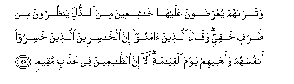
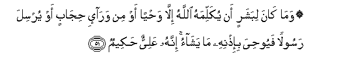
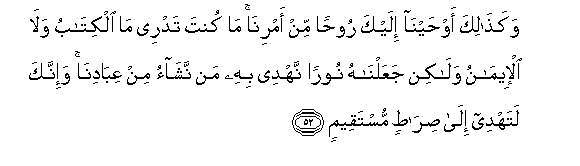

  
[Intangible Textual Heritage](../../index)  [Islam](../index) 
[Index](index)   
[Hypertext Qur'an](../htq/index)  [Unicode](../uq/042.htm#042_044) 
[Palmer](../sbe09/042)  [Pickthall](../pick/042.htm#042_044)  [Yusuf Ali
English](../yaq/yaq042)  [Rodwell](../qr/042)   
  
[Sūra XLII.: Shūrā, or Consultation. Index](042)  
  [Previous](04204)  [Next](04301) 

------------------------------------------------------------------------

  
*The Holy Quran*, tr. by Yusuf Ali, \[1934\], at Intangible Textual
Heritage

------------------------------------------------------------------------

# Sūra XLII.: Shūrā, or Consultation.

### Section 5

------------------------------------------------------------------------

44. Waman yu<u>d</u>lili All<u>a</u>hu fam<u>a</u> lahu min waliyyin min
baAAdihi watar<u>a</u> a**l***<u>thth</u>*<u>a</u>limeena lamm<u>a</u>
raawoo alAAa<u>tha</u>ba yaqooloona hal il<u>a</u> maraddin min
sabeel**in**

44\. For any whom God  
Leaves astray, there is  
No protector thereafter.  
And thou wilt see  
The wrong-doers, when  
In sight of the Penalty,  
Say: "Is there any way  
(To effect) a return?"

------------------------------------------------------------------------

45. Watar<u>a</u>hum yuAAra<u>d</u>oona AAalayh<u>a</u>
kh<u>a</u>shiAAeena mina a**l**<u>thth</u>ulli yan*<u>th</u>*uroona min
<u>t</u>arfin khafiyyin waq<u>a</u>la alla<u>th</u>eena <u>a</u>manoo
inna alkh<u>a</u>sireena alla<u>th</u>eena khasiroo anfusahum waahleehim
yawma alqiy<u>a</u>mati al<u>a</u> inna
a**l***<u>thth</u>*<u>a</u>limeena fee AAa<u>tha</u>bin muqeem**in**

45\. And thou wilt see them  
Brought forward to the (Penalty),  
In a humble frame of mind  
Because of (their) disgrace,  
(And) looking with a stealthy  
Glance. And the Believers  
Will say: "Those are indeed.  
In loss. who have given  
To perdition their own selves  
And those belonging to them  
On the Day of Judgment.  
Behold! Truly the wrong-doers  
Are in a lasting Penalty!"

------------------------------------------------------------------------

46. Wam<u>a</u> k<u>a</u>na lahum min awliy<u>a</u>a
yan<u>s</u>uroonahum min dooni All<u>a</u>hi waman yu<u>d</u>lili
All<u>a</u>hu fam<u>a</u> lahu min sabeel**in**

46\. And no protectors have they  
To help them,  
Other than God.  
And for any whom God  
Leaves to stray, there is  
No way (to the Goal).

------------------------------------------------------------------------

47. Istajeeboo lirabbikum min qabli an ya/tiya yawmun l<u>a</u> maradda
lahu mina All<u>a</u>hi m<u>a</u> lakum min malja-in yawma-i<u>th</u>in
wam<u>a</u> lakum min nakeer**in**

47\. Hearken ye to your Lord,  
Before there come a Day  
Which there will be  
No putting back, because  
Of (the ordainment of) God!  
That Day there will be  
For you no place of refuge  
Nor will there be for you  
Any room for denial  
(Of your sins)!

------------------------------------------------------------------------

48. Fa-in aAAra<u>d</u>oo fam<u>a</u> arsaln<u>a</u>ka AAalayhim
<u>h</u>afee*<u>th</u>*an in AAalayka ill<u>a</u> albal<u>a</u>ghu
wa-inn<u>a</u> i<u>tha</u> a<u>th</u>aqn<u>a</u> al-ins<u>a</u>na
minn<u>a</u> ra<u>h</u>matan fari<u>h</u>a bih<u>a</u> wa-in
tu<u>s</u>ibhum sayyi-atun bim<u>a</u> qaddamat aydeehim fa-inna
al-ins<u>a</u>na kafoor**un**

48\. If then they turn away,  
We have not sent thee  
As a guard over them.  
Thy duty is but to convey  
(The Message). And truly,  
When We give man  
A taste of a Mercy  
From ourselves, he doth  
Exult thereat, but  
When some ill happens  
To him, on account  
Of the deeds which  
His hands have sent forth,  
Truly then is man ungrateful!

------------------------------------------------------------------------

49. Lill<u>a</u>hi mulku a**l**ssam<u>a</u>w<u>a</u>ti
wa**a**l-ar<u>d</u>i yakhluqu m<u>a</u> yash<u>a</u>o yahabu liman
yash<u>a</u>o in<u>a</u>than wayahabu liman yash<u>a</u>o
a**l**<u>thth</u>ukoor**a**

49\. To God belongs the dominion  
Of the heavens and the earth.  
He creates what He wills  
(And plans). He bestows  
(Children) male or female  
According to His Will (and Plan),

------------------------------------------------------------------------

50. Aw yuzawwijuhum <u>th</u>ukr<u>a</u>nan wa-in<u>a</u>than wayajAAalu
man yash<u>a</u>o AAaqeeman innahu AAaleemun qadeer**un**

50\. Or He bestows both males  
And females, and He leaves  
Barren whom He will:  
For He is full  
Of knowledge and power.

------------------------------------------------------------------------

51. Wam<u>a</u> k<u>a</u>na libasharin an yukallimahu All<u>a</u>hu
ill<u>a</u> wa<u>h</u>yan aw min war<u>a</u>-i <u>h</u>ij<u>a</u>bin aw
yursila rasoolan fayoo<u>h</u>iya bi-i<u>th</u>nihi m<u>a</u>
yash<u>a</u>o innahu AAaliyyun <u>h</u>akeem**un**

51\. It is not fitting  
For a man that God  
Should speak to him  
Except by inspiration,  
Or from behind a veil,  
Or by the sending  
Of a Messenger  
To reveal, with God's permission,  
What God wills: for He  
Is Most High, Most Wise.

------------------------------------------------------------------------

52. Waka<u>tha</u>lika aw<u>h</u>ayn<u>a</u> ilayka roo<u>h</u>an min
amrin<u>a</u> m<u>a</u> kunta tadree m<u>a</u> alkit<u>a</u>bu
wal<u>a</u> al-eem<u>a</u>nu wal<u>a</u>kin jaAAaln<u>a</u>hu nooran
nahdee bihi man nash<u>a</u>o min AAib<u>a</u>din<u>a</u> wa-innaka
latahdee il<u>a</u> <u>s</u>ir<u>at</u>in mustaqeem**in**

52\. And thus have We,  
By Our command, sent  
Inspiration to thee:  
Thou knewest not (before)  
What was Revelation, and  
What was Faith; but We  
Have made the (Qur-ān)  
A Light, wherewith We  
Guide such of Our servants  
As We will; and verily  
Thou dost guide (men)  
To the Straight Way,—

------------------------------------------------------------------------

53. <u>S</u>ir<u>at</u>i All<u>a</u>hi alla<u>th</u>ee lahu m<u>a</u>
fee a**l**ssam<u>a</u>w<u>a</u>ti wam<u>a</u> fee al-ar<u>d</u>i
al<u>a</u> il<u>a</u> All<u>a</u>hi ta<u>s</u>eeru al-omoor**u**

53\. The Way of God,  
To Whom belongs  
Whatever is in the heavens  
And whatever is on earth.  
Behold (how) all affairs  
Tend towards God!

------------------------------------------------------------------------

[Next: Section 1 (1-15)](04301)

