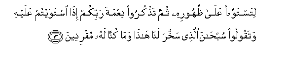

  
[Intangible Textual Heritage](../../index)  [Islam](../index) 
[Index](index)   
[Hypertext Qur'an](../htq/index)  [Unicode](../uq/043.htm#043_001) 
[Palmer](../sbe09/043)  [Pickthall](../pick/043.htm#043_001)  [Yusuf Ali
English](../yaq/yaq043)  [Rodwell](../qr/043)   
  
[Sūra XLIII.: Zu&lt;u&gt;kh&lt;/u&gt;ruf, or Gold Adornments.
Index](043)  
  [Previous](04205)  [Next](04302) 

------------------------------------------------------------------------

  
*The Holy Quran*, tr. by Yusuf Ali, \[1934\], at Intangible Textual
Heritage

------------------------------------------------------------------------

# Sūra XLIII.: Zu<u>kh</u>ruf, or Gold Adornments.

### Section 1

1. <u>Ha</u>-meem

1\. Ha-Mīm

------------------------------------------------------------------------

2. Wa**a**lkit<u>a</u>bi almubeen**i**

2\. By the Book that  
Makes things clear,—

------------------------------------------------------------------------

3. Inn<u>a</u> jaAAaln<u>a</u>hu qur-<u>a</u>nan AAarabiyyan laAAallakum
taAAqiloona

3\. We have made it  
A Qur-ān in: Arabic,  
That ye may be able  
To understand (and learn wisdom).

------------------------------------------------------------------------

4. Wa-innahu fee ommi alkit<u>a</u>bi ladayn<u>a</u> laAAaliyyun
<u>h</u>akeem**un**

4\. And verily, it is  
In the Mother of the Book,  
In Our Presence, high  
(In dignity), full of wisdom.

------------------------------------------------------------------------

5. Afana<u>d</u>ribu AAankumu a**l**<u>thth</u>ikra <u>s</u>af<u>h</u>an
an kuntum qawman musrifeen**a**

5\. Shall We then  
Take away the Message  
From you and repel (you),  
For that ye are a people  
Transgressing beyond bounds?

------------------------------------------------------------------------

6. Wakam arsaln<u>a</u> min nabiyyin fee al-awwaleen**a**

6\. But how many were  
The prophets We sent  
Amongst the peoples of old?

------------------------------------------------------------------------

7. Wam<u>a</u> ya/teehim min nabiyyin ill<u>a</u> k<u>a</u>noo bihi
yastahzi-oon**a**

7\. And never came there  
A prophet to them  
But they mocked him.

------------------------------------------------------------------------

8. Faahlakn<u>a</u> ashadda minhum ba<u>t</u>shan wama<u>da</u> mathalu
al-awwaleen**a**

8\. So We destroyed (them)—  
Stronger in power than these;—  
And (thus) has passed on  
The Parable of the peoples  
Of old.

------------------------------------------------------------------------

9. Wala-in saaltahum man khalaqa a**l**ssam<u>a</u>w<u>a</u>ti
wa**a**l-ar<u>d</u>a layaqoolunna khalaqahunna alAAazeezu alAAaleem**u**

9\. If thou wert  
To question them, "Who created  
The heavens and the earth?''  
They would be sure to reply,  
"They were created by (Him),  
The Exalted in Power,  
Full of Knowledge";—

------------------------------------------------------------------------

10. Alla<u>th</u>ee jaAAala lakumu al-ar<u>d</u>a mahdan wajaAAala lakum
feeh<u>a</u> subulan laAAallakum tahtadoon**a**

10\. (Yea, the same that)  
Has made for you  
The earth (like a carpet)  
Spread out, and has made  
For you roads (and channels)  
Therein, in order that ye  
May find guidance (on the way);

------------------------------------------------------------------------

11. Wa**a**lla<u>th</u>ee nazzala mina a**l**ssam<u>a</u>-i m<u>a</u>an
biqadarin faansharn<u>a</u> bihi baldatan maytan ka<u>tha</u>lika
tukhrajoon**a**

11\. That sends down  
(From time to time)  
Rain from the sky  
In due measure;—  
And We raise to life  
Therewith a land that is  
Dead; even so will ye  
Be raised (from the dead);—

------------------------------------------------------------------------

12. Wa**a**lla<u>th</u>ee khalaqa al-azw<u>a</u>ja kullah<u>a</u>
wajaAAala lakum mina alfulki wa**a**l-anAA<u>a</u>mi m<u>a</u>
tarkaboon**a**

12\. That has created pairs  
In all things, and has made  
For you ships and cattle  
On which ye ride,

------------------------------------------------------------------------

13. Litastawoo AAal<u>a</u> *<u>th</u>*uhoorihi thumma ta<u>th</u>kuroo
niAAmata rabbikum i<u>tha</u> istawaytum AAalayhi wataqooloo
sub<u>ha</u>na alla<u>th</u>ee sakhkhara lan<u>a</u> h<u>atha</u>
wam<u>a</u> kunn<u>a</u> lahu muqrineen**a**

13\. In order that ye may  
Sit firm and square  
On their backs, and when  
So seated, ye may  
Celebrate the (kind) favour  
Of your Lord, and say,  
"Glory to Him Who  
Has subjected these  
To our (use), for we  
Could never have accomplished  
This (by ourselves),

------------------------------------------------------------------------

14. Wa-inn<u>a</u> il<u>a</u> rabbin<u>a</u> lamunqaliboon**a**

14\. "And to our Lord, surely,  
Must we turn back!"

------------------------------------------------------------------------

15. WajaAAaloo lahu min AAib<u>a</u>dihi juz-an inna al-ins<u>a</u>na
lakafoorun mubeen**un**

15\. Yet they attribute  
To some of His servants  
A share with Him  
(In His godhead)!  
Truly is man a blasphemous  
Ingrate avowed!

------------------------------------------------------------------------

[Next: Section 2 (16-25)](04302)

