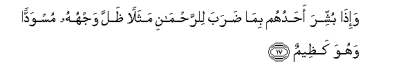
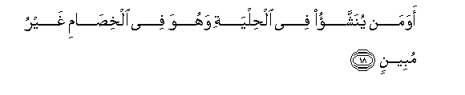
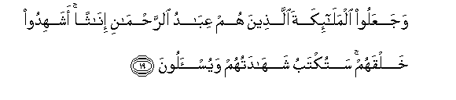
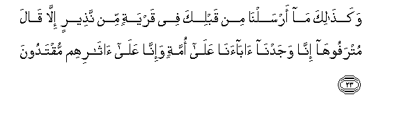
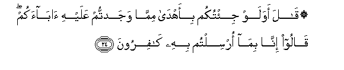

  
[Intangible Textual Heritage](../../index)  [Islam](../index) 
[Index](index)   
[Hypertext Qur'an](../htq/index)  [Unicode](../uq/043.htm#043_016) 
[Palmer](../sbe09/043)  [Pickthall](../pick/043.htm#043_016)  [Yusuf Ali
English](../yaq/yaq043)  [Rodwell](../qr/043)   
  
[Sūra XLIII.: Zu&lt;u&gt;kh&lt;/u&gt;ruf, or Gold Adornments.
Index](043)  
  [Previous](04301)  [Next](04303) 

------------------------------------------------------------------------

  
*The Holy Quran*, tr. by Yusuf Ali, \[1934\], at Intangible Textual
Heritage

------------------------------------------------------------------------

# Sūra XLIII.: Zu<u>kh</u>ruf, or Gold Adornments.

### Section 2

------------------------------------------------------------------------

16. Ami ittakha<u>th</u>a mimm<u>a</u> yakhluqu ban<u>a</u>tin
waa<u>s</u>f<u>a</u>kum bi**a**lbaneen**a**

16\. What! Has He taken  
Daughters out of what He  
Himself creates, and granted  
To you sons for choice?

------------------------------------------------------------------------

17. Wa-i<u>tha</u> bushshira a<u>h</u>aduhum bim<u>a</u> <u>d</u>araba
li**l**rra<u>h</u>m<u>a</u>ni mathalan *<u>th</u>*alla wajhuhu muswaddan
wahuwa ka*<u>th</u>*eem**un**

17\. When news is brought  
To one of them of (the birth  
Of) what he sets up  
As a likeness to (God)  
Most Gracious, his face  
Darkens, and he is filled  
With inward grief!

------------------------------------------------------------------------

18. Awaman yunashshao fee al<u>h</u>ilyati wahuwa fee alkhi<u>sa</u>mi
ghayru mubeen**in**

18\. Is then one brought up  
Among trinkets, and unable  
To give a clear account  
In a dispute (to be  
Associated with God)?

------------------------------------------------------------------------

19. WajaAAaloo almal<u>a</u>-ikata alla<u>th</u>eena hum AAib<u>a</u>du
a**l**rra<u>h</u>m<u>a</u>ni in<u>a</u>than ashahidoo khalqahum
satuktabu shah<u>a</u>datuhum wayus-aloon**a**

19\. And they make into females  
Angels who themselves serve  
God. Did they witness  
Their creation? Their evidence  
Will be recorded, and they  
Will be called to account!

------------------------------------------------------------------------

20. Waq<u>a</u>loo law sh<u>a</u>a a**l**rra<u>h</u>m<u>a</u>nu
m<u>a</u> AAabadn<u>a</u>hum m<u>a</u> lahum bi<u>tha</u>lika min
AAilmin in hum ill<u>a</u> yakhru<u>s</u>oon**a**

20\. ("Ah!") they say, "If  
It had been the Will  
Of (God) Most Gracious,  
We should not have  
Worshipped such (deities)!"  
Of that they have  
No knowledge! They  
Do nothing but lie!

------------------------------------------------------------------------

21. Am <u>a</u>tayn<u>a</u>hum kit<u>a</u>ban min qablihi fahum bihi
mustamsikoon**a**

21\. What! have We given them  
A Book before this,  
To which they are  
Holding fast?

------------------------------------------------------------------------

22. Bal q<u>a</u>loo inn<u>a</u> wajadn<u>a</u>
<u>a</u>b<u>a</u>an<u>a</u> AAal<u>a</u> ommatin wa-inn<u>a</u>
AAal<u>a</u> <u>a</u>th<u>a</u>rihim muhtadoon**a**

22\. Nay! they say: "We found  
Our fathers following  
A certain religion,  
And we do guide ourselves  
By their footsteps."

------------------------------------------------------------------------

23. Waka<u>tha</u>lika m<u>a</u> arsaln<u>a</u> min qablika fee qaryatin
min na<u>th</u>eerin ill<u>a</u> q<u>a</u>la mutrafooh<u>a</u>
inn<u>a</u> wajadn<u>a</u> <u>a</u>b<u>a</u>an<u>a</u> AAal<u>a</u>
ommatin wa-inn<u>a</u> AAal<u>a</u> <u>a</u>th<u>a</u>rihim
muqtadoon**a**

23\. Just in the same way,  
Whenever We sent a Warner  
Before thee to any people,  
The wealthy ones among them  
Said: "We found our fathers  
Following a certain religion,  
And we will certainly  
Follow in their footsteps."

------------------------------------------------------------------------

24. Q<u>a</u>la awa law ji/tukum bi-ahd<u>a</u> mimm<u>a</u> wajadtum
AAalayhi <u>a</u>b<u>a</u>akum q<u>a</u>loo inn<u>a</u> bim<u>a</u>
orsiltum bihi k<u>a</u>firoon**a**

24\. He said: "What!  
Even if I brought you  
Better guidance than that  
Which ye found  
Your fathers following?"  
They said: "For us,  
We deny that ye (prophets)  
Are sent (on a mission  
At all)."

------------------------------------------------------------------------

25. Fa**i**ntaqamn<u>a</u> minhum fa**o**n*<u>th</u>*ur kayfa
k<u>a</u>na AA<u>a</u>qibatu almuka<u>thth</u>ibeen**a**

25\. So We exacted retribution  
From them: now see  
What was the end  
Of those who rejected (Truth)!

------------------------------------------------------------------------

[Next: Section 3 (26-35)](04303)

