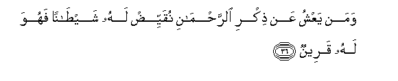
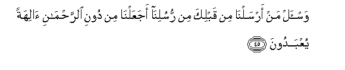

  
[Intangible Textual Heritage](../../index)  [Islam](../index) 
[Index](index)   
[Hypertext Qur'an](../htq/index)  [Unicode](../uq/043.htm#043_036) 
[Palmer](../sbe09/043)  [Pickthall](../pick/043.htm#043_036)  [Yusuf Ali
English](../yaq/yaq043)  [Rodwell](../qr/043)   
  
[Sūra XLIII.: Zu&lt;u&gt;kh&lt;/u&gt;ruf, or Gold Adornments.
Index](043)  
  [Previous](04303)  [Next](04305) 

------------------------------------------------------------------------

  
*The Holy Quran*, tr. by Yusuf Ali, \[1934\], at Intangible Textual
Heritage

------------------------------------------------------------------------

# Sūra XLIII.: Zu<u>kh</u>ruf, or Gold Adornments.

### Section 4

------------------------------------------------------------------------

36. Waman yaAAshu AAan <u>th</u>ikri a**l**rra<u>h</u>m<u>a</u>ni
nuqayyi<u>d</u> lahu shay<u>ta</u>nan fahuwa lahu qareen**un**

36\. If anyone withdraws himself  
From remembrance  
Of (God) Most Gracious,  
We appoint for him  
An evil one, to be  
An intimate companion to him.

------------------------------------------------------------------------

37. Wa-innahum laya<u>s</u>uddoonahum AAani a**l**ssabeeli
waya<u>h</u>saboona annahum muhtadoon**a**

37\. Such (evil ones) really  
Hinder them from the Path,  
But they think that they  
Are being guided aright!

------------------------------------------------------------------------

38. <u>H</u>att<u>a</u> i<u>tha</u> j<u>a</u>an<u>a</u> q<u>a</u>la
y<u>a</u> layta baynee wabaynaka buAAda almashriqayni fabi/sa
alqareen**u**

38\. At length, when (such a one)  
Comes to Us, he says  
(To his evil companion):  
"Would that between me  
And thee were the distance  
Of East and West!" Ah!  
Evil is the companion (indeed)!

------------------------------------------------------------------------

39. Walan yanfaAAakumu alyawma i<u>th</u> *<u>th</u>*alamtum annakum fee
alAAa<u>tha</u>bi mushtarikoon**a**

39\. When ye have done wrong,  
It will avail you nothing,  
That day, that ye shall be  
Partners in punishment!

------------------------------------------------------------------------

40. Afaanta tusmiAAu a**l**<u>ss</u>umma aw tahdee alAAumya waman
k<u>a</u>na fee <u>d</u>al<u>a</u>lin mubeen**in**

40\. Canst thou then make  
The deaf to hear, or give  
Direction to the blind  
Or to such as (wander)  
In manifest error?

------------------------------------------------------------------------

41. Fa-imm<u>a</u> na<u>th</u>habanna bika fa-inn<u>a</u> minhum
muntaqimoon**a**

41\. Even if We take thee  
Away, We shall be sure  
To exact retribution from them,

------------------------------------------------------------------------

42. Aw nuriyannaka alla<u>th</u>ee waAAadn<u>a</u>hum fa-inn<u>a</u>
AAalayhim muqtadiroon**a**

42\. Or We shall show thee  
That (accomplished) which We  
Have promised them:  
For verily We shall  
Prevail over them.

------------------------------------------------------------------------

43. Fa**i**stamsik bi**a**lla<u>th</u>ee oo<u>h</u>iya ilayka innaka
AAal<u>a</u> <u>s</u>ir<u>at</u>in mustaqeem**in**

43\. So hold thou fast  
To the Revelation sent down  
To thee: verily thou  
Art on a Straight Way.

------------------------------------------------------------------------

44. Wa-innahu la<u>th</u>ikrun laka waliqawmika wasawfa tus-aloon**a**

44\. The (Qur-ān) is indeed  
The Message, for thee  
And for thy people;  
And soon shall ye  
(All) be brought to account.

------------------------------------------------------------------------

45. Wa**i**s-al man arsaln<u>a</u> min qablika min rusulin<u>a</u>
ajaAAaln<u>a</u> min dooni a**l**rra<u>h</u>m<u>a</u>ni <u>a</u>lihatan
yuAAbadoon**a**

45\. And question thou our apostles  
Whom We sent before thee;  
Did We appoint any deities  
Other than (God) Most Gracious,  
To be worshipped?

------------------------------------------------------------------------

[Next: Section 5 (46-56)](04305)

