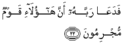

  
[Intangible Textual Heritage](../../index)  [Islam](../index) 
[Index](index)   
[Hypertext Qur'an](../htq/index)  [Unicode](../uq/044.htm#044_001) 
[Palmer](../sbe09/044)  [Pickthall](../pick/044.htm#044_001)  [Yusuf Ali
English](../yaq/yaq044)  [Rodwell](../qr/044)   
  
[Sūra XLIV.: Du&lt;u&gt;kh&lt;/u&gt;ān, or Smoke (or Mist.)
Index](044)  
  [Previous](04307)  [Next](04402) 

------------------------------------------------------------------------

  
*The Holy Quran*, tr. by Yusuf Ali, \[1934\], at Intangible Textual
Heritage

------------------------------------------------------------------------

# Sūra XLIV.: Du<u>kh</u>ān, or Smoke (or Mist.)

### Section 1

1. <u>Ha</u>-meem

1\. Hā-Mīm.

------------------------------------------------------------------------

2. Wa**a**lkit<u>a</u>bi almubeen**i**

2\. By the Book that  
Makes things clear;—

------------------------------------------------------------------------

3. Inn<u>a</u> anzaln<u>a</u>hu fee laylatin mub<u>a</u>rakatin
inn<u>a</u> kunn<u>a</u> mun<u>th</u>ireen**a**

3\. We sent it down  
During a blessed night:  
For We (ever) wish  
To warn (against Evil).

------------------------------------------------------------------------

4. Feeh<u>a</u> yufraqu kullu amrin <u>h</u>akeem**in**

4\. In that (night) is made  
Distinct every affair  
Of wisdom,

------------------------------------------------------------------------

5. Amran min AAindin<u>a</u> inn<u>a</u> kunn<u>a</u> mursileen**a**

5\. By command, from Our  
Presence. For We (ever)  
Send (revelations),

------------------------------------------------------------------------

6. Ra<u>h</u>matan min rabbika innahu huwa a**l**ssameeAAu
alAAaleem**u**

6\. As a Mercy  
From thy Lord:  
For He hears and knows  
(All things);

------------------------------------------------------------------------

7. Rabbi a**l**ssam<u>a</u>w<u>a</u>ti wa**a**l-ar<u>d</u>i wam<u>a</u>
baynahum<u>a</u> in kuntum mooqineen**a**

7\. The Lord of the heavens  
And the earth and all  
Between them, if ye (but)  
Have an assured faith.

------------------------------------------------------------------------

8. L<u>a</u> il<u>a</u>ha ill<u>a</u> huwa yu<u>h</u>yee wayumeetu
rabbukum warabbu <u>a</u>b<u>a</u>-ikumu al-awwaleen**a**

8\. There is no god but He:  
It is He Who gives life  
And gives death,  
The Lord and Cherisher  
To you and your earliest  
Ancestors.

------------------------------------------------------------------------

9. Bal hum fee shakkin yalAAaboon**a**

9\. Yet they play about  
In doubt.

------------------------------------------------------------------------

10. Fa**i**rtaqib yawma ta/tee a**l**ssam<u>a</u>o bidukh<u>a</u>nin
mubeen**in**

10\. Then watch thou  
For the Day  
That the sky will  
Bring forth a kind  
Of smoke (or mist)  
Plainly visible,

------------------------------------------------------------------------

11. Yaghsh<u>a</u> a**l**nn<u>a</u>sa h<u>atha</u> AAa<u>tha</u>bun
aleem**un**

11\. Enveloping the people:  
This will be a Penalty  
Grievous.

------------------------------------------------------------------------

12. Rabban<u>a</u> ikshif AAann<u>a</u> alAAa<u>tha</u>ba inn<u>a</u>
mu/minoon**a**

12\. (They will say:)  
"Our Lord! Remove  
The Penalty from us,  
For we do really believe!"

------------------------------------------------------------------------

13. Ann<u>a</u> lahumu a**l**<u>thth</u>ikr<u>a</u> waqad j<u>a</u>ahum
rasoolun mubeen**un**

13\. How shall the Message  
Be (effectual) for them,  
Seeing that an Apostle  
Explaining things clearly  
Has (already) come to them,—

------------------------------------------------------------------------

14. Thumma tawallaw AAanhu waq<u>a</u>loo muAAallamun majnoon**un**

14\. Yet they turn away  
From him and say: "Tutored  
(By others), a man possessed!"

------------------------------------------------------------------------

15. Inn<u>a</u> k<u>a</u>shifoo alAAa<u>tha</u>bi qaleelan innakum
AA<u>a</u>-idoon**a**

15\. We shall indeed remove  
The Penalty for a while,  
(But) truly ye will revert  
(To your ways).

------------------------------------------------------------------------

16. Yawma nab<u>t</u>ishu alba<u>t</u>shata alkubr<u>a</u> inn<u>a</u>
muntaqimoon**a**

16\. One day We shall seize  
You with a mighty onslaught:  
We will indeed (then)  
Exact Retribution!

------------------------------------------------------------------------

17. Walaqad fatann<u>a</u> qablahum qawma firAAawna waj<u>a</u>ahum
rasoolun kareem**un**

17\. We did, before them,  
Try the people of Pharaoh:  
There came to them  
An apostle most honourable,

------------------------------------------------------------------------

18. An addoo ilayya AAib<u>a</u>da All<u>a</u>hi innee lakum rasoolun
ameen**un**

18\. Saying: "Restore to me  
The servants of God:  
I am to you an apostle  
Worthy of all trust;

------------------------------------------------------------------------

19. Waan l<u>a</u> taAAloo AAal<u>a</u> All<u>a</u>hi innee
<u>a</u>teekum bisul<u>ta</u>nin mubeen**in**

19\. "And be not arrogant  
As against God:  
For I come to you  
With authority manifest.

------------------------------------------------------------------------

20. Wa-innee AAu<u>th</u>tu birabbee warabbikum an tarjumoon**i**

20\. "For me, I have sought  
Safety with my Lord  
And your Lord, against  
Your injuring me.

------------------------------------------------------------------------

21. Wa-in lam tu/minoo lee fa**i**AAtaziloon**i**

21\. "If ye believe me not,  
At least keep yourselves  
Away from me."

------------------------------------------------------------------------

22. FadaAA<u>a</u> rabbahu anna h<u>a</u>ol<u>a</u>-i qawmun
mujrimoon**a**

22\. (But they were aggressive:)  
Then he cried  
To his Lord:  
"These are indeed  
A people given to sin."

------------------------------------------------------------------------

23. Faasri biAAib<u>a</u>dee laylan innakum muttabaAAoon**a**

23\. (The reply came:)  
"March forth with my servants  
By night: for ye are  
Sure to be pursued.

------------------------------------------------------------------------

24. Wa**o**truki alba<u>h</u>ra rahwan innahum jundun mughraqoon**a**

24\. "And leave the sea  
As a furrow (divided):  
For they are a host  
(Destined) to be drowned."

------------------------------------------------------------------------

25. Kam tarakoo min jann<u>a</u>tin waAAuyoon**in**

25\. How many were the gardens  
And springs they left behind,

------------------------------------------------------------------------

26. WazurooAAin wamaq<u>a</u>min kareem**in**

26\. And corn-fields  
And noble buildings,

------------------------------------------------------------------------

27. WanaAAmatin k<u>a</u>noo feeh<u>a</u> f<u>a</u>kiheen**a**

27\. And wealth (and conveniences  
Of life), wherein they  
Had taken such delight!

------------------------------------------------------------------------

28. Ka<u>tha</u>lika waawrathn<u>a</u>h<u>a</u> qawman
<u>a</u>khareen**a**

28\. Thus (was their end)!  
And We made other people  
Inherit (those things)!

------------------------------------------------------------------------

29. Fam<u>a</u> bakat AAalayhimu a**l**ssam<u>a</u>o
wa**a**l-ar<u>d</u>u wam<u>a</u> k<u>a</u>noo mun*<u>th</u>*areen**a**

29\. And neither heaven  
Nor earth shed a tear  
Over them: nor were  
They given a respite (again).

------------------------------------------------------------------------

[Next: Section 2 (30-42)](04402)

