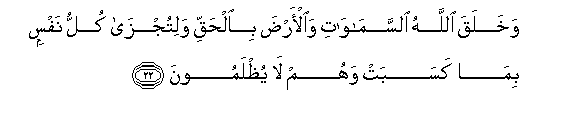
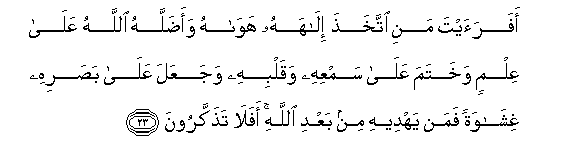
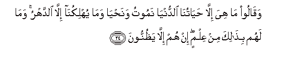
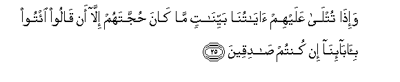
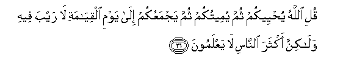

  
[Intangible Textual Heritage](../../index)  [Islam](../index) 
[Index](index)   
[Hypertext Qur'an](../htq/index)  [Unicode](../uq/045.htm#045_022) 
[Palmer](../sbe09/045)  [Pickthall](../pick/045.htm#045_022)  [Yusuf Ali
English](../yaq/yaq045)  [Rodwell](../qr/045)   
  
[Sūra XLV.: Ja&lt;u&gt;th&lt;/u&gt;iya, or Bowing the Knee.
Index](045)  
  [Previous](04502)  [Next](04504) 

------------------------------------------------------------------------

  
*The Holy Quran*, tr. by Yusuf Ali, \[1934\], at Intangible Textual
Heritage

------------------------------------------------------------------------

# Sūra XLV.: Ja<u>th</u>iya, or Bowing the Knee.

### Section 3

------------------------------------------------------------------------

22. Wakhalaqa All<u>a</u>hu a**l**ssam<u>a</u>w<u>a</u>ti
wa**a**l-ar<u>d</u>a bi**a**l<u>h</u>aqqi walitujz<u>a</u> kullu nafsin
bim<u>a</u> kasabat wahum l<u>a</u> yu*<u>th</u>*lamoon**a**

22\. God created the heavens  
And the earth for  
Just ends, and in order  
That each soul may find  
The recompense of what  
It has earned, and none  
Of them be wronged.

------------------------------------------------------------------------

23. Afaraayta mani ittakha<u>th</u>a il<u>a</u>hahu haw<u>a</u>hu
waa<u>d</u>allahu All<u>a</u>hu AAal<u>a</u> AAilmin wakhatama
AAal<u>a</u> samAAihi waqalbihi wajaAAala AAal<u>a</u> ba<u>s</u>arihi
ghish<u>a</u>watan faman yahdeehi min baAAdi All<u>a</u>hi afal<u>a</u>
ta<u>th</u>akkaroon**a**

23\. Then seest thou such  
A one as takes  
As his god his own  
Vain desire? God has,  
Knowing (him as such),  
Left him astray, and sealed  
His hearing and his heart  
(And understanding), and put  
A cover on his sight.  
Who, then, will guide him  
After God (has withdrawn  
Guidance)? Will ye not  
Then receive admonition?

------------------------------------------------------------------------

24. Waq<u>a</u>loo m<u>a</u> hiya ill<u>a</u>
<u>h</u>ay<u>a</u>tun<u>a</u> a**l**dduny<u>a</u> namootu
wana<u>h</u>y<u>a</u> wam<u>a</u> yuhlikun<u>a</u> ill<u>a</u>
a**l**ddahru wam<u>a</u> lahum bi<u>tha</u>lika min AAilmin in hum
ill<u>a</u> ya*<u>th</u>*unnoon**a**

24\. And they say: "What is  
There but our life  
In this world?  
We shall die and we live,  
And nothing but Time  
Can destroy us." But  
Of that they have no  
Knowledge: they merely conjecture:

------------------------------------------------------------------------

25. Wa-i<u>tha</u> tutl<u>a</u> AAalayhim <u>a</u>y<u>a</u>tun<u>a</u>
bayyin<u>a</u>tin m<u>a</u> k<u>a</u>na <u>h</u>ujjatahum ill<u>a</u> an
q<u>a</u>loo i/too bi-<u>a</u>b<u>a</u>-in<u>a</u> in kuntum
<u>sa</u>diqeen**a**

25\. And when Our Clear  
Signs are rehearsed to them,  
Their argument is nothing  
But this: they say, "Bring  
(Back) our forefathers, if  
What ye say is true!"

------------------------------------------------------------------------

26. Quli All<u>a</u>hu yu<u>h</u>yeekum thumma yumeetukum thumma
yajmaAAukum il<u>a</u> yawmi alqiy<u>a</u>mati l<u>a</u> rayba feehi
wal<u>a</u>kinna akthara a**l**nn<u>a</u>si l<u>a</u> yaAAlamoon**a**

26\. Say: "It is God Who  
Gives you life, then  
Gives you death; then  
He will gather you together  
For the Day of Judgment  
About which there is  
No doubt": but most  
Men do not understand.

------------------------------------------------------------------------

[Next: Section 4 (27-37)](04504)

