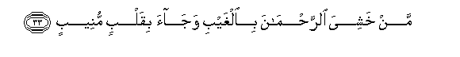

  
[Intangible Textual Heritage](../../index)  [Islam](../index) 
[Index](index)   
[Hypertext Qur'an](../htq/index)  [Unicode](../uq/050.htm#050_030) 
[Palmer](../sbe09/050)  [Pickthall](../pick/050.htm#050_030)  [Yusuf Ali
English](../yaq/yaq050)  [Rodwell](../qr/050)   
  
[Sūra L.: Qāf. Index](050)  
  [Previous](05002)  [Next](05101) 

------------------------------------------------------------------------

  
*The Holy Quran*, tr. by Yusuf Ali, \[1934\], at Intangible Textual
Heritage

------------------------------------------------------------------------

# Sūra L.: Qāf.

### Section 3

------------------------------------------------------------------------

30. Yawma naqoolu lijahannama hali imtala/ti wataqoolu hal min
mazeed**in**

30\. One Day We will  
Ask Hell, "Art thou  
Filled to the full?"  
It will say, "Are there  
Any more (to come)?"

------------------------------------------------------------------------

31. Waozlifati aljannatu lilmuttaqeena ghayra baAAeed**in**

31\. And the Garden  
Will be brought nigh  
To the Righteous,—no more  
A thing distant.

------------------------------------------------------------------------

32. H<u>atha</u> m<u>a</u> tooAAadoona likulli aww<u>a</u>bin
<u>h</u>afee*<u>th</u>***in**

32\. (A voice will say:)  
"This is what was  
Promised for you,  
For every one who turned  
(To God) in sincere repentance,  
Who kept (His Law),

------------------------------------------------------------------------

33. Man khashiya a**l**rra<u>h</u>m<u>a</u>na bi**a**lghaybi
waj<u>a</u>a biqalbin muneeb**in**

33\. "Who feared (God)  
Most Gracious unseen,  
And brought a heart  
Turned in devotion (to Him):

------------------------------------------------------------------------

34. Odkhulooh<u>a</u> bisal<u>a</u>min <u>tha</u>lika yawmu
alkhulood**i**

34\. "Enter ye therein  
In Peace and Security;  
This is a Day  
Of Eternal Life!"

------------------------------------------------------------------------

35. Lahum m<u>a</u> yash<u>a</u>oona feeh<u>a</u> waladayn<u>a</u>
mazeed**un**

35\. There will be for them  
Therein all that they wish,—  
And more besides  
In Our Presence,

------------------------------------------------------------------------

36. Wakam ahlakn<u>a</u> qablahum min qarnin hum ashaddu minhum
ba<u>t</u>shan fanaqqaboo fee albil<u>a</u>di hal min
ma<u>h</u>ee<u>s</u>**in**

36\. But how many  
Generations before them  
Did We destroy (for their  
Sins),—stronger in power  
Than they? Then did they  
Wander through the land:  
Was there any place  
Of escape (for them)?

------------------------------------------------------------------------

37. Inna fee <u>tha</u>lika la<u>th</u>ikr<u>a</u> liman k<u>a</u>na
lahu qalbun aw alq<u>a</u> a**l**ssamAAa wahuwa shaheed**un**

37\. Verily in this  
Is a Message  
For any that has  
A heart and understanding  
Or who gives ear and  
Earnestly witnesses (the truth).

------------------------------------------------------------------------

38. Walaqad khalaqn<u>a</u> a**l**ssam<u>a</u>w<u>a</u>ti
wa**a**l-ar<u>d</u>a wam<u>a</u> baynahum<u>a</u> fee sittati
ayy<u>a</u>min wam<u>a</u> massan<u>a</u> min lughoob**in**

38\. We created the heavens  
And the earth and all  
Between them in Six Days,  
Nor did any sense  
Of weariness touch Us.

------------------------------------------------------------------------

39. Fa**i**<u>s</u>bir AAal<u>a</u> m<u>a</u> yaqooloona wasabbi<u>h</u>
bi<u>h</u>amdi rabbika qabla <u>t</u>ulooAAi a**l**shshamsi waqabla
alghuroob**i**

39\. Bear, then, with patience,  
All that they say,  
And celebrate the praises  
Of thy Lord, before  
The rising of the sun  
And before (its) setting,

------------------------------------------------------------------------

40. Wamina allayli fasabbi<u>h</u>hu waadb<u>a</u>ra a**l**ssujood**i**

40\. And during part  
Of the night, (also,)  
Celebrate His praises,  
And (so likewise)  
After the postures  
Of adoration.

------------------------------------------------------------------------

41. Wa**i**stamiAA yawma yun<u>a</u>di almun<u>a</u>di min
mak<u>a</u>nin qareeb**in**

41\. And listen for the Day  
When the Caller will call  
Out from a place  
Quite near,—

------------------------------------------------------------------------

42. Yawma yasmaAAoona a**l**<u>ss</u>ay<u>h</u>ata bi**a**l<u>h</u>aqqi
<u>tha</u>lika yawmu alkhurooj**i**

42\. The Day when they will  
Hear a (mighty) Blast  
In (very) truth: that  
Will be the Day  
Of Resurrection.

------------------------------------------------------------------------

43. Inn<u>a</u> na<u>h</u>nu nu<u>h</u>yee wanumeetu wa-ilayn<u>a</u>
alma<u>s</u>eer**u**

43\. Verily it is We Who  
Give Life and Death;  
And to Us is  
The Final Goal—

------------------------------------------------------------------------

44. Yawma tashaqqaqu al-ar<u>d</u>u AAanhum sir<u>a</u>AAan
<u>tha</u>lika <u>h</u>ashrun AAalayn<u>a</u> yaseer**un**

44\. The Day when  
The Earth will be  
Rent asunder, from (men)  
Hurrying out: that will be  
A gathering together,—  
Quite easy for Us.

------------------------------------------------------------------------

45. Na<u>h</u>nu aAAlamu bim<u>a</u> yaqooloona wam<u>a</u> anta
AAalayhim bijabb<u>a</u>rin fa<u>th</u>akkir bi**a**lqur-<u>a</u>ni man
yakh<u>a</u>fu waAAeed**i**

45\. We know best what they  
Say; and thou art not  
One to overawe them  
By force. So admonish  
With the Qur-ān such  
As fear My Warning!

------------------------------------------------------------------------

[Next: Section 1 (1-23)](05101)

