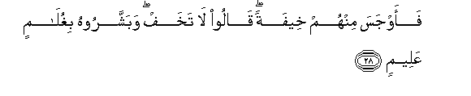

  
[Intangible Textual Heritage](../../index)  [Islam](../index) 
[Index](index)   
[Hypertext Qur'an](../htq/index)  [Unicode](../uq/051.htm#051_024) 
[Palmer](../sbe09/051)  [Pickthall](../pick/051.htm#051_024)  [Yusuf Ali
English](../yaq/yaq051)  [Rodwell](../qr/051)   
  
[Sūra LI.: Zāriyāt, or the Winds That Scatter. Index](051)  
  [Previous](05101)  [Next](05103) 

------------------------------------------------------------------------

  
*The Holy Quran*, tr. by Yusuf Ali, \[1934\], at Intangible Textual
Heritage

------------------------------------------------------------------------

# Sūra LI.: Zāriyāt, or the Winds That Scatter.

### Section 2

------------------------------------------------------------------------

24. Hal at<u>a</u>ka <u>h</u>adeethu <u>d</u>ayfi ibr<u>a</u>heema
almukrameen**a**

24\. Has the story  
Reached thee, of the honoured  
Guests of Abraham?

------------------------------------------------------------------------

25. I<u>th</u> dakhaloo AAalayhi faq<u>a</u>loo sal<u>a</u>man
q<u>a</u>la sal<u>a</u>mun qawmun munkaroon**a**

25\. Behold, they entered  
His presence, and said:  
"Peace!" He said, "Peace"  
(And thought, "These seem)  
Unusual people."

------------------------------------------------------------------------

26. Far<u>a</u>gha il<u>a</u> ahlihi faj<u>a</u>a biAAijlin sameen**in**

26\. Then he turned quickly  
To his household, brought  
Out a fatted calf,

------------------------------------------------------------------------

27. Faqarrabahu ilayhim q<u>a</u>la al<u>a</u> ta/kuloon**a**

27\. And placed it before them…  
He said, "Will ye not  
Eat?"

------------------------------------------------------------------------

28. Faawjasa minhum kheefatan q<u>a</u>loo l<u>a</u> takhaf
wabashsharoohu bighul<u>a</u>min AAaleem**in**

28\. (When they did not eat),  
He conceived a fear of them.  
They said, "Fear not,"  
And they gave him  
Glad tidings of a son  
Endowed with knowledge.

------------------------------------------------------------------------

29. Faaqbalati imraatuhu fee <u>s</u>arratin fa<u>s</u>akkat
wajhah<u>a</u> waq<u>a</u>lat AAajoozun AAaqeem**un**

29\. But his wife came forward  
(Laughing) aloud: she smote  
Her forehead and said:  
"A barren old woman!"

------------------------------------------------------------------------

30. Q<u>a</u>loo ka<u>tha</u>liki q<u>a</u>la rabbuki innahu huwa
al<u>h</u>akeemu alAAaleem**u**

30\. They said, "Even so  
Has thy Lord spoken:  
And He is full  
Of Wisdom and Knowledge."

------------------------------------------------------------------------

31. Q<u>a</u>la fam<u>a</u> kha<u>t</u>bukum ayyuh<u>a</u>
almursaloon**a**

31\. (Abraham) said: "And what,  
O ye Messengers,  
Is your errand (now)?"

------------------------------------------------------------------------

32. Q<u>a</u>loo inn<u>a</u> orsiln<u>a</u> il<u>a</u> qawmin
mujrimeen**a**

32\. They said, "We have  
Been sent to a people  
(Deep) in sin;—

------------------------------------------------------------------------

33. Linursila AAalayhim <u>h</u>ij<u>a</u>ratan min <u>t</u>een**in**

33\. "To bring on, on them,  
(A shower of) stones  
Of clay (brimstone),

------------------------------------------------------------------------

34. Musawwamatan AAinda rabbika lilmusrifeen**a**

34\. "Marked as from thy Lord  
For those who trespass  
Beyond bounds."

------------------------------------------------------------------------

35. Faakhrajn<u>a</u> man k<u>a</u>na feeh<u>a</u> mina almu/mineen**a**

35\. Then We evacuated  
Those of the Believers  
Who were there,

------------------------------------------------------------------------

36. Fam<u>a</u> wajadn<u>a</u> feeh<u>a</u> ghayra baytin mina
almuslimeen**a**

36\. But We found not there  
Any just (Muslim) persons  
Except in one house:

------------------------------------------------------------------------

37. Watarakn<u>a</u> feeh<u>a</u> <u>a</u>yatan lilla<u>th</u>eena
yakh<u>a</u>foona alAAa<u>tha</u>ba al-aleem**a**

37\. And We left there  
A Sign for such as  
Fear the Grievous Penalty.

------------------------------------------------------------------------

38. Wafee moos<u>a</u> i<u>th</u> arsa**l**n<u>a</u>hu il<u>a</u>
firAAawna bisul<u>ta</u>nin mubeen**in**

38\. And in Moses  
(Was another Sign):  
Behold, We sent him  
To Pharaoh, with authority  
Manifest.

------------------------------------------------------------------------

39. Fatawall<u>a</u> biruknihi waq<u>a</u>la s<u>ah</u>irun aw
majnoon**un**

39\. But (Pharaoh) turned back  
With his Chiefs, and said,  
"A sorcerer, or  
One possessed!"

------------------------------------------------------------------------

40. Faakha<u>th</u>n<u>a</u>hu wajunoodahu fanaba<u>th</u>n<u>a</u>hum
fee alyammi wahuwa muleem**un**

40\. So We took him  
And his forces, and  
Threw them into the sea;  
And his was the blame:

------------------------------------------------------------------------

41. Wafee AA<u>a</u>din i<u>th</u> arsaln<u>a</u> AAalayhimu
a**l**rree<u>h</u>a alAAaqeem**a**

41\. And in the ‘Ād (people)  
(Was another Sign):  
Behold, We sent against them  
The devastating Wind:

------------------------------------------------------------------------

42. M<u>a</u> ta<u>th</u>aru min shay-in atat AAalayhi ill<u>a</u>
jaAAalat-hu ka**al**rrameem**i**

42\. It left nothing whatever  
That it came up against,  
But reduced it to ruin  
And rottenness.

------------------------------------------------------------------------

43. Wafee thamooda i<u>th</u> qeela lahum tamattaAAoo
<u>h</u>att<u>a</u> <u>h</u>een**in**

43\. And in the <u>Th</u>amūd  
(Was another Sign):  
Behold, they were told,  
"Enjoy (your brief day)  
For a little while!"

------------------------------------------------------------------------

44. FaAAataw AAan amri rabbihim faakha<u>th</u>at-humu
a**l**<u>ssa</u>AAiqatu wahum yan*<u>th</u>*uroon**a**

44\. But they insolently defied  
The Command of their Lord:  
So the stunning noise  
(Of an earthquake) seized  
Them, even while they  
Were looking on.

------------------------------------------------------------------------

45. Fam<u>a</u> ista<u>ta</u>AAoo min qiy<u>a</u>min wam<u>a</u>
k<u>a</u>noo munta<u>s</u>ireen**a**

45\. Then they could not  
Even stand (on their feet),  
Nor could they help themselves.

------------------------------------------------------------------------

46. Waqawma noo<u>h</u>in min qablu innahum k<u>a</u>noo qawman
f<u>a</u>siqeen**a**

46\. So were the People  
Of Noah before them:  
For they wickedly transgressed.

------------------------------------------------------------------------

[Next: Section 3 (47-60)](05103)

