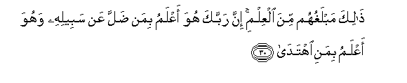

  
[Intangible Textual Heritage](../../index)  [Islam](../index) 
[Index](index)   
[Hypertext Qur'an](../htq/index)  [Unicode](../uq/053.htm#053_026) 
[Palmer](../sbe09/053)  [Pickthall](../pick/053.htm#053_026)  [Yusuf Ali
English](../yaq/yaq053)  [Rodwell](../qr/053)   
  
[Sūra LIII.: Najm, or the Star. Index](053)  
  [Previous](05301)  [Next](05303) 

------------------------------------------------------------------------

  
*The Holy Quran*, tr. by Yusuf Ali, \[1934\], at Intangible Textual
Heritage

------------------------------------------------------------------------

# Sūra LIII.: Najm, or the Star.

### Section 2

------------------------------------------------------------------------

26. Wakam min malakin fee a**l**ssam<u>a</u>w<u>a</u>ti l<u>a</u>
tughnee shaf<u>a</u>AAatuhum shay-an ill<u>a</u> min baAAdi an
ya/<u>th</u>ana All<u>a</u>hu liman yash<u>a</u>o wayar<u>da</u>

26\. How many-so-ever be  
The angels in the heavens,  
Their intercession will avail nothing  
Except after God has given  
Leave for whom He pleases  
And that he is acceptable  
To Him.

------------------------------------------------------------------------

27. Inna alla<u>th</u>eena l<u>a</u> yu/minoona bi**a**l-<u>a</u>khirati
layusammoona almal<u>a</u>-ikata tasmiyata al-onth<u>a</u>

27\. Those who believe not  
In the Hereafter, name  
The angels with female names.

------------------------------------------------------------------------

28. Wam<u>a</u> lahum bihi min AAilmin in yattabiAAoona ill<u>a</u>
a**l***<u>thth</u>*anna wa-inna a**l***<u>thth</u>*anna l<u>a</u>
yughnee mina al<u>h</u>aqqi shay-<u>a</u>**n**

28\. But they have no knowledge  
Therein. They follow nothing  
But conjecture; and conjecture  
Avails nothing against Truth.

------------------------------------------------------------------------

29. FaaAAri<u>d</u> AAan man tawall<u>a</u> AAan <u>th</u>ikrin<u>a</u>
walam yurid ill<u>a</u> al<u>h</u>ay<u>a</u>ta a**l**dduny<u>a</u>

29\. Therefore shun those who  
Turn away from Our Message  
And desire nothing but  
The life of this world.

------------------------------------------------------------------------

30. <u>Tha</u>lika mablaghuhum mina alAAilmi inna rabbaka huwa aAAlamu
biman <u>d</u>alla AAan sabeelihi wahuwa aAAlamu bimani ihtad<u>a</u>

30\. That is as far as  
Knowledge will reach them.  
Verily thy Lord knoweth best  
Those who stray from  
His Path, and He knoweth  
Best those who receive guidance.

------------------------------------------------------------------------

31. Walill<u>a</u>hi m<u>a</u> fee a**l**ssam<u>a</u>w<u>a</u>ti
wam<u>a</u> fee al-ar<u>d</u>i liyajziya alla<u>th</u>eena as<u>a</u>oo
bim<u>a</u> AAamiloo wayajziya alla<u>th</u>eena a<u>h</u>sanoo
bi**a**l<u>h</u>usn<u>a</u>

31\. Yea, to God belongs all  
That is in the heavens  
And on earth: so that  
He rewards those who do  
Evil, according to their deeds,  
And He rewards those who  
Do good, with what is best.

------------------------------------------------------------------------

32. Alla<u>th</u>eena yajtaniboona kab<u>a</u>-ira al-ithmi
wa**a**lfaw<u>ah</u>isha ill<u>a</u> allamama inna rabbaka
w<u>a</u>siAAu almaghfirati huwa aAAlamu bikum i<u>th</u> anshaakum mina
al-ar<u>d</u>i wa-i<u>th</u> antum ajinnatun fee bu<u>t</u>ooni
ommah<u>a</u>tikum fal<u>a</u> tuzakkoo anfusakum huwa aAAlamu bimani
ittaq<u>a</u>

32\. Those who avoid  
Great sins and shameful deeds,  
Only (falling into) small faults,  
Verily thy Lord is ample  
In forgiveness. He knows  
You well when He brings  
You out of the earth,  
And when ye are hidden  
In your mothers’ wombs.  
Therefore justify not yourselves;  
He knows best who it is  
That guards against evil.

------------------------------------------------------------------------

[Next: Section 3 (33-62)](05303)

