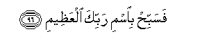

  
[Intangible Textual Heritage](../../index)  [Islam](../index) 
[Index](index)   
[Hypertext Qur'an](../htq/index)  [Unicode](../uq/056.htm#056_075) 
[Palmer](../sbe09/056)  [Pickthall](../pick/056.htm#056_075)  [Yusuf Ali
English](../yaq/yaq056)  [Rodwell](../qr/056)   
  
[Sūra LVI.: Wāqi‘a, or The Inevitable Event. Index](056)  
  [Previous](05602)  [Next](05701) 

------------------------------------------------------------------------

  
*The Holy Quran*, tr. by Yusuf Ali, \[1934\], at Intangible Textual
Heritage

------------------------------------------------------------------------

# Sūra LVI.: Wāqi‘a, or The Inevitable Event.

### Section 3

------------------------------------------------------------------------

75. Fal<u>a</u> oqsimu bimaw<u>a</u>qiAAi a**l**nnujoom**i**

75\. Furthermore I call  
To witness the setting  
Of the Stars,—

------------------------------------------------------------------------

76. Wa-innahu laqasamun law taAAlamoona AAa*<u>th</u>*eem**un**

76\. And that is indeed  
A mighty adjuration  
If ye but knew,—

------------------------------------------------------------------------

77. Innahu laqur-<u>a</u>nun kareem**un**

77\. That this is indeed  
A Qur-ān most honourable,

------------------------------------------------------------------------

78. Fee kit<u>a</u>bin maknoon**in**

78\. In a Book well-guarded,

------------------------------------------------------------------------

79. L<u>a</u> yamassuhu ill<u>a</u> almu<u>t</u>ahharoon**a**

79\. Which none shall touch  
But those who are clean:

------------------------------------------------------------------------

80. Tanzeelun min rabbi alAA<u>a</u>lameen**a**

80\. A Revelation from the Lord  
Of the Worlds.

------------------------------------------------------------------------

81. Afabih<u>atha</u> al<u>h</u>adeethi antum mudhinoon**a**

81\. Is it such a Message  
That ye would hold  
In light esteem?

------------------------------------------------------------------------

82. WatajAAaloona rizqakum annakum tuka<u>thth</u>iboon**a**

82\. And have ye made it  
Your livelihood that ye  
Should declare it false?

------------------------------------------------------------------------

83. Falawl<u>a</u> i<u>tha</u> balaghati al<u>h</u>ulqoom**a**

83\. Then why do ye not  
(Intervene) when (the soul  
Of the dying man)  
Reaches the throat,—

------------------------------------------------------------------------

84. Waantum <u>h</u>eena-i<u>th</u>in tan*<u>th</u>*uroona

84\. And ye the while  
(Sit) looking on,—

------------------------------------------------------------------------

85. Wana<u>h</u>nu aqrabu ilayhi minkum wal<u>a</u>kin l<u>a</u>
tub<u>s</u>iroon**a**

85\. But We are nearer  
To him than ye,  
And yet see not,—

------------------------------------------------------------------------

86. Falawl<u>a</u> in kuntum ghayra madeeneen**a**

86\. Then why do ye not,—  
If you are exempt  
From (future) account,—

------------------------------------------------------------------------

87. TarjiAAoonah<u>a</u> in kuntum <u>sa</u>diqeen**a**

87\. Call back the soul,  
If ye are true  
(In your claim of Independence)?

------------------------------------------------------------------------

88. Faamm<u>a</u> in k<u>a</u>na mina almuqarrabeen**a**

88\. Thus, then, if he  
Be of those Nearest to God,

------------------------------------------------------------------------

89. Faraw<u>h</u>un waray<u>ha</u>nun wajannatu naAAeem**in**

89\. (There is for him) Rest  
And Satisfaction, and  
A Garden of Delights.

------------------------------------------------------------------------

90. Waamm<u>a</u> in k<u>a</u>na min a<u>s</u>-<u>ha</u>bi alyameen**i**

90\. And if he be  
Of the Companions of  
The Right Hand,

------------------------------------------------------------------------

91. Fasal<u>a</u>mun laka min a<u>s</u>-<u>ha</u>bi alyameen**i**

91\. (For him is the salutation),  
"Peace be unto thee",  
From the Companions  
Of the Right Hand.

------------------------------------------------------------------------

92. Waamm<u>a</u> in k<u>a</u>na mina almuka<u>thth</u>ibeena
a**l**<u>dda</u>lleen**a**

92\. And if he be  
Of those who treat  
(Truth) as Falsehood,  
Who go wrong,

------------------------------------------------------------------------

93. Fanuzulun min <u>h</u>ameem**in**

93\. For him is Entertainment  
With Boiling Water,

------------------------------------------------------------------------

94. Wata<u>s</u>liyatu ja<u>h</u>eem**in**

94\. And burning in Hell-Fire.

------------------------------------------------------------------------

95. Inna h<u>atha</u> lahuwa <u>h</u>aqqu alyaqeen**i**

95\. Verily, this is  
The Very Truth  
And Certainty.

------------------------------------------------------------------------

96. Fasabbi<u>h</u> bi**i**smi rabbika alAAa*<u>th</u>*eem**i**

96\. So celebrate with praises  
The name of thy Lord,  
The Supreme.

------------------------------------------------------------------------

[Next: Section 1 (1-10)](05701)

