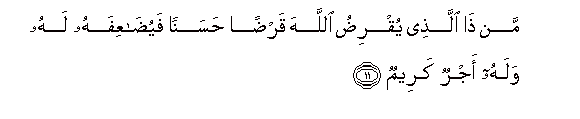
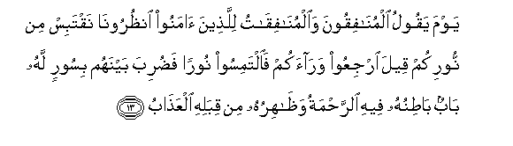

  
[Intangible Textual Heritage](../../index)  [Islam](../index) 
[Index](index)   
[Hypertext Qur'an](../htq/index)  [Unicode](../uq/057.htm#057_011) 
[Palmer](../sbe09/057)  [Pickthall](../pick/057.htm#057_011)  [Yusuf Ali
English](../yaq/yaq057)  [Rodwell](../qr/057)   
  
[Sūra LVII.: Ḥadīd, or Iron. Index](057)  
  [Previous](05701)  [Next](05703) 

------------------------------------------------------------------------

  
*The Holy Quran*, tr. by Yusuf Ali, \[1934\], at Intangible Textual
Heritage

------------------------------------------------------------------------

# Sūra LVII.: Ḥadīd, or Iron.

### Section 2

------------------------------------------------------------------------

11. Man <u>tha</u> alla<u>th</u>ee yuqri<u>d</u>u All<u>a</u>ha
qar<u>d</u>an <u>h</u>asanan fayu<u>da</u>AAifahu lahu walahu ajrun
kareem**un**

11\. Who is he that will  
Loan to God a beautiful  
Loan? For (God) will  
Increase it manifold  
To his credit,  
And he will have (besides)  
A liberal reward.

------------------------------------------------------------------------

12. Yawma tar<u>a</u> almu/mineena wa**a**lmu/min<u>a</u>ti
yasAA<u>a</u> nooruhum bayna aydeehim wabi-aym<u>a</u>nihim
bushr<u>a</u>kumu alyawma jann<u>a</u>tun tajree min
ta<u>h</u>tih<u>a</u> al-anh<u>a</u>ru kh<u>a</u>lideena feeh<u>a</u>
<u>tha</u>lika huwa alfawzu alAAa*<u>th</u>*eem**u**

12\. One Day shalt thou see  
The believing men and  
The believing women—  
How their Light runs  
Forward before them  
And by their right hands:  
(Their greeting will be):  
"Good News for you this Day!  
Gardens beneath which How rivers!  
To dwell therein for aye!  
This is indeed  
The highest Achievement!

------------------------------------------------------------------------

13. Yawma yaqoolu almun<u>a</u>fiqoona wa**a**lmun<u>a</u>fiq<u>a</u>tu
lilla<u>th</u>eena <u>a</u>manoo on*<u>th</u>*uroon<u>a</u> naqtabis min
noorikum qeela irjiAAoo war<u>a</u>akum fa**i**ltamisoo nooran
fa<u>d</u>uriba baynahum bisoorin lahu b<u>a</u>bun b<u>at</u>inuhu
feehi a**l**rra<u>h</u>matu wa*<u>th</u>*<u>a</u>hiruhu min qibalihi
alAAa<u>tha</u>b**u**

13\. One Day will the Hypocrites  
Men and women—say  
To the Believers: "Wait  
For us! Let us borrow  
(A light) from your Light!"  
It will be said: "Turn  
Ye back to your rear!  
Then seek a light (where  
Ye can)!" So a wall  
Will be put up betwixt them,  
With a gate therein.  
Within it will be Mercy  
Throughout, and without it,  
All alongside, will be  
(Wrath and) Punishment!

------------------------------------------------------------------------

14. Yun<u>a</u>doonahum alam nakun maAAakum q<u>a</u>loo bal<u>a</u>
wal<u>a</u>kinnakum fatantum anfusakum watarabba<u>s</u>tum
wa**i**rtabtum wagharratkumu al-am<u>a</u>niyyu <u>h</u>att<u>a</u>
j<u>a</u>a amru All<u>a</u>hi wagharrakum bi**A**ll<u>a</u>hi
algharoor**u**

14\. (Those without) will call out,  
"Were we not with you?  
(The others) will reply, "True!  
But ye led yourselves  
Into temptation; ye looked forward  
(To our ruin); ye doubted  
(God's Promise); and (your false)  
Desires deceived you; until  
There issued the Command  
Of God. And the Deceiver  
Deceived you in respect of God.

------------------------------------------------------------------------

15. Fa**a**lyawma l<u>a</u> yu/kha<u>th</u>u minkum fidyatun wal<u>a</u>
mina alla<u>th</u>eena kafaroo ma/w<u>a</u>kumu a**l**nn<u>a</u>ru hiya
mawl<u>a</u>kum wabi/sa alma<u>s</u>eer**u**

15\. "This Day shall no ransom  
Be accepted of you, nor  
Of those who rejected God.  
Your abode is the Fire:  
That is the proper place .  
To claim you: and an evil  
Refuge it is!"

------------------------------------------------------------------------

16. Alam ya/ni lilla<u>th</u>eena <u>a</u>manoo an takhshaAAa quloobuhum
li<u>th</u>ikri All<u>a</u>hi wam<u>a</u> nazala mina al<u>h</u>aqqi
wal<u>a</u> yakoonoo ka**a**lla<u>th</u>eena ootoo alkit<u>a</u>ba min
qablu fa<u>ta</u>la AAalayhimu al-amadu faqasat quloobuhum wakatheerun
minhum f<u>a</u>siqoon**a**

16\. Has not the time arrived  
For the Believers that  
Their hearts in all humility  
Should engage in the remembrance  
Of God and of the Truth  
Which has been revealed (to them),  
And that they should not  
Become like those to whom  
Was given Revelation aforetime,  
But long ages passed over them  
And their hearts grew hard?  
For many among them  
Are rebellious transgressors.

------------------------------------------------------------------------

17. IAAlamoo anna All<u>a</u>ha yu<u>h</u>yee al-ar<u>d</u>a baAAda
mawtih<u>a</u> qad bayyann<u>a</u> lakumu al-<u>a</u>y<u>a</u>ti
laAAallakum taAAqiloon**a**

17\. Know ye (all) that  
God giveth life  
To the earth after its death  
Already have We shown  
The Signs plainly to you,  
That ye may learn wisdom.

------------------------------------------------------------------------

18. Inna almu<u>ss</u>addiqeena wa**a**lmu<u>ss</u>addiq<u>a</u>ti
waaqra<u>d</u>oo All<u>a</u>ha qar<u>d</u>an <u>h</u>asanan
yu<u>da</u>AAafu lahum walahum ajrun kareem**un**

18\. For those who give  
In Charity, men and women,  
And loan to God  
A Beautiful Loan,  
It shall be increased manifold  
(To their credit),  
And they shall have (besides)  
A liberal reward.

------------------------------------------------------------------------

19. Wa**a**lla<u>th</u>eena <u>a</u>manoo bi**A**ll<u>a</u>hi warusulihi
ol<u>a</u>-ika humu a**l**<u>ss</u>iddeeqoona wa**al**shshuhad<u>a</u>o
AAinda rabbihim lahum ajruhum wanooruhum wa**a**lla<u>th</u>eena kafaroo
waka<u>thth</u>aboo bi-<u>a</u>y<u>a</u>tin<u>a</u> ol<u>a</u>-ika
a<u>s</u>-<u>ha</u>bu alja<u>h</u>eem**i**

19\. And those who believe  
In God and His apostles—  
They are the Sincere  
(Lovers of Truth), and  
The Witnesses (who testify),  
In the eyes of their Lord:  
They shall have their Reward  
And their Light,  
But those who reject God  
And deny Our Signs,—  
They are the Companions  
Of Hell-Fire.

------------------------------------------------------------------------

[Next: Section 3 (20-25)](05703)

