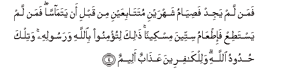
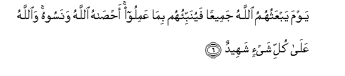

  
[Intangible Textual Heritage](../../index)  [Islam](../index) 
[Index](index)   
[Hypertext Qur'an](../htq/index)  [Unicode](../uq/058.htm#058_001) 
[Palmer](../sbe09/058)  [Pickthall](../pick/058.htm#058_001)  [Yusuf Ali
English](../yaq/yaq058)  [Rodwell](../qr/058)   
  
[Sūra LVIII.: Mujādila, or The Woman who Pleads. Index](058)  
  [Previous](05704)  [Next](05802) 

------------------------------------------------------------------------

  
*The Holy Quran*, tr. by Yusuf Ali, \[1934\], at Intangible Textual
Heritage

------------------------------------------------------------------------

# Sūra LVIII.: Mujādila, or The Woman who Pleads.

### Section 1

1. Qad samiAAa All<u>a</u>hu qawla allatee tuj<u>a</u>diluka fee
zawjih<u>a</u> watashtakee il<u>a</u> All<u>a</u>hi wa**A**ll<u>a</u>hu
yasmaAAu ta<u>ha</u>wurakum<u>a</u> inna All<u>a</u>ha sameeAAun
ba<u>s</u>eer**un**

1\. God has indeed  
Heard (and accepted) the statement  
Of the woman who pleads  
With thee concerning her husband  
And carries her complaint  
(In prayer) to God:  
And God (always) hears  
The arguments between both  
Sides among you: for God  
Hears and sees (all things).

------------------------------------------------------------------------

2. Alla<u>th</u>eena yu*<u>th</u>*<u>a</u>hiroona minkum min
nis<u>a</u>-ihim m<u>a</u> hunna ommah<u>a</u>tihim in
ommah<u>a</u>tuhum ill<u>a</u> all<u>a</u>-ee waladnahum wa-innahum
layaqooloona munkaran mina alqawli wazooran wa-inna All<u>a</u>ha
laAAafuwwun ghafoor**un**

2\. If any men among you  
Divorce their wives by  
(Calling them mothers),  
They cannot be their mothers:  
None can be their mothers  
Except those who gave them  
Birth. And in fact  
They use words (both) iniquitous  
And false: but truly  
God is One that blots out  
(Sins), and forgives  
(Again and again).

------------------------------------------------------------------------

3. Wa**a**lla<u>th</u>eena yu*<u>th</u>*<u>a</u>hiroona min
nis<u>a</u>-ihim thumma yaAAoodoona lim<u>a</u> q<u>a</u>loo
fata<u>h</u>reeru raqabatin min qabli an yatam<u>a</u>ss<u>a</u>
<u>tha</u>likum tooAAa*<u>th</u>*oona bihi wa**A**ll<u>a</u>hu
bim<u>a</u> taAAmaloona khabeer**un**

3\. But those who divorce  
Their wives by Zihār,  
Then wish to go back  
On the words they uttered,—  
(It is ordained that  
Such a one)  
Should free a slave  
Before they touch each other:  
This are ye admonished  
To perform: and God is  
Well-acquainted with (all)  
That ye do.

------------------------------------------------------------------------

4. Faman lam yajid fa<u>s</u>iy<u>a</u>mu shahrayni
mutat<u>a</u>biAAayni min qabli an yatam<u>a</u>ss<u>a</u> faman lam
yasta<u>t</u>iAA fa-i<u>t</u>AA<u>a</u>mu sitteena miskeenan
<u>tha</u>lika litu/minoo bi**A**ll<u>a</u>hi warasoolihi watilka
<u>h</u>udoodu All<u>a</u>hi walilk<u>a</u>fireena AAa<u>tha</u>bun
aleem**un**

4\. And if any has not  
(The wherewithal),  
He should fast for  
Two months consecutively  
Before they touch each other.  
But if any is unable  
To do so, he should feed  
Sixty indigent ones.  
This, that ye may show  
Your faith in God  
And His Apostle.  
Those are limits (set  
By) God. For those who  
Reject (Him), there is  
A grievous Penalty.

------------------------------------------------------------------------

5. Inna alla<u>th</u>eena yu<u>ha</u>ddoona All<u>a</u>ha warasoolahu
kubitoo kam<u>a</u> kubita alla<u>th</u>eena min qablihim waqad
anzaln<u>a</u> <u>a</u>y<u>a</u>tin bayyin<u>a</u>tin
walilk<u>a</u>fireena AAa<u>tha</u>bun muheen**un**

5\. Those who resist God  
And His Apostle will be  
Humbled to dust, as were  
Those before them: for We  
Have already sent down  
Clear Signs. And the Unbelievers  
(Will have) a humiliating Penalty,—

------------------------------------------------------------------------

6. Yawma yabAAathuhumu All<u>a</u>hu jameeAAan fayunabbi-ohum
bim<u>a</u> AAamiloo a<u>hsa</u>hu All<u>a</u>hu wanasoohu
wa**A**ll<u>a</u>hu AAal<u>a</u> kulli shay-in shaheed**un**

6\. On the Day that  
God will raise them  
All up (again) and show  
Them the truth (and meaning)  
Of their conduct. God has  
Reckoned its (value), though  
They may have forgotten it,  
For God is Witness  
To all things.

------------------------------------------------------------------------

[Next: Section 2 (7-13)](05802)

