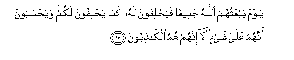
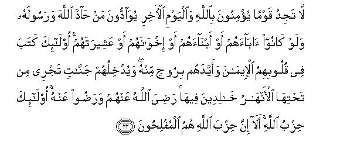

  
[Intangible Textual Heritage](../../index)  [Islam](../index) 
[Index](index)   
[Hypertext Qur'an](../htq/index)  [Unicode](../uq/058.htm#058_014) 
[Palmer](../sbe09/058)  [Pickthall](../pick/058.htm#058_014)  [Yusuf Ali
English](../yaq/yaq058)  [Rodwell](../qr/058)   
  
[Sūra LVIII.: Mujādila, or The Woman who Pleads. Index](058)  
  [Previous](05802)  [Next](05901) 

------------------------------------------------------------------------

  
*The Holy Quran*, tr. by Yusuf Ali, \[1934\], at Intangible Textual
Heritage

------------------------------------------------------------------------

# Sūra LVIII.: Mujādila, or The Woman who Pleads.

### Section 3

------------------------------------------------------------------------

14. Alam tara il<u>a</u> alla<u>th</u>eena tawallaw qawman
gha<u>d</u>iba All<u>a</u>hu AAalayhim m<u>a</u> hum minkum wal<u>a</u>
minhum waya<u>h</u>lifoona AAal<u>a</u> alka<u>th</u>ibi wahum
yaAAlamoon**a**

14\. Turnest thou not  
Thy attention to those  
Who turn (in friendship)  
To such as have the Wrath  
Of God upon them?  
They are neither of you  
Nor of them, and they  
Swear to falsehood knowingly.

------------------------------------------------------------------------

15. aAAadda All<u>a</u>hu lahum AAa<u>tha</u>ban shadeedan innahum
s<u>a</u>a m<u>a</u> k<u>a</u>noo yaAAmaloon**a**

15\. God has prepared for them  
A severe Penalty: evil  
Indeed are their deeds.

------------------------------------------------------------------------

16. Ittakha<u>th</u>oo aym<u>a</u>nahum junnatan fa<u>s</u>addoo AAan
sabeeli All<u>a</u>hi falahum AAa<u>tha</u>bun muheen**un**

16\. They have made their oaths  
A screen (for their misdeeds):  
Thus they obstruct (men)  
From the Path of God:  
Therefore shall they have  
A humiliating Penalty.

------------------------------------------------------------------------

17. Lan tughniya AAanhum amw<u>a</u>luhum wal<u>a</u> awl<u>a</u>duhum
mina All<u>a</u>hi shay-an ol<u>a</u>-ika a<u>s</u>-<u>ha</u>bu
a**l**nn<u>a</u>ri hum feeh<u>a</u> kh<u>a</u>lidoon**a**

17\. Of no profit whatever  
To them, against God,  
Will be their riches  
Nor their sons:  
They will be Companions  
Of the Fire, to dwell  
Therein (for aye)!

------------------------------------------------------------------------

18. Yawma yabAAathuhumu All<u>a</u>hu jameeAAan faya<u>h</u>lifoona lahu
kam<u>a</u> ya<u>h</u>lifoona lakum waya<u>h</u>saboona annahum
AAal<u>a</u> shay-in al<u>a</u> innahum humu alk<u>ath</u>iboon**a**

18\. One Day will God  
Raise them all up  
(For Judgment): then  
Will they swear to Him  
As they swear to you:  
And they think that they  
Have something (to stand upon).  
No, indeed! they are  
But liars!

------------------------------------------------------------------------

19. Ista<u>h</u>wa<u>th</u>a AAalayhimu a**l**shshay<u>ta</u>nu
faans<u>a</u>hum <u>th</u>ikra All<u>a</u>hi ol<u>a</u>-ika <u>h</u>izbu
a**l**shshay<u>ta</u>ni al<u>a</u> inna <u>h</u>izba
a**l**shshay<u>ta</u>ni humu alkh<u>a</u>siroon**a**

19\. The Evil One has  
Got the better of them:  
So he has made them  
Lose the remembrance  
Of God. They are the Party  
Of the Evil One. Truly,  
It is the Party  
Of the Evil One  
That will perish!

------------------------------------------------------------------------

20. Inna alla<u>th</u>eena yu<u>ha</u>ddoona All<u>a</u>ha warasoolahu
ol<u>a</u>-ika fee al-a<u>th</u>alleen**a**

20\. Those who resist  
God and His Apostle  
Will be among those  
Most humiliated.

------------------------------------------------------------------------

21. Kataba All<u>a</u>hu laaghlibanna an<u>a</u> warusulee inna
All<u>a</u>ha qawiyyun AAazeez**un**

21\. God has decreed:  
"It is I and My apostles  
Who must prevail":  
For God is One  
Full of strength,  
Able to enforce His Will.

------------------------------------------------------------------------

22. L<u>a</u> tajidu qawman yu/minoona bi**A**ll<u>a</u>hi wa**a**lyawmi
al-<u>a</u>khiri yuw<u>a</u>ddoona man <u>ha</u>dda All<u>a</u>ha
warasoolahu walaw k<u>a</u>noo <u>a</u>b<u>a</u>ahum aw abn<u>a</u>ahum
aw ikhw<u>a</u>nahum aw AAasheeratahum ol<u>a</u>-ika kataba fee
quloobihimu al-eem<u>a</u>na waayyadahum biroo<u>h</u>in minhu
wayudkhiluhum jann<u>a</u>tin tajree min ta<u>h</u>tih<u>a</u>
al-anh<u>a</u>ru kh<u>a</u>lideena feeh<u>a</u> ra<u>d</u>iya
All<u>a</u>hu AAanhum wara<u>d</u>oo AAanhu ol<u>a</u>-ika <u>h</u>izbu
All<u>a</u>hi al<u>a</u> inna <u>h</u>izba All<u>a</u>hi humu
almufli<u>h</u>oon**a**

22\. Thou wilt not find  
Any people who believe  
In God and the Last Day,  
Loving those who resist  
God and His Apostle,  
Even though they were  
Their fathers or their sons,  
Or their brothers, or  
Their kindred. For such  
He has written Faiths  
In their hearts, and strengthened  
Them with a spirit  
From Himself. And He  
Will admit them to Gardens  
Beneath which Rivers flow,  
To dwell therein (for ever).  
God will be well pleased  
With them, and they with Him.  
They are the Party  
Of God. Truly it is  
The Party of God that  
Will achieve Felicity.

------------------------------------------------------------------------

[Next: Section 1 (1-10)](05901)

