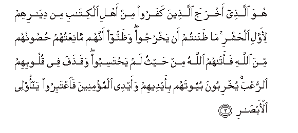
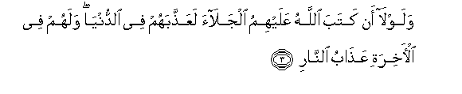
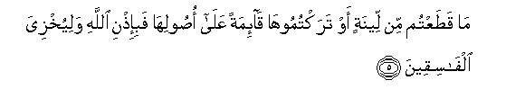
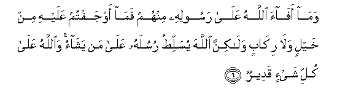
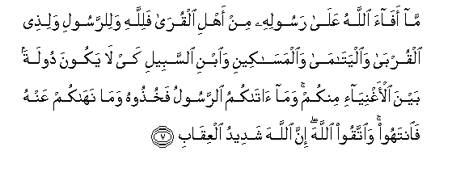
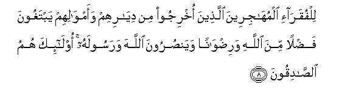
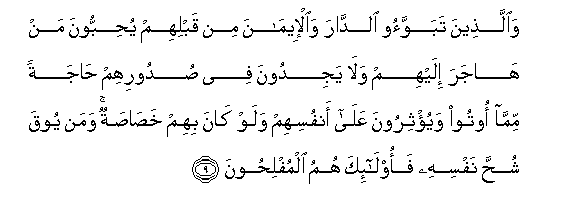
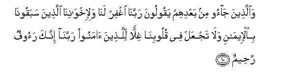

  
[Intangible Textual Heritage](../../index)  [Islam](../index) 
[Index](index)   
[Hypertext Qur'an](../htq/index)  [Unicode](../uq/059.htm#059_001) 
[Palmer](../sbe09/059)  [Pickthall](../pick/059.htm#059_001)  [Yusuf Ali
English](../yaq/yaq059)  [Rodwell](../qr/059)   
  
[Sūra LIX.: Ḥa&lt;u&gt;sh&lt;/u&gt;r, or The Gathering Index](059)  
  [Previous](05803)  [Next](05902) 

------------------------------------------------------------------------

  
*The Holy Quran*, tr. by Yusuf Ali, \[1934\], at Intangible Textual
Heritage

------------------------------------------------------------------------

# Sūra LIX.: Ḥa<u>sh</u>r, or The Gathering

### Section 1

1. Sabba<u>h</u>a lill<u>a</u>hi m<u>a</u> fee
a**l**ssam<u>a</u>w<u>a</u>ti wam<u>a</u> fee al-ar<u>d</u>i wahuwa
alAAazeezu al<u>h</u>akeem**u**

1\. Whatever is  
In the heavens and  
On earth, let it declare  
The Praises and Glory  
Of God: for He is  
The Exalted in Might,  
The Wise.

------------------------------------------------------------------------

2. Huwa alla<u>th</u>ee akhraja alla<u>th</u>eena kafaroo min ahli
alkit<u>a</u>bi min diy<u>a</u>rihim li-awwali al<u>h</u>ashri m<u>a</u>
*<u>th</u>*anantum an yakhrujoo wa*<u>th</u>*annoo annahum
m<u>a</u>niAAatuhum <u>h</u>u<u>s</u>oonuhum mina All<u>a</u>hi
faat<u>a</u>humu All<u>a</u>hu min <u>h</u>aythu lam ya<u>h</u>tasiboo
waqa<u>th</u>afa fee quloobihimu a**l**rruAAba yukhriboona buyootahum
bi-aydeehim waaydee almu/mineena fa**i**AAtabiroo y<u>a</u> olee
al-ab<u>sa</u>r**i**

2\. It is He Who got out  
The Unbelievers among  
The People of the Book  
From their homes  
At the first gathering  
(Of the forces).  
Little did ye think  
That they would get out:  
And they thought  
That their fortresses  
Would defend them from God!  
But the (Wrath of) God  
Came to them from quarters  
From which they little  
Expected (it), and cast  
Terror into their hearts,  
So that they destroyed  
Their dwellings by their own  
Hands and the hands  
Of the Believers.  
Take warning, then,  
O ye with eyes (to see)!

------------------------------------------------------------------------

3. Walawl<u>a</u> an kataba All<u>a</u>hu AAalayhimu aljal<u>a</u>a
laAAa<u>thth</u>abahum fee a**l**dduny<u>a</u> walahum fee
al-<u>a</u>khirati AAa<u>tha</u>bu a**l**nn<u>a</u>r**i**

3\. And had it not been  
That God had decreed  
Banishment for them,  
He would certainly have  
Punished them in this world:  
And in the Hereafter  
They shall (certainly) have  
The Punishment of the Fire.

------------------------------------------------------------------------

4. <u>Tha</u>lika bi-annahum sh<u>a</u>qqoo All<u>a</u>ha warasoolahu
waman yush<u>a</u>qqi All<u>a</u>ha fa-inna All<u>a</u>ha shadeedu
alAAiq<u>a</u>b**i**

4\. That is because they  
Resisted God and His Apostle:  
And if any one resists God,  
Verily God is severe  
In Punishment.

------------------------------------------------------------------------

5. M<u>a</u> qa<u>t</u>aAAtum min leenatin aw taraktumooh<u>a</u>
q<u>a</u>-imatan AAal<u>a</u> o<u>s</u>oolih<u>a</u> fabi-i<u>th</u>ni
All<u>a</u>hi waliyukhziya alf<u>a</u>siqeen**a**

5\. Whether ye cut down  
(O ye Muslims!)  
The tender palm-trees,  
Or ye left them standing  
On their roots, it was  
By leave of God, and  
In order that He might  
Cover with shame  
The rebellious transgressors.

------------------------------------------------------------------------

6. Wam<u>a</u> af<u>a</u>a All<u>a</u>hu AAal<u>a</u> rasoolihi minhum
fam<u>a</u> awjaftum AAalayhi min khaylin wal<u>a</u> rik<u>a</u>bin
wal<u>a</u>kinna All<u>a</u>ha yusalli<u>t</u>u rusulahu AAal<u>a</u>
man yash<u>a</u>o wa**A**ll<u>a</u>hu AAal<u>a</u> kulli shay-in
qadeer**un**

6\. What God has bestowed  
On His Apostle (and taken  
Away) from them—for this  
Ye made no expedition  
With either cavalry or camelry:  
But God gives power  
To His apostles over  
Any He pleases: and God  
Has power over all things.

------------------------------------------------------------------------

7. M<u>a</u> af<u>a</u>a All<u>a</u>hu AAal<u>a</u> rasoolihi min ahli
alqur<u>a</u> falill<u>a</u>hi wali**l**rrasooli wali<u>th</u>ee
alqurb<u>a</u> wa**a**lyat<u>a</u>m<u>a</u> wa**a**lmas<u>a</u>keeni
wa**i**bni a**l**ssabeeli kay l<u>a</u> yakoona doolatan bayna
al-aghniy<u>a</u>-i minkum wam<u>a</u> <u>a</u>t<u>a</u>kumu
a**l**rrasoolu fakhu<u>th</u>oohu wam<u>a</u> nah<u>a</u>kum AAanhu
fa**i**ntahoo wa**i**ttaqoo All<u>a</u>ha inna All<u>a</u>ha shadeedu
alAAiq<u>a</u>b**i**

7\. What God has bestowed  
On His Apostle (and taken  
Away) from the people  
Of the townships,—belongs  
To God,—to His Apostle  
And to kindred and orphans,  
The needy and the wayfarer;  
In order that it may not  
(Merely) make a circuit  
Between the wealthy among you.  
So take what the Apostle  
Assigns to you, and deny  
Yourselves that which he  
Withholds from you.  
And fear God; for God  
Is strict in Punishment.

------------------------------------------------------------------------

8. Lilfuqar<u>a</u>-i almuh<u>a</u>jireena alla<u>th</u>eena okhrijoo
min diy<u>a</u>rihim waamw<u>a</u>lihim yabtaghoona fa<u>d</u>lan mina
All<u>a</u>hi wari<u>d</u>w<u>a</u>nan wayan<u>s</u>uroona All<u>a</u>ha
warasoolahu ol<u>a</u>-ika humu a**l**<u>ssa</u>diqoon**a**

8\. (Some part is due)  
To the indigent Muhājirs,  
Those who were expelled  
From their homes and their property,  
While seeking Grace from God  
And (His) Good Pleasure,  
And aiding God and His Apostle:  
Such are indeed  
The sincere ones;—

------------------------------------------------------------------------

9. Wa**a**lla<u>th</u>eena tabawwaoo a**l**dd<u>a</u>ra
wa**a**l-eem<u>a</u>na min qablihim yu<u>h</u>ibboona man h<u>a</u>jara
ilayhim wal<u>a</u> yajidoona fee <u>s</u>udoorihim <u>ha</u>jatan
mimm<u>a</u> ootoo wayu/thiroona AAal<u>a</u> anfusihim walaw
k<u>a</u>na bihim kha<u>sas</u>atun waman yooqa shu<u>hh</u>a nafsihi
faol<u>a</u>-ika humu almufli<u>h</u>oon**a**

9\. But those who  
Before them, had homes  
(In Medina)  
And had adopted the Faith,—  
Show their affection to such  
As came to them for refuge,  
And entertain no desire  
In their hearts for things  
Given to the (latter),  
But give them preference  
Over themselves, even though  
Poverty was their (own lot).  
And those saved from  
The covetousness of their own  
Souls,—they are the ones  
That achieve prosperity.

------------------------------------------------------------------------

10. Wa**a**lla<u>th</u>eena j<u>a</u>oo min baAAdihim yaqooloona
rabban<u>a</u> ighfir lan<u>a</u> wali-ikhw<u>a</u>nin<u>a</u>
alla<u>th</u>eena sabaqoon<u>a</u> bi**a**l-eem<u>a</u>ni wal<u>a</u>
tajAAal fee quloobin<u>a</u> ghillan lilla<u>th</u>eena <u>a</u>manoo
rabban<u>a</u> innaka raoofun ra<u>h</u>eem**un**

10\. And those who came  
After them say: "Our Lord!  
Forgive us, and our brethren  
Who came before us  
Into the Faith,  
And leave not,  
In our hearts,  
Rancour (or sense of injury)  
Against those who have believed.  
Our Lord! Thou art  
Indeed Full of Kindness,  
Most Merciful."

------------------------------------------------------------------------

[Next: Section 2 (11-17)](05902)

