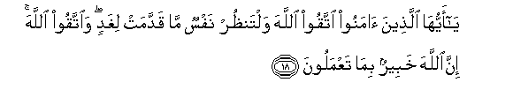
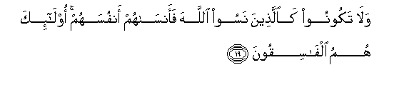
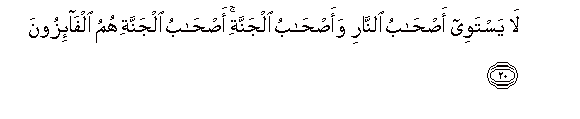
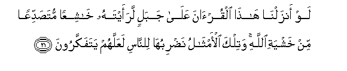
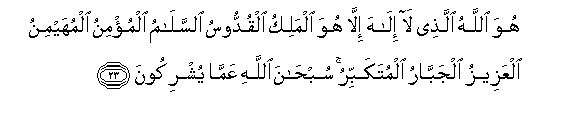
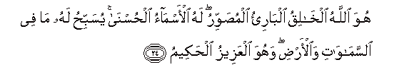

  
[Intangible Textual Heritage](../../index)  [Islam](../index) 
[Index](index)   
[Hypertext Qur'an](../htq/index)  [Unicode](../uq/059.htm#059_018) 
[Palmer](../sbe09/059)  [Pickthall](../pick/059.htm#059_018)  [Yusuf Ali
English](../yaq/yaq059)  [Rodwell](../qr/059)   
  
[Sūra LIX.: Ḥa&lt;u&gt;sh&lt;/u&gt;r, or The Gathering Index](059)  
  [Previous](05902)  [Next](06001) 

------------------------------------------------------------------------

  
*The Holy Quran*, tr. by Yusuf Ali, \[1934\], at Intangible Textual
Heritage

------------------------------------------------------------------------

# Sūra LIX.: Ḥa<u>sh</u>r, or The Gathering

### Section 3

------------------------------------------------------------------------

18. Y<u>a</u> ayyuh<u>a</u> alla<u>th</u>eena <u>a</u>manoo ittaqoo
All<u>a</u>ha waltan*<u>th</u>*ur nafsun m<u>a</u> qaddamat lighadin
wa**i**ttaqoo All<u>a</u>ha inna All<u>a</u>ha khabeerun bim<u>a</u>
taAAmaloon**a**

18\. O ye who believe!  
Fear God,  
And let every soul look  
To what (provision) he has  
Sent forth for the morrow.  
Yea, fear God:  
For God is well-acquainted  
With (all) that ye do.

------------------------------------------------------------------------

19. Wal<u>a</u> takoonoo ka**a**lla<u>th</u>eena nasoo All<u>a</u>ha
faans<u>a</u>hum anfusahum ol<u>a</u>-ika humu alf<u>a</u>siqoon**a**

19\. And be ye not like  
Those who forgot God;  
And He made them forget  
Their own souls! Such  
Are the rebellious transgressors!

------------------------------------------------------------------------

20. L<u>a</u> yastawee a<u>s</u>-<u>ha</u>bu a**l**nn<u>a</u>ri
waa<u>s</u>-<u>ha</u>bu aljannati a<u>s</u>-<u>ha</u>bu aljannati humu
alf<u>a</u>-izoon**a**

20\. Not equal are  
The Companions of the Fire  
And the Companions  
Of the Garden:  
It is the Companions  
Of the Garden,  
That will achieve Felicity.

------------------------------------------------------------------------

21. Law anzaln<u>a</u> h<u>atha</u> alqur-<u>a</u>na AAal<u>a</u>
jabalin laraaytahu kh<u>a</u>shiAAan muta<u>s</u>addiAAan min khashyati
All<u>a</u>hi watilka al-amth<u>a</u>lu na<u>d</u>ribuh<u>a</u>
li**l**nn<u>a</u>si laAAallahum yatafakkaroon**a**

21\. Had We sent down  
This Qur-ān on a mountain,  
Verily, thou wouldst have seen  
It humble itself and cleave  
Asunder for fear of God.  
Such are the similitudes  
Which We propound to men,  
That they may reflect.

------------------------------------------------------------------------

22. Huwa All<u>a</u>hu alla<u>th</u>ee l<u>a</u> il<u>a</u>ha
ill<u>a</u> huwa AA<u>a</u>limu alghaybi wa**al**shshah<u>a</u>dati huwa
a**l**rra<u>h</u>m<u>a</u>nu a**l**rra<u>h</u>eem**u**

22\. God is He, than Whom  
There is no other god;—  
Who knows (all things)  
Both secret and open;  
He, Most Gracious,  
Most Merciful.

------------------------------------------------------------------------

23. Huwa All<u>a</u>hu alla<u>th</u>ee l<u>a</u> il<u>a</u>ha
ill<u>a</u> huwa almaliku alquddoosu a**l**ssal<u>a</u>mu almu/minu
almuhayminu alAAazeezu aljabb<u>a</u>ru almutakabbiru sub<u>ha</u>na
All<u>a</u>hi AAamm<u>a</u> yushrikoon**a**

23\. God is He, than Whom  
There is no other god;—  
The Sovereign, the Holy One,  
The Source of Peace  
(and Perfection),  
The Guardian of Faith,  
The Preserver of Safety,  
The Exalted in Might,  
The Irresistible, the Supreme:  
Glory to God!  
(High is He)  
Above the partners  
They attribute to Him.

------------------------------------------------------------------------

24. Huwa All<u>a</u>hu alkh<u>a</u>liqu alb<u>a</u>ri-o
almu<u>s</u>awwiru lahu al-asm<u>a</u>o al<u>h</u>usn<u>a</u>
yusabbi<u>h</u>u lahu m<u>a</u> fee a**l**ssam<u>a</u>w<u>a</u>ti
wa**a**l-ar<u>d</u>i wahuwa alAAazeezu al<u>h</u>akeem**u**

24\. He is God, the Creator,  
The Evolver,  
The Bestower of Forms  
(Or Colours).  
To Him belongs  
The Most Beautiful Names:  
Whatever is in  
The heavens and on earth,  
Doth declare  
His Praises and Glory:  
And He is the Exalted  
In Might, the Wise.

------------------------------------------------------------------------

[Next: Section 1 (1-6)](06001)

