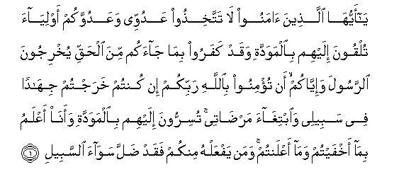
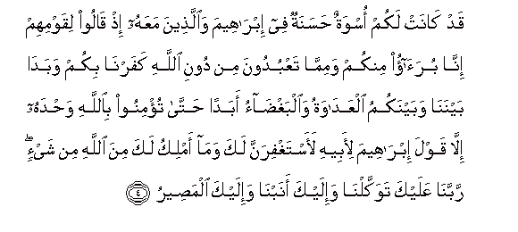

  
[Intangible Textual Heritage](../../index)  [Islam](../index) 
[Index](index)   
[Hypertext Qur'an](../htq/index)  [Unicode](../uq/060.htm#060_001) 
[Palmer](../sbe09/060)  [Pickthall](../pick/060.htm#060_001)  [Yusuf Ali
English](../yaq/yaq060)  [Rodwell](../qr/060)   
  
[Sūra LX.: Mumtaḥana, or the Woman to be Examined. Index](060)  
  [Previous](05903)  [Next](06002) 

------------------------------------------------------------------------

  
*The Holy Quran*, tr. by Yusuf Ali, \[1934\], at Intangible Textual
Heritage

------------------------------------------------------------------------

# Sūra LX.: Mumtaḥana, or the Woman to be Examined.

### Section 1

1. Y<u>a</u> ayyuh<u>a</u> alla<u>th</u>eena <u>a</u>manoo l<u>a</u>
tattakhi<u>th</u>oo AAaduwwee waAAaduwwakum awliy<u>a</u>a tulqoona
ilayhim bi**a**lmawaddati waqad kafaroo bim<u>a</u> j<u>a</u>akum mina
al<u>h</u>aqqi yukhrijoona a**l**rrasoola wa-iyy<u>a</u>kum an tu/minoo
bi**A**ll<u>a</u>hi rabbikum in kuntum kharajtum jih<u>a</u>dan fee
sabeelee wa**i**btigh<u>a</u>a mar<u>da</u>tee tusirroona ilayhim
bi**a**lmawaddati waan<u>a</u> aAAlamu bim<u>a</u> akhfaytum wam<u>a</u>
aAAlantum waman yafAAalhu minkum faqad <u>d</u>alla saw<u>a</u>a
a**l**ssabeel**i**

1\. O ye who believe!  
Take not My enemies  
And yours as friends  
(Or protectors),—offering them  
(Your) love, even though  
They have rejected the Truth  
That has come to you,  
And have (on the contrary)  
Driven out the Prophet  
And yourselves (from your homes),  
(Simply) because ye believe  
In God your Lord!  
If ye have come out  
To strive in My Way  
And to seek My Good Pleasure,  
(Take them not as friends),  
Holding secret converse  
Of love (and friendship)  
With them: for I know  
Full well all that ye  
Conceal and all that ye  
Reveal. And any of you  
That does this has strayed  
From the Straight Path.

------------------------------------------------------------------------

2. In yathqafookum yakoonoo lakam aAAd<u>a</u>an wayabsu<u>t</u>oo
ilaykum aydiyahum waalsinatahum bi**al**ssoo-i wawaddoo law
takfuroon**a**

2\. If they were to get  
The better of you,  
They would behave to you  
As enemies, and stretch forth  
Their hands and their tongues  
Against you for evil;  
And they desire that ye  
Should reject the Truth.

------------------------------------------------------------------------

3. Lan tanfaAAakum ar<u>ha</u>mukum wal<u>a</u> awl<u>a</u>dukum yawma
alqiy<u>a</u>mati yaf<u>s</u>ilu baynakum wa**A**ll<u>a</u>hu
bim<u>a</u> taAAmaloona ba<u>s</u>eer**un**

3\. Of no profit to you  
Will be your relatives  
And your children  
On the Day of Judgment:  
He will judge between you:  
For God sees well  
All that ye do.

------------------------------------------------------------------------

4. Qad k<u>a</u>nat lakum oswatun <u>h</u>asanatun fee ibr<u>a</u>heema
wa**a**lla<u>th</u>eena maAAahu i<u>th</u> q<u>a</u>loo liqawmihim
inn<u>a</u> bura<u>a</u>o minkum wamimm<u>a</u> taAAbudoona min dooni
All<u>a</u>hi kafarn<u>a</u> bikum wabad<u>a</u> baynan<u>a</u>
wabaynakumu alAAad<u>a</u>watu wa**a**lbagh<u>da</u>o abadan
<u>h</u>att<u>a</u> tu/minoo bi**A**ll<u>a</u>hi wa<u>h</u>dahu
ill<u>a</u> qawla ibr<u>a</u>heema li-abeehi laastaghfiranna laka
wam<u>a</u> amliku laka mina All<u>a</u>hi min shay-in rabban<u>a</u>
AAalayka tawakkaln<u>a</u> wa-ilayka anabn<u>a</u> wa-ilayka
alma<u>s</u>eer**u**

4\. There is for you  
An excellent example (to follow)  
In Abraham and those with him,  
When they said  
To their people:  
"We are clear of you  
And of whatever ye worship  
Besides God: we have rejected  
You, and there has arisen,  
Between us and you, enmity  
And hatred for ever,—unless  
Ye believe in God  
And Him alone":  
But not when Abraham  
Said to his father:  
"I will pray for forgiveness  
For thee, though I have  
No power (to get) aught  
On thy behalf from God."  
(They prayed): "Our Lord!  
In Thee do we trust,  
And to Thee do we turn  
In repentance: to Thee  
Is (our) final Goal.

------------------------------------------------------------------------

5. Rabban<u>a</u> l<u>a</u> tajAAaln<u>a</u> fitnatan lilla<u>th</u>eena
kafaroo wa**i**ghfir lan<u>a</u> rabban<u>a</u> innaka anta alAAazeezu
al<u>h</u>akeem**u**

5\. "Our Lord! Make us not  
A (test and) trial  
For the Unbelievers,  
But forgive us, our Lord!  
For Thou art the Exalted  
In Might, the Wise."

------------------------------------------------------------------------

6. Laqad k<u>a</u>na lakum feehim oswatun <u>h</u>asanatun liman
k<u>a</u>na yarjoo All<u>a</u>ha wa**a**lyawma al-<u>a</u>khira waman
yatawalla fa-inna All<u>a</u>ha huwa alghanniyyu al<u>h</u>ameed**u**

6\. There was indeed in them  
An excellent example for you  
To follow,—for those  
Whose hope is in God  
And in the Last Day.  
But if any turn away,  
Truly God is Free of all  
Wants, Worthy of all Praise.

------------------------------------------------------------------------

[Next: Section 2 (7-13)](06002)

