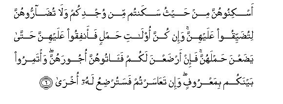

  
[Intangible Textual Heritage](../../index)  [Islam](../index) 
[Index](index)   
[Hypertext Qur'an](../htq/index)  [Unicode](../uq/065.htm#065_001) 
[Palmer](../sbe09/065)  [Pickthall](../pick/065.htm#065_001)  [Yusuf Ali
English](../yaq/yaq065)  [Rodwell](../qr/065)   
  
[Sūra LXV.: Ṭalāq, or Divorce. Index](065)  
  [Previous](06402)  [Next](06502) 

------------------------------------------------------------------------

  
*The Holy Quran*, tr. by Yusuf Ali, \[1934\], at Intangible Textual
Heritage

------------------------------------------------------------------------

# Sūra LXV.: Ṭalāq, or Divorce.

### Section 1

1. Y<u>a</u> ayyuh<u>a</u> a**l**nnabiyyu i<u>tha</u> <u>t</u>allaqtumu
a**l**nnis<u>a</u>a fa<u>t</u>alliqoohunna liAAiddatihinna
waa<u>hs</u>oo alAAiddata wa**i**ttaqoo All<u>a</u>ha rabbakum l<u>a</u>
tukhrijoohunna min buyootihinna wal<u>a</u> yakhrujna ill<u>a</u> an
ya/teena bif<u>ah</u>ishatin mubayyinatin watilka <u>h</u>udoodu
All<u>a</u>hi waman yataAAadda <u>h</u>udooda All<u>a</u>hi faqad
*<u>th</u>*alama nafsahu l<u>a</u> tadree laAAalla All<u>a</u>ha
yu<u>h</u>dithu baAAda <u>tha</u>lika amr<u>a</u>**n**

1\. O Prophet! When ye  
Do divorce women,  
Divorce them at their  
Prescribed periods,  
And count (accurately)  
Their prescribed periods:  
And fear God your Lord:  
And turn them not out  
Of their houses, nor shall  
They (themselves) leave,  
Except in case they are  
Guilty of some open lewdness,  
Those are limits  
Set by God: and any  
Who transgresses the limits  
Of God, does verily  
Wrong his (own) soul:  
Thou knowest not if  
Perchance God will  
Bring about thereafter  
Some new situation.

------------------------------------------------------------------------

2. Fa-i<u>tha</u> balaghna ajalahunna faamsikoohunna bimaAAroofin aw
f<u>a</u>riqoohunna bimaAAroofin waashhidoo <u>th</u>away AAadlin minkum
waaqeemoo a**l**shshah<u>a</u>data lill<u>a</u>hi <u>tha</u>likum
yooAAa*<u>th</u>*u bihi man k<u>a</u>na yu/minu bi**A**ll<u>a</u>hi
wa**a**lyawmi al-<u>a</u>khiri waman yattaqi All<u>a</u>ha yajAAal lahu
makhraj<u>a</u>**n**

2\. Thus when they fulfil  
Their term appointed,  
Either take them back  
On equitable terms  
Or part with them  
On equitable terms;  
And take for witness  
Two persons from among you,  
Endued with justice,  
And establish the evidence  
(As) before God. Such  
Is the admonition given  
To him who believes  
In God and the Last Day.  
And for those who fear  
God, He (ever) prepares  
A way out,

------------------------------------------------------------------------

3. Wayarzuqhu min <u>h</u>aythu l<u>a</u> ya<u>h</u>tasibu waman
yatawakkal AAal<u>a</u> All<u>a</u>hi fahuwa <u>h</u>asbuhu inna
All<u>a</u>ha b<u>a</u>lighu amrihi qad jaAAala All<u>a</u>hu likulli
shay-in qadr<u>a</u>**n**

3\. And He provides for him  
From (sources) he never  
Could imagine. And if  
Any one puts his trust  
In God, sufficient is (God)  
For him. For God will  
Surely accomplish His purpose:  
Verily, for all things  
Has God appointed  
A due proportion.

------------------------------------------------------------------------

4. Wa**a**ll<u>a</u>-ee ya-isna mina alma<u>h</u>ee<u>d</u>i min
nis<u>a</u>-ikum ini irtabtum faAAiddatuhunna thal<u>a</u>thatu ashhurin
wa**a**ll<u>a</u>-ee lam ya<u>h</u>i<u>d</u>na waol<u>a</u>tu
al-a<u>h</u>m<u>a</u>li ajaluhunna an ya<u>d</u>aAAna <u>h</u>amlahunna
waman yattaqi All<u>a</u>ha yajAAal lahu min amrihi yusr<u>a</u>**n**

4\. Such of your women  
As have passed the age  
Of monthly courses, for them  
The prescribed period, if ye  
Have any doubts, is  
Three months, and for those  
Who have no courses  
(It is the same):  
For those who carry  
(Life within their wombs),  
Their period is until  
They deliver their burdens:  
And for those who  
Fear God, He will  
Make their path easy.

------------------------------------------------------------------------

5. <u>Tha</u>lika amru All<u>a</u>hi anzalahu ilaykum waman yattaqi
All<u>a</u>ha yukaffir AAanhu sayyi-<u>a</u>tihi wayuAA*<u>th</u>*im
lahu ajr<u>a</u>**n**

5\. That is the Command  
Of God, which He  
Has sent down to you:  
And if any one fears God,  
He will remove his ills  
From him, and will enlarge  
His reward.

------------------------------------------------------------------------

6. Askinoohunna min <u>h</u>aythu sakantum min wujdikum wal<u>a</u>
tu<u>da</u>rroohunna litu<u>d</u>ayyiqoo AAalayhinna wa-in kunna
ol<u>a</u>ti <u>h</u>amlin faanfiqoo AAalayhinna <u>h</u>att<u>a</u>
ya<u>d</u>aAAna <u>h</u>amlahunna fa-in ar<u>d</u>aAAna lakum
fa<u>a</u>toohunna ojoorahunna wa/tamiroo baynakum bimaAAroofin wa-in
taAA<u>a</u>sartum fasatur<u>d</u>iAAu lahu okhr<u>a</u>

6\. Let the women live  
(In ‘iddat) in the same  
Style as ye live,  
According to your means:  
Annoy them not, so as  
To restrict them.  
And if they carry (life  
In their wombs), then  
Spend (your substance) on them  
Until they deliver  
Their burden: and if  
They suckle your (offspring),  
Give them their recompense:  
And take mutual counsel  
Together, according to  
What is just and reasonable.  
And if ye find yourselves  
In difficulties, let another  
Woman suckle (the child)  
On the (father's) behalf.

------------------------------------------------------------------------

7. Liyunfiq <u>th</u>oo saAAatin min saAAatihi waman qudira AAalayhi
rizquhu falyunfiq mimm<u>a</u> <u>a</u>t<u>a</u>hu All<u>a</u>hu
l<u>a</u> yukallifu All<u>a</u>hu nafsan ill<u>a</u> m<u>a</u>
<u>a</u>t<u>a</u>h<u>a</u> sayajAAalu All<u>a</u>hu baAAda AAusrin
yusr<u>a</u>**n**

7\. Let the man of means  
Spend according to  
His means: and the man  
Whose resources are restricted,  
Let him spend according  
To what God has given him.  
God puts no burden  
On any person beyond  
What He has given him.  
After a difficulty, God  
Will soon grant relief.

------------------------------------------------------------------------

[Next: Section 2 (8-12)](06502)

