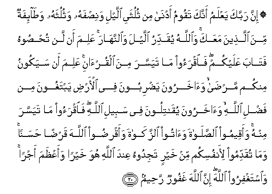

  
[Intangible Textual Heritage](../../index)  [Islam](../index) 
[Index](index)   
[Hypertext Qur'an](../htq/index)  [Unicode](../uq/073.htm#073_020) 
[Palmer](../sbe09/073)  [Pickthall](../pick/073.htm#073_020)  [Yusuf Ali
English](../yaq/yaq073)  [Rodwell](../qr/073)   
  
[Sūra LXXIII.: Muzzammil, or Folded in Garments. Index](073)  
  [Previous](07301)  [Next](07401) 

------------------------------------------------------------------------

  
*The Holy Quran*, tr. by Yusuf Ali, \[1934\], at Intangible Textual
Heritage

------------------------------------------------------------------------

# Sūra LXXIII.: Muzzammil, or Folded in Garments.

### Section 2

------------------------------------------------------------------------

20. Inna rabbaka yaAAlamu annaka taqoomu adn<u>a</u> min thuluthayi
allayli wani<u>s</u>fahu wathuluthahu wa<u>ta</u>-ifatun mina
alla<u>th</u>eena maAAaka wa**A**ll<u>a</u>hu yuqaddiru allayla
wa**al**nnah<u>a</u>ra AAalima an lan tu<u>hs</u>oohu fat<u>a</u>ba
AAalaykum fa**i**qraoo m<u>a</u> tayassara mina alqur-<u>a</u>ni AAalima
an sayakoonu minkum mar<u>da</u> wa<u>a</u>kharoona ya<u>d</u>riboona
fee al-ar<u>d</u>i yabtaghoona min fa<u>d</u>li All<u>a</u>hi
wa<u>a</u>kharoona yuq<u>a</u>tiloona fee sabeeli All<u>a</u>hi
fa**i**qraoo m<u>a</u> tayassara minhu waaqeemoo
a**l**<u>ss</u>al<u>a</u>ta wa<u>a</u>too a**l**zzak<u>a</u>ta
waaqri<u>d</u>oo All<u>a</u>ha qar<u>d</u>an <u>h</u>asanan wam<u>a</u>
tuqaddimoo li-anfusikum min khayrin tajidoohu AAinda All<u>a</u>hi huwa
khayran waaAA*<u>th</u>*ama ajran wa**i**staghfiroo All<u>a</u>ha inna
All<u>a</u>ha ghafoorun ra<u>h</u>eem**un**

20\. Thy Lord doth know  
That thou standest forth  
(To prayer) nigh two-thirds  
Of the night, or half  
The night, or a third  
Of the night, and so doth  
A party of those with thee.  
But God doth appoint Night  
And Day in due measure.  
He knoweth that ye are  
Unable to keep count thereof.  
So He hath turned to you  
(In mercy): read ye,  
Therefore, of the Qur-ān  
As much as may be  
Easy for you. He knoweth  
That there may be (some)  
Among you in ill-health;  
Others travelling through the land,  
Seeking of God's bounty;  
Yet others fighting  
In God's Cause. Read ye,  
Therefore, as much of the Qur-ān  
As may be easy (for you);  
And establish regular Prayer  
And give regular Charity;  
And loan to God  
A Beautiful Loan.  
And whatever good  
Ye send forth  
For your souls,  
Ye shall find it  
In God's Presence,—  
Yea, better and  
Greater, in Reward.  
And seek ye the Grace  
Of God: for God is  
Oft-Forgiving, Most Merciful.

------------------------------------------------------------------------

[Next: Section 1 (1-31)](07401)

