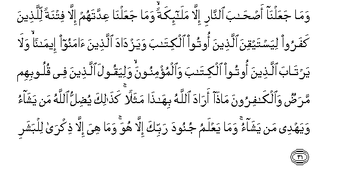

  
[Intangible Textual Heritage](../../index)  [Islam](../index) 
[Index](index)   
[Hypertext Qur'an](../htq/index)  [Unicode](../uq/074.htm#074_001) 
[Palmer](../sbe09/074)  [Pickthall](../pick/074.htm#074_001)  [Yusuf Ali
English](../yaq/yaq074)  [Rodwell](../qr/074)   
  
[Sūra LXXIV.: Mudda&lt;u&gt;th&lt;/u&gt;&lt;u&gt;th&lt;/u&gt;ir, or One
Wrapped Up. Index](074)  
  [Previous](07302)  [Next](07402) 

------------------------------------------------------------------------

  
*The Holy Quran*, tr. by Yusuf Ali, \[1934\], at Intangible Textual
Heritage

------------------------------------------------------------------------

# Sūra LXXIV.: Mudda<u>thth</u>ir, or One Wrapped Up.

### Section 1

1. Y<u>a</u> ayyuh<u>a</u> almuddaththir**u**

1\. O thou wrapped up  
(In a mantle)!

------------------------------------------------------------------------

2. Qum faan<u>th</u>ir

2\. Arise and deliver thy warning!

------------------------------------------------------------------------

3. Warabbaka fakabbir

3\. And thy Lord  
Do thou magnify!

------------------------------------------------------------------------

4. Wathiy<u>a</u>baka fa<u>t</u>ahhir

4\. And thy garments  
Keep free from stain!

------------------------------------------------------------------------

5. Wa**al**rrujza fa**o**hjur

5\. And all abomination shun!

------------------------------------------------------------------------

6. Wal<u>a</u> tamnun tastakthir**u**

6\. Nor expect, in giving,  
Any increase (for thyself)!

------------------------------------------------------------------------

7. Walirabbika fa**i**<u>s</u>bir

7\. But, for thy Lord's (Cause),  
Be patient and constant!

------------------------------------------------------------------------

8. Fa-i<u>tha</u> nuqira fee a**l**nn<u>a</u>qoor**i**

8\. Finally, when the trumpet  
Is sounded,

------------------------------------------------------------------------

9. Fa<u>thal</u>ika yawma-i<u>th</u>in yawmun AAaseer**un**

9\. That will be—that Day—  
A Day of Distress,—

------------------------------------------------------------------------

10. AAal<u>a</u> alk<u>a</u>fireena ghayru yaseer**in**

10\. Far from easy  
For those without Faith.

------------------------------------------------------------------------

11. <u>Th</u>arnee waman khalaqtu wa<u>h</u>eed<u>a</u>**n**

11\. Leave Me alone, (to deal)  
With the (creature) whom  
I created (bare and) alone!—

------------------------------------------------------------------------

12. WajaAAaltu lahu m<u>a</u>lan mamdood<u>a</u>**n**

12\. To whom I granted  
Resources in abundance,

------------------------------------------------------------------------

13. Wabaneena shuhood<u>a</u>**n**

13\. And sons to be  
By his side!—

------------------------------------------------------------------------

14. Wamahhadtu lahu tamheed<u>a</u>**n**

14\. To whom I made  
(Life) smooth and comfortable!

------------------------------------------------------------------------

15. Thumma ya<u>t</u>maAAu an azeed**a**

15\. Yet is he greedy—  
That I should add  
(Yet more);—

------------------------------------------------------------------------

16. Kall<u>a</u> innahu k<u>a</u>na li-<u>a</u>y<u>a</u>tin<u>a</u>
AAaneed<u>a</u>**n**

16\. By no means!  
For to Our Signs  
He has been refractory!

------------------------------------------------------------------------

17. Saorhiquhu <u>s</u>aAAood<u>a</u>**n**

17\. Soon will I visit him  
With a mount of calamities!

------------------------------------------------------------------------

18. Innahu fakkara waqaddar**a**

18\. For he thought  
And he plotted;—

------------------------------------------------------------------------

19. Faqutila kayfa qaddar**a**

19\. And woe to him!  
How he plotted!—

------------------------------------------------------------------------

20. Thumma qutila kayfa qaddar**a**

20\. Yea, woe to him:  
How he plotted!—

------------------------------------------------------------------------

21. Thumma na*<u>th</u>*ar**a**

21\. Then he looked round;

------------------------------------------------------------------------

22. Thumma AAabasa wabasar**a**

22\. Then he frowned  
And he scowled;

------------------------------------------------------------------------

23. Thumma adbara wa**i**stakbar**a**

23\. Then he turned back  
And was haughty;

------------------------------------------------------------------------

24. Faq<u>a</u>la in h<u>atha</u> ill<u>a</u> si<u>h</u>run yu/thar**u**

24\. Then said he:  
"This is nothing but magic,  
Derived from of old;

------------------------------------------------------------------------

25. In h<u>atha</u> ill<u>a</u> qawlu albashar**i**

25\. "This is nothing but  
The word of a mortal!"

------------------------------------------------------------------------

26. Sao<u>s</u>leehi saqar**a**

26\. Soon will I  
Cast him into Hell-Fire!

------------------------------------------------------------------------

27. Wam<u>a</u> adr<u>a</u>ka m<u>a</u> saqar**u**

27\. And what will explain  
To thee what Hell-Fire is?

------------------------------------------------------------------------

28. L<u>a</u> tubqee wal<u>a</u> ta<u>th</u>ar**u**

28\. Naught doth it permit  
To endure, and naught  
Doth it leave alone!—

------------------------------------------------------------------------

29. Laww<u>ah</u>atun lilbashar**i**

29\. Darkening and changing  
The colour of man!

------------------------------------------------------------------------

30. AAalayh<u>a</u> tisAAata AAashar**a**

30\. Over it are Nineteen.

------------------------------------------------------------------------

31. Wam<u>a</u> jaAAaln<u>a</u> a<u>s</u>-<u>ha</u>ba a**l**nn<u>a</u>ri
ill<u>a</u> mal<u>a</u>-ikatan wam<u>a</u> jaAAaln<u>a</u> AAiddatahum
ill<u>a</u> fitnatan lilla<u>th</u>eena kafaroo liyastayqina
alla<u>th</u>eena ootoo alkit<u>a</u>ba wayazd<u>a</u>da
alla<u>th</u>eena <u>a</u>manoo eem<u>a</u>nan wal<u>a</u>
yart<u>a</u>ba alla<u>th</u>eena ootoo alkit<u>a</u>ba
wa**a**lmu/minoona waliyaqoola alla<u>th</u>eena fee quloobihim
mara<u>d</u>un wa**a**lk<u>a</u>firoona m<u>atha</u> ar<u>a</u>da
All<u>a</u>hu bih<u>atha</u> mathalan ka<u>tha</u>lika yu<u>d</u>illu
All<u>a</u>hu man yash<u>a</u>o wayahdee man yash<u>a</u>o wam<u>a</u>
yaAAlamu junooda rabbika ill<u>a</u> huwa wam<u>a</u> hiya ill<u>a</u>
<u>th</u>ikr<u>a</u> lilbashar**i**

31\. And We have set none  
But angels as guardians  
Of the Fire; and We  
Have fixed their number  
Only as a trial  
For Unbelievers,—in order  
That the People of the Book  
May arrive at certainty,  
And the Believers may increase  
In Faith,—and that no doubts  
May be left for the People  
Of the Book and the Believers,  
And that those in whose hearts  
Is a disease and the Unbelievers  
May say, "What symbol  
Doth God intend by this?  
Thus doth God leave to stray  
Whom He pleaseth, and guide  
Whom He pleaseth: and none  
Can know the forces  
Of thy Lord, except He.  
And this is no other than  
A warning to mankind.

------------------------------------------------------------------------

[Next: Section 2 (32-56)](07402)

