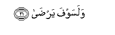

  
[Intangible Textual Heritage](../../index)  [Islam](../index) 
[Index](index)   
[Hypertext Qur'an](../htq/index)  [Unicode](../uq/092.htm#092_001) 
[Palmer](../sbe09/092)  [Pickthall](../pick/092.htm#092_001)  [Yusuf Ali
English](../yaq/yaq092)  [Rodwell](../qr/092)   
  
[Sūra XCII.: Lail, or The Night. Index](092)  
  [Previous](09101)  [Next](09301) 

------------------------------------------------------------------------

  
*The Holy Quran*, tr. by Yusuf Ali, \[1934\], at Intangible Textual
Heritage

------------------------------------------------------------------------

# Sūra XCII.: Lail, or The Night.

### Section 1

1. Wa**a**llayli i<u>tha</u> yaghsh<u>a</u>

1\. By the Night as it  
Conceals (the light);

------------------------------------------------------------------------

2. Wa**al**nnah<u>a</u>ri i<u>tha</u> tajall<u>a</u>

2\. By the Day as it  
Appears in glory;

------------------------------------------------------------------------

3. Wam<u>a</u> khalaqa a**l**<u>thth</u>akara wa**a**l-onth<u>a</u>

3\. By (the mystery of)  
The creation of male  
And female;—

------------------------------------------------------------------------

4. Inna saAAyakum lashatt<u>a</u>

4\. Verily, (the ends) ye  
Strive for are diverse.

------------------------------------------------------------------------

5. Faamm<u>a</u> man aAA<u>ta</u> wa**i**ttaq<u>a</u>

5\. So he who gives  
(In charity) and fears (God),

------------------------------------------------------------------------

6. Wa<u>s</u>addaqa bi**a**l<u>h</u>usn<u>a</u>

6\. And (in all sincerity)  
Testifies to the Best,—

------------------------------------------------------------------------

7. Fasanuyassiruhu lilyusr<u>a</u>

7\. We will indeed  
Make smooth for him  
The path to Bliss,

------------------------------------------------------------------------

8. Waamm<u>a</u> man bakhila wa**i**staghn<u>a</u>

8\. But he who is  
A greedy miser  
And thinks himself  
Self-sufficient,

------------------------------------------------------------------------

9. Waka<u>thth</u>aba bi**a**l<u>h</u>usn<u>a</u>

9\. And gives the lie  
To the Best,—

------------------------------------------------------------------------

10. Fasanuyassiruhu lilAAusr<u>a</u>

10\. We will indeed  
Make smooth for him  
The Path to Misery;

------------------------------------------------------------------------

11. Wam<u>a</u> yughnee AAanhu m<u>a</u>luhu i<u>tha</u> taradd<u>a</u>

11\. Nor will his wealth  
Profit him when he  
Falls headlong (into the Pit).

------------------------------------------------------------------------

12. Inna AAalayn<u>a</u> lalhud<u>a</u>

12\. Verily We take  
Upon Ourselves to guide,

------------------------------------------------------------------------

13. Wa-inna lan<u>a</u> lal-<u>a</u>khirata wa**a**l-ool<u>a</u>

13\. And verily unto Us  
(Belong) the End  
And the Beginning,

------------------------------------------------------------------------

14. Faan<u>th</u>artukum n<u>a</u>ran tala*<u>thth</u>*<u>a</u>

14\. Therefore do I warn you  
Of a Fire blazing fiercely;

------------------------------------------------------------------------

15. L<u>a</u> ya<u>s</u>l<u>a</u>h<u>a</u> ill<u>a</u> al-ashq<u>a</u>

15\. None shall reach it  
But those most unfortunate ones

------------------------------------------------------------------------

16. Alla<u>th</u>ee ka<u>thth</u>aba watawall<u>a</u>

16\. Who give the lie to Truth  
And turn their backs.

------------------------------------------------------------------------

17. Wasayujannabuh<u>a</u> al-atq<u>a</u>

17\. But those most devoted  
To God shall be  
Removed far from it,—

------------------------------------------------------------------------

18. Alla<u>th</u>ee yu/tee m<u>a</u>lahu yatazakk<u>a</u>

18\. Those who spend their wealth  
For increase in self-purification,

------------------------------------------------------------------------

19. Wam<u>a</u> li-a<u>h</u>adin AAindahu min niAAmatin tujz<u>a</u>

19\. And have in their minds  
No favour from anyone  
For which a reward  
Is expected in return,

------------------------------------------------------------------------

20. Ill<u>a</u> ibtigh<u>a</u>a wajhi rabbihi al-aAAl<u>a</u>

20\. But only the desire  
To seek for the Countenance  
Of their Lord Most High;

------------------------------------------------------------------------

21. Walasawfa yar<u>da</u>  

21\. And soon will they  
Attain (complete) satisfaction.

------------------------------------------------------------------------

[Next: Section 1 (1-11)](09301)

